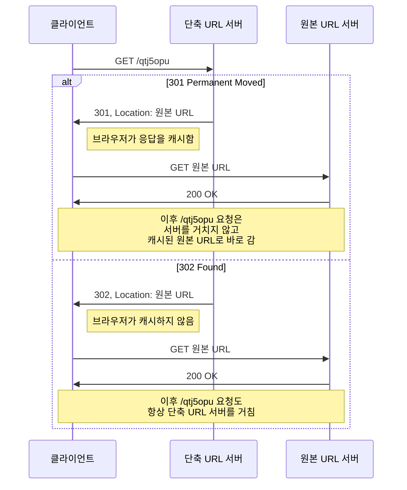
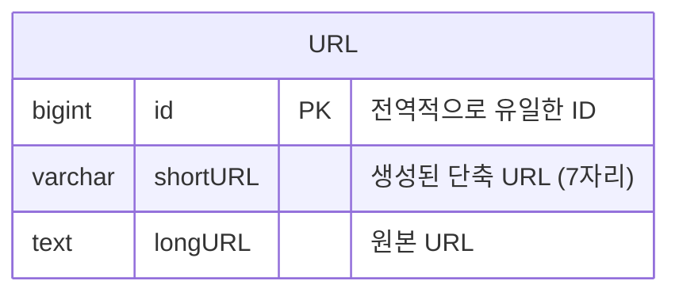
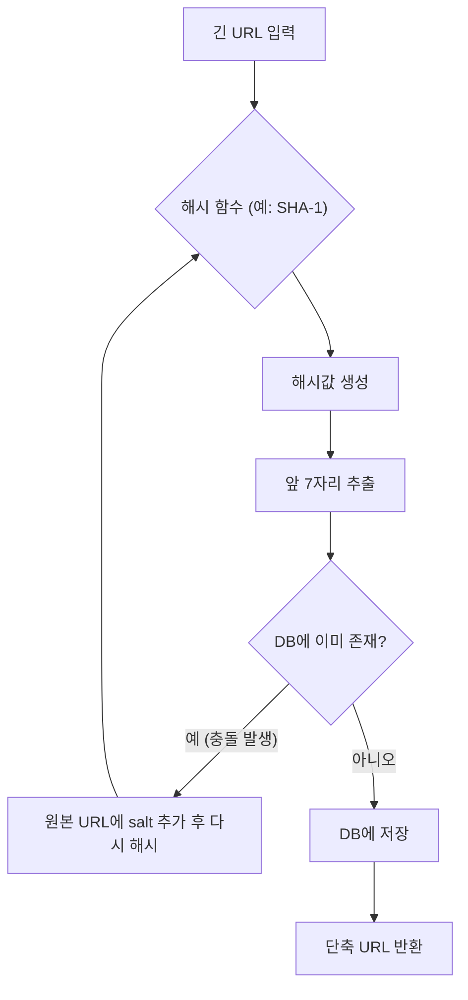
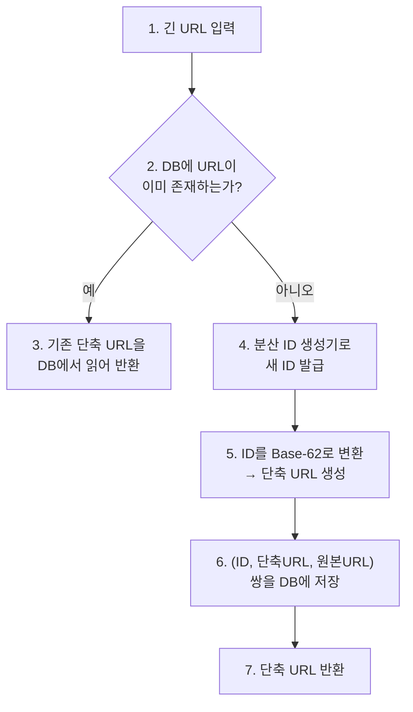
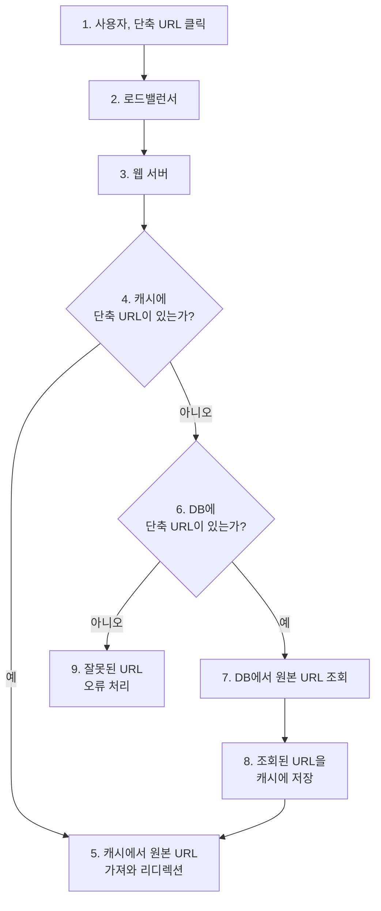

# [가면사배 시리즈 #8] URL 단축기 설계

## 📖 책 소개

**제목**: 가상 면접 사례로 배우는 대규모 시스템 설계 기초  
**8장**: URL 단축기 설계  
**핵심 주제**: 대규모 트래픽을 처리하는 URL 단축기의 설계 원리, 해시 함수, 데이터 모델, 그리고 확장성 전략

## 🎯 학습 목표

- URL 단축기의 핵심 기능과 비기능적 요구사항 정의
- 대규모 트래픽 처리를 위한 개략적 규모 추정 방법 학습
- URL 단축 및 리디렉션을 위한 API 엔드포인트 설계
- Base-62 변환 등 다양한 해시 함수 구현 전략의 장단점 비교
- 읽기/쓰기 부하를 고려한 데이터 모델 및 캐시 전략 수립
- 처리율 제한, 규모 확장, 데이터 분석 등 시스템 확장 방안 모색

## ⚠️ 문제 상황: URL 단축기 설계

URL 단축기는 긴 URL을 짧게 줄여주는 서비스입니다. 예를 들어, `https://www.systeminterview.com/q=chatsystem&...` 같은 긴 주소를 `https://tinyurl.com/y7ke-ocwj`처럼 짧게 만들어줍니다.

### 요구사항 정의

면접 상황을 가정하여 시스템의 요구사항을 명확히 합니다.

- **기능적 요구사항**:
  1.  **URL 단축**: 긴 URL을 입력받아 훨씬 짧은 URL을 생성
  2.  **URL 리디렉션**: 단축 URL로 접속 시 원래 URL로 리디렉션
- **비기능적 요구사항**:
  1.  **고가용성(High Availability)**: 시스템이 항상 정상 동작해야 함
  2.  **확장성(Scalability)**: 대규모 트래픽을 처리할 수 있도록 확장 가능해야 함
  3.  **짧은 URL**: 생성된 URL은 가능한 짧아야 함
- **제약사항**:
  - 단축 URL은 숫자(0-9)와 영문자(a-z, A-Z)로만 구성
  - 생성된 URL은 삭제하거나 갱신할 수 없음

### 개략적 규모 추정

- **쓰기 연산**:
  - 매일 1억 개의 단축 URL 생성
  - 초당 쓰기 연산: 1억 / (24 \* 3600) ≈ **1,160 QPS**
- **읽기 연산**:
  - 읽기:쓰기 비율을 10:1로 가정
  - 초당 읽기 연산: 1,160 \* 10 = **11,600 QPS**
- **저장소 요구량**:
  - 10년간 운영 가정: 1억 _ 365 _ 10 = **3,650억 개**의 레코드
  - 평균 원본 URL 길이 100바이트 가정
  - 총 저장 용량: 3,650억 \* 100바이트 ≈ **36.5TB**

## 🏛️ 개략적 설계안

### API 엔드포인트 설계

RESTful API 스타일로 두 개의 주요 엔드포인트를 설계합니다.

1.  **URL 단축용 엔드포인트**:
    - `POST /api/v1/data/shorten`
    - **인자**: `{ "longUrl": "longURLstring" }`
    - **반환**: 단축 URL
2.  **URL 리디렉션용 엔드포인트**:
    - `GET /api/v1/{shortUrl}`
    - **반환**: HTTP 리디렉션 응답 (301 또는 302)

### URL 리디렉션: 301 vs 302

단축 URL을 원래 URL로 리디렉션할 때, HTTP 상태 코드로 301 또는 302를 사용할 수 있습니다.

| 상태 코드                 | 장점                                  | 단점                              | 사용 사례               |
| ------------------------- | ------------------------------------- | --------------------------------- | ----------------------- |
| **301 Permanently Moved** | 서버 부하 감소 (브라우저 캐싱)        | 클릭 발생률 등 트래픽 분석 어려움 | 성능이 중요할 때        |
| **302 Found**             | 모든 클릭을 추적하여 트래픽 분석 용이 | 서버 부하 증가 (매번 서버 경유)   | 데이터 분석이 중요할 때 |

## 🔧 상세 설계

### 데이터 모델

메모리 기반 해시 테이블은 비싸고 유한하므로, 관계형 데이터베이스에 `<단축 URL, 원본 URL>` 쌍을 저장합니다.

### 해시 함수 설계

긴 URL을 짧은 `hashValue`로 변환하는 해시 함수가 필요합니다.

#### 해시 값 길이 결정

- **문자 집합**: `[0-9, a-z, A-Z]` (62개 문자)
- **요구사항**: 10년간 3,650억 개의 URL 지원
- **계산**: `62^n >= 3,650억`을 만족하는 최소 `n` 찾기
  - `62^6` ≈ 568억 (부족)
  - `62^7` ≈ 3.5조 (충분)
- **결론**: `hashValue`의 길이는 **7자리**로 결정합니다.

#### 접근법 1: 해시 후 충돌 해소

잘 알려진 해시 함수(CRC32, MD5 등)를 사용하고, 결과값의 일부를 취하는 방식입니다.

- **장점**: 단축 URL 길이가 고정됨.
- **단점**: 충돌 발생 시 DB 질의가 추가로 필요하여 오버헤드가 큼. (블룸 필터로 일부 완화 가능)

#### 접근법 2: Base-62 변환

이 방법이 URL 단축기 설계에 널리 쓰입니다. 전역 ID 생성기로부터 받은 10진수 ID를 62진법으로 변환합니다.

**변환 과정 (예: ID `11157`)**:

1.  ID를 62로 나눈 나머지를 구하고, 해당 문자를 찾습니다.
2.  몫이 0이 될 때까지 1번 과정을 반복합니다.
3.  결과를 역순으로 조합합니다.

| 연산       | 몫  | 나머지 | 62진수 문자 |
| ---------- | --- | ------ | ----------- |
| 11157 ÷ 62 | 179 | **59** | **X**       |
| 179 ÷ 62   | 2   | **55** | **T**       |
| 2 ÷ 62     | 0   | **2**  | **2**       |

- 결과: `2TX` -> 단축 URL은 `https://tinyurl.com/2TX`

#### 두 접근법 비교

| 해시 후 충돌 해소 전략            | Base-62 변환                                          |
| --------------------------------- | ----------------------------------------------------- |
| 단축 URL의 길이가 고정됨          | 단축 URL의 길이가 가변적 (ID가 커지면 URL도 길어짐)   |
| 별도의 ID 생성기 불필요           | **전역적으로 유일한 ID 생성기 필수** (7장 참고)       |
| 충돌 가능성 존재 (해소 전략 필요) | ID가 유일하므로 충돌이 원천적으로 불가능              |
| 다음에 생성될 URL 예측 불가       | ID가 1씩 증가하면 다음 URL 예측 가능 (보안 문제 소지) |

### URL 단축 및 리디렉션 흐름

`Base-62` 변환 방식을 채택하여 전체 흐름을 설계합니다.

#### URL 단축 흐름

#### URL 리디렉션 흐름 (캐시 적용)

읽기 연산이 쓰기보다 훨씬 많으므로, 캐시를 도입하여 성능을 높입니다.

## ⚙️ 4단계: 마무리 및 추가 논의사항

설계를 마친 후, 다음과 같은 주제로 논의를 확장할 수 있습니다.

- **처리율 제한 장치 (Rate Limiter)**: 악의적인 사용자의 과도한 요청을 막기 위해 IP 주소나 사용자 계정별로 요청 횟수를 제한합니다. (4장 참고)
- **웹 서버의 규모 확장**: 웹 계층은 무상태(stateless)로 설계되었으므로, 로드밸런서 뒤에 웹 서버를 추가하는 것만으로 간단히 수평 확장이 가능합니다.
- **데이터베이스의 규모 확장**: 데이터베이스 부하를 줄이기 위해 다중화(Replication)나 샤딩(Sharding) 전략을 사용할 수 있습니다.
  - **다중화**: 주(Master)-부(Slave) 구조로 복제하여 읽기 연산 부하 분산
  - **샤딩**: 데이터를 여러 데이터베이스에 분산 저장하여 쓰기 연산 부하 분산
- **데이터 분석 솔루션 (Analytics)**: 링크 클릭 수, 시간대별/지역별 클릭 분포 등 중요한 비즈니스 지표를 수집하고 분석하는 시스템을 통합할 수 있습니다.
- **가용성, 일관성, 안정성**: 6장에서 다룬 CAP 정리, 정족수 합의, 가십 프로토콜 등을 적용하여 시스템의 안정성을 더욱 높일 수 있습니다.

## 🤔 토론 주제

### 기술적 관점

1.  **Base-62의 보안 문제**: ID가 1씩 증가할 경우 다음 URL을 예측할 수 있는 보안 문제를 어떻게 해결할 수 있을까요? (예: ID에 난수성을 추가)
2.  **캐시 무효화**: 원본 URL이 변경되어야 하는 (요구사항 외) 시나리오가 발생한다면, 캐시와 데이터베이스의 데이터 일관성은 어떻게 유지해야 할까요?
3.  **해시 충돌**: '해시 후 충돌 해소' 전략을 사용한다면, 충돌이 계속해서 발생하는 최악의 경우에 대한 대응책은 무엇일까요?

### 실무 적용 관점

1.  **커스텀 URL**: 사용자가 직접 단축 URL 문자열을 지정하는 기능을 추가한다면, 기존 설계에 어떤 변경이 필요할까요?
2.  **비용 최적화**: 36.5TB 이상의 데이터를 10년간 저렴하게 보관하기 위한 스토리지 전략은 무엇일까요? (예: Cold Storage 활용)
3.  **모니터링**: URL 단축기의 상태를 파악하기 위해 어떤 메트릭(응답 시간, 에러율, 캐시 히트율 등)을 중점적으로 모니터링해야 할까요?

## 📚 추가 학습 자료

- **분산 ID 생성기**: 7장 스터디 자료 복습
- **처리율 제한 장치**: 4장 스터디 자료 복습
- **Bloom Filter**: [Wikipedia](https://en.wikipedia.org/wiki/Bloom_filter)
- **Base62 인코딩/디코딩**: 다양한 언어로 구현된 라이브러리 분석

## 🎯 핵심 메시지

> "URL 단축기는 간단해 보이지만, 대규모 트래픽을 안정적으로 처리하기 위해서는 분산 시스템의 핵심 원리(확장성, 가용성, 데이터 처리)를 종합적으로 고려해야 하는 고전적인 설계 문제다."
