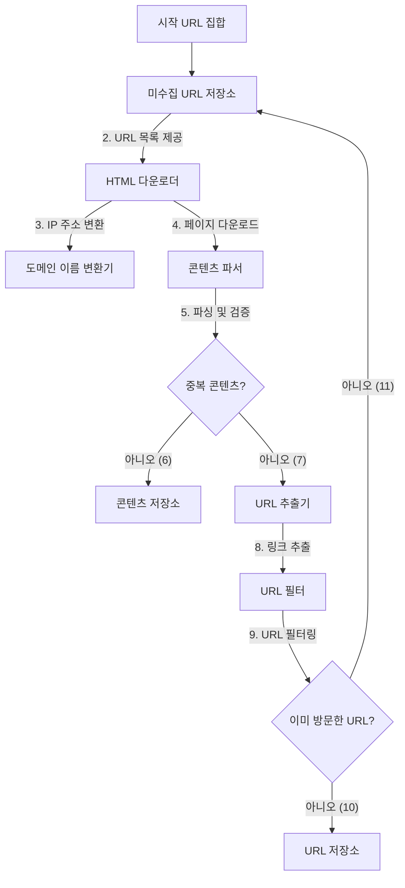
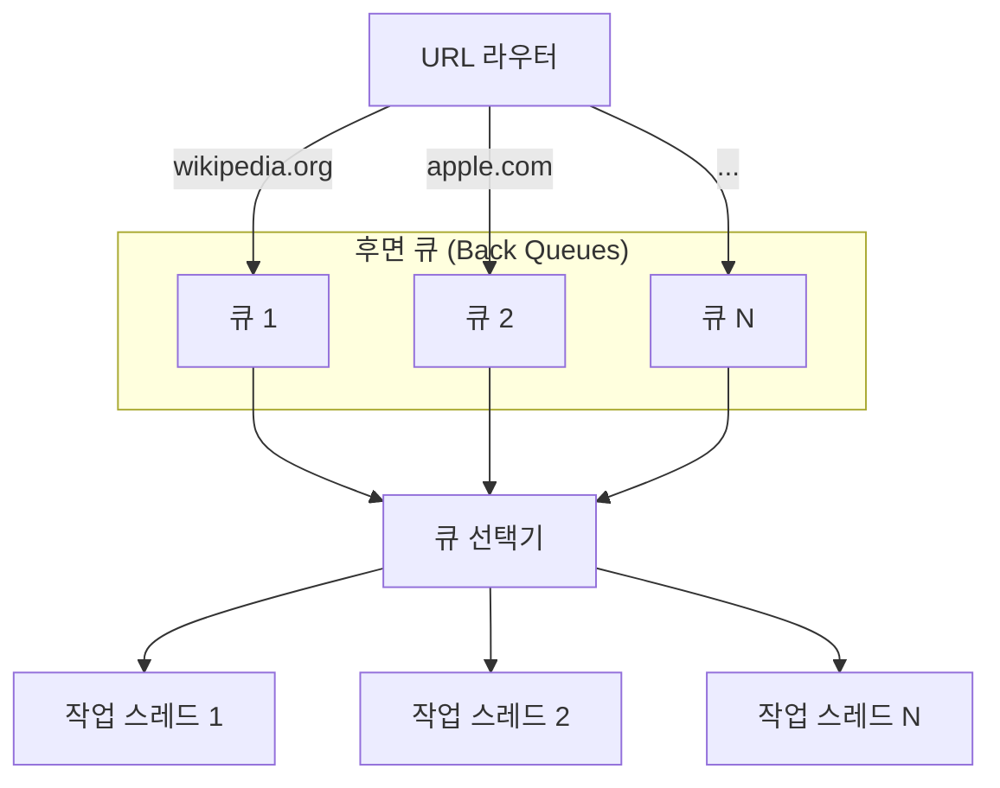
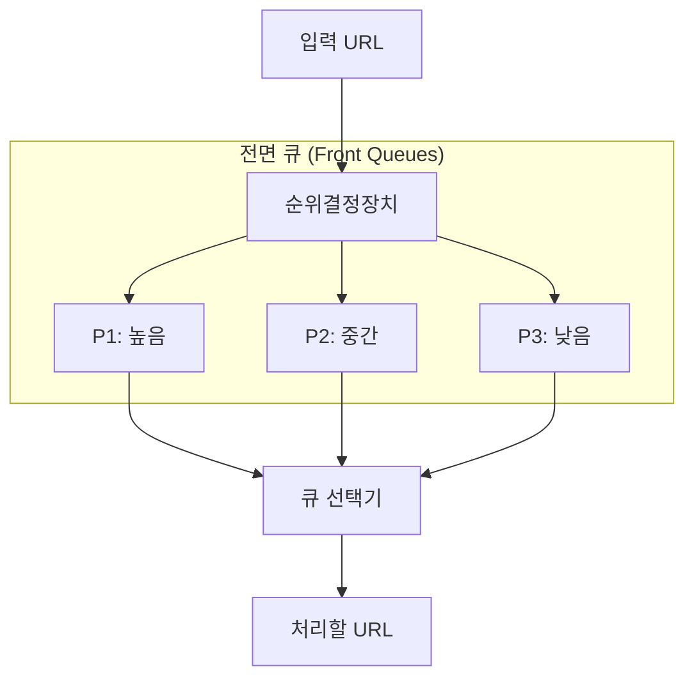

# [가면사배 시리즈 #9] 웹 크롤러 설계

## 📖 책 소개

**제목**: 가상 면접 사례로 배우는 대규모 시스템 설계 기초  
**9장**: 웹 크롤러 설계  
**핵심 주제**: 웹 크롤링의 기본 원리, 분산 크롤러 아키텍처, 그리고 대규모 시스템에서 요구되는 예의, 확장성, 안정성 확보 전략

## 🎯 학습 목표

- 웹 크롤러의 목적(검색 엔진 인덱싱, 웹 아카이빙 등)과 기본 알고리즘 이해
- 대규모 크롤링 시스템의 핵심 요구사항(규모 확장성, 안정성, 예의, 확장성) 정의
- 분산 크롤러의 주요 컴포넌트(URL 저장소, 다운로더, 파서, 중복 탐지 등) 설계
- 단순 BFS 크롤링의 한계를 극복하기 위한 우선순위 및 예의(Politeness) 기반의 URL 스케줄링 전략 학습
- 안정성, 확장성, 문제성 콘텐츠(중복, 거미 덫) 처리 등 심화 설계 주제 탐구

## 1️⃣ 단계: 문제 이해 및 설계 범위 확정

**웹 크롤러(Web Crawler)**는 로봇(Robot) 또는 스파이더(Spider)라고도 불리며, 웹에 존재하는 방대한 콘텐츠(웹 페이지, 이미지, 비디오 등)를 자동으로 탐색하고 수집하는 기술입니다.

### 요구사항
- **주 용도**: 검색 엔진 인덱싱
- **수집 규모**: 매달 10억 개의 신규 또는 수정된 웹 페이지
- **저장 기간**: 수집된 페이지는 5년간 보관
- **중복 처리**: 중복된 콘텐츠는 수집하지 않음

### 좋은 크롤러의 4대 속성
- **규모 확장성 (Scalability)**: 수십억 개의 웹 페이지를 효율적으로 처리하기 위한 병렬 처리 능력
- **안정성 (Robustness)**: 잘못된 HTML, 응답 없는 서버, 악성 링크 등 비정상적 환경에 대한 대응 능력
- **예의 (Politeness)**: 특정 웹 사이트에 과도한 부하를 주지 않도록 요청 빈도 조절
- **확장성 (Extensibility)**: 이미지, 비디오 등 새로운 콘텐츠 유형을 쉽게 지원할 수 있는 구조

### 개략적 규모 추정
- **쓰기 연산 (QPS)**: 10억 페이지 / 30일 / 24시간 / 3600초 ≈ **400 QPS** (최대 800 QPS)
- **저장소 요구량**: 5년간 30PB (월 500TB)

## 2️⃣ 단계: 개략적 설계안

웹 크롤러의 전체적인 아키텍처와 데이터 흐름은 다음과 같이 설계할 수 있습니다.

### 핵심 컴포넌트 설명
- **시작 URL 집합**: 크롤링을 시작할 최상위 페이지 목록입니다.
- **미수집 URL 저장소 (URL Frontier)**: 다운로드할 URL을 관리하는 큐(Queue)입니다. 단순 FIFO가 아닌, 예의와 우선순위를 고려한 복잡한 로직이 포함됩니다.
- **HTML 다운로더**: `robots.txt` 규칙을 준수하며 웹 페이지를 다운로드합니다.
- **도메인 이름 변환기 (DNS Resolver)**: URL의 도메인 이름을 IP 주소로 변환합니다. 성능 병목이 될 수 있어 캐시가 필수적입니다.
- **콘텐츠 파서**: 다운로드된 페이지의 형식을 검증하고, 깨진 HTML이라도 파싱할 수 있어야 합니다.
- **중복 콘텐츠 판별**: 페이지의 해시 값을 비교하여 이미 수집된 콘텐츠인지 확인합니다.
- **콘텐츠 저장소**: 수집된 HTML 문서를 디스크 기반 저장소에 보관합니다.
- **URL 추출기**: 파싱된 페이지에서 새로운 URL(하이퍼링크)들을 추출합니다.
- **URL 필터**: 특정 콘텐츠 타입이나 파일 확장자(.zip, .pdf), 접속 시 오류가 발생하는 URL, 접근 제외 목록(deny list)에 포함된 URL 등을 크롤링 대상에서 배제하는 역할을 합니다.
- **URL 저장소**: 이미 방문했거나 방문 예정인 URL을 블룸 필터나 해시 테이블로 관리하여 중복 수집을 방지합니다.

## 3️⃣ 단계: 상세 설계

### 미수집 URL 저장소 (URL Frontier)
단순 FIFO 큐를 사용하는 BFS 방식은 특정 사이트에 요청을 집중시키는 '무례함'과 모든 페이지를 동일하게 취급하는 '우선순위 부재' 문제를 야기합니다. 이를 해결하기 위해 정교한 스케줄링 로직이 필요합니다.

#### 1. 예의(Politeness) 확보
동일 호스트에 대한 요청이 집중되지 않도록, 각 호스트별로 별도의 큐를 두고 작업 스레드가 시간차를 두고 처리합니다.

- **큐 라우터**: URL의 호스트명을 기준으로 적절한 후면 큐에 URL을 배정합니다.
- **후면 큐**: 각 호스트별로 하나의 큐가 할당되어, 해당 호스트의 URL들만 저장합니다.
- **큐 선택기**: 후면 큐들을 순회하며 URL을 꺼내 작업 스레드에 전달합니다.
- **작업 스레드**: URL을 다운로드하며, 동일 호스트에 대한 연속 요청을 피하기 위해 지연시간을 설정합니다.

#### 2. 우선순위(Priority) 부여
페이지랭크, 트래픽, 업데이트 빈도 등을 기준으로 URL의 우선순위를 정하고, 우선순위가 높은 큐에서 URL을 더 자주 꺼내 처리합니다.

- **순위결정장치**: URL의 우선순위를 계산합니다.
- **전면 큐**: 우선순위별로 큐를 나누어 URL을 저장합니다.
- **큐 선택기**: 우선순위가 높은 큐에서 URL을 더 자주 꺼내도록 설계합니다.

#### 3. 신선도(Freshness)
웹 페이지는 수시로 변경되므로, 데이터의 신선함을 유지하기 위해 주기적으로 재수집해야 합니다. 페이지의 변경 이력, 중요도 등을 고려하여 재수집 주기를 최적화합니다.

### HTML 다운로더

- **Robots.txt**: 크롤러가 웹사이트에 접근하기 전에 반드시 읽어야 하는 규칙 파일입니다. 반복적인 다운로드를 피하기 위해 캐시에 보관합니다.
- **성능 최적화**:
  - **분산 크롤링**: 크롤링 작업을 여러 서버에 분산하여 병렬로 처리합니다.
  - **DNS 결과 캐시**: DNS 조회는 동기적 작업으로 병목이 될 수 있으므로, 결과를 캐시에 저장하여 재사용합니다.
  - **지역성(Locality)**: 크롤링 서버를 대상 서버와 지리적으로 가까운 곳에 배치하여 다운로드 시간을 줄입니다.
  - **짧은 타임아웃**: 응답이 느린 서버를 무한정 기다리지 않도록 타임아웃을 설정합니다.
- **안정성 확보**:
  - **안정 해시**: 다운로더 서버 간 부하를 균등하게 분산합니다. (5장 참고)
  - **상태 저장**: 장애 발생 시 복구를 위해 크롤링 상태와 데이터를 지속적 저장장치에 기록합니다.

### 확장성 (Extensibility) 확보
새로운 형태의 콘텐츠(이미지, 비디오 등)를 쉽게 지원할 수 있도록 시스템을 설계해야 합니다. 콘텐츠 파서 이후 단계를 플러그인(Plug-in) 형태로 구현하여, 새로운 콘텐츠 유형을 처리하는 모듈(예: `PNG 다운로더`, `웹 모니터`)을 쉽게 추가하거나 제거할 수 있는 유연한 구조를 채택합니다.

### 문제 있는 콘텐츠 처리
- **중복 콘텐츠**: 페이지 콘텐츠의 해시(Hash)나 체크섬(Checksum)을 비교하여 중복을 탐지합니다.
- **거미 덫 (Spider Trap)**: 크롤러를 무한 루프에 빠뜨리는 웹페이지. URL의 최대 길이를 제한하거나, 비정상적으로 많은 페이지를 가진 사이트를 수동으로 탐지하여 필터링합니다.
- **데이터 노이즈**: 광고, 스팸 등 가치 없는 콘텐츠는 제외합니다.

## 4️⃣ 단계: 마무리 및 추가 논의사항

- **서버 측 렌더링 (SSR)**: JavaScript로 동적으로 생성되는 콘텐츠를 수집하기 위해, 페이지 파싱 전 동적 렌더링을 수행하는 과정이 필요합니다.
- **데이터베이스 확장**: 읽기/쓰기 부하를 분산하기 위해 다중화(Replication) 및 샤딩(Sharding) 기법을 적용할 수 있습니다.
- **수평적 규모 확장**: 대규모 크롤링을 위해 서버가 상태를 유지하지 않는 무상태(Stateless) 서버로 설계하여 수평 확장을 용이하게 합니다.

## 🤔 토론 주제

### 기술적 관점
1.  **동적 콘텐츠 크롤링**: JavaScript를 많이 사용하는 현대 웹사이트(SPA)를 효과적으로 크롤링하기 위한 가장 큰 기술적 과제는 무엇일까요?
2.  **`robots.txt`**: 만약 악의적인 웹사이트가 크롤러를 속이기 위해 `robots.txt` 파일을 동적으로 변경한다면 어떻게 대응해야 할까요?
3.  **중복 탐지**: 내용이 거의 비슷하지만 약간 다른 페이지(예: 광고만 다른 뉴스 기사)를 효율적으로 중복 처리하는 방법은 무엇일까요?

### 비즈니스 및 운영 관점
1.  **비용 최적화**: 대규모 크롤링에 따르는 막대한 서버 및 트래픽 비용을 절감하기 위한 가장 효과적인 운영 전략은 무엇일까요?
2.  **데이터 활용**: 수집한 방대한 데이터를 분석하여 새로운 비즈니스 가치(예: 실시간 트렌드 분석, 경쟁사 동향 모니터링)를 창출할 방안에는 어떤 것들이 있을까요?
3.  **A/B 테스팅**: 크롤링 전략(예: 우선순위 로직, 수집 주기) 변경이 검색 품질에 미치는 영향을 측정하고 최적화하기 위해 어떤 형태의 A/B 테스팅을 도입할 수 있을까요?

## 📚 추가 학습 자료

- **핵심 논문**: Mercator: A scalable, extensible web crawler
- **관련 기술**: 블룸 필터, 안정 해시
- **오픈소스 크롤러**: Apache Nutch, Scrapy

## 🎯 핵심 메시지

> "대규모 웹 크롤러 설계는 단순한 페이지 다운로드의 반복이 아니라, 분산 시스템의 핵심 원리인 **규모 확장성, 안정성, 예의, 확장성**의 균형을 맞추는 복합적인 엔지니어링 과제다."