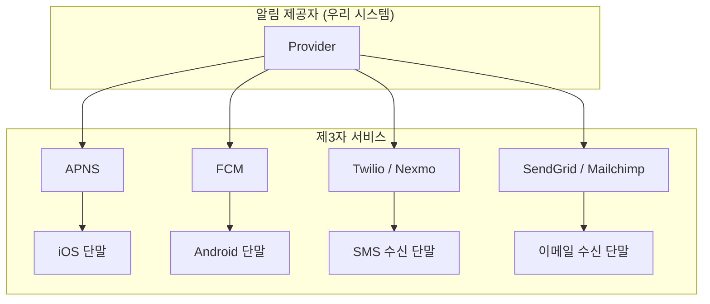
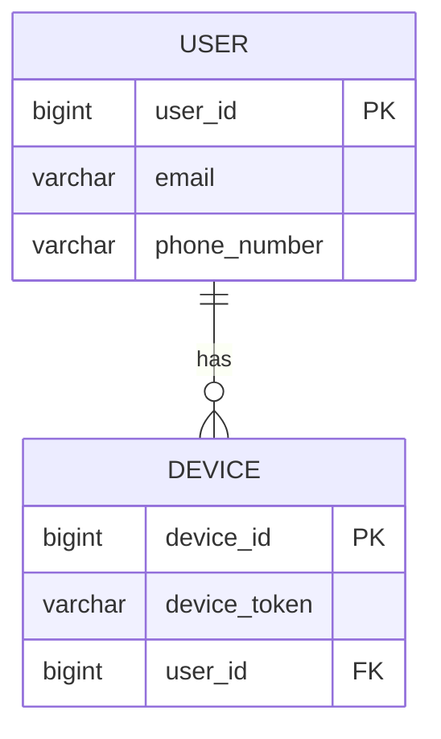
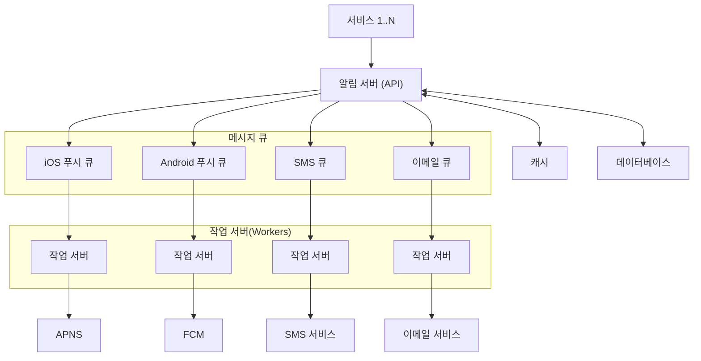
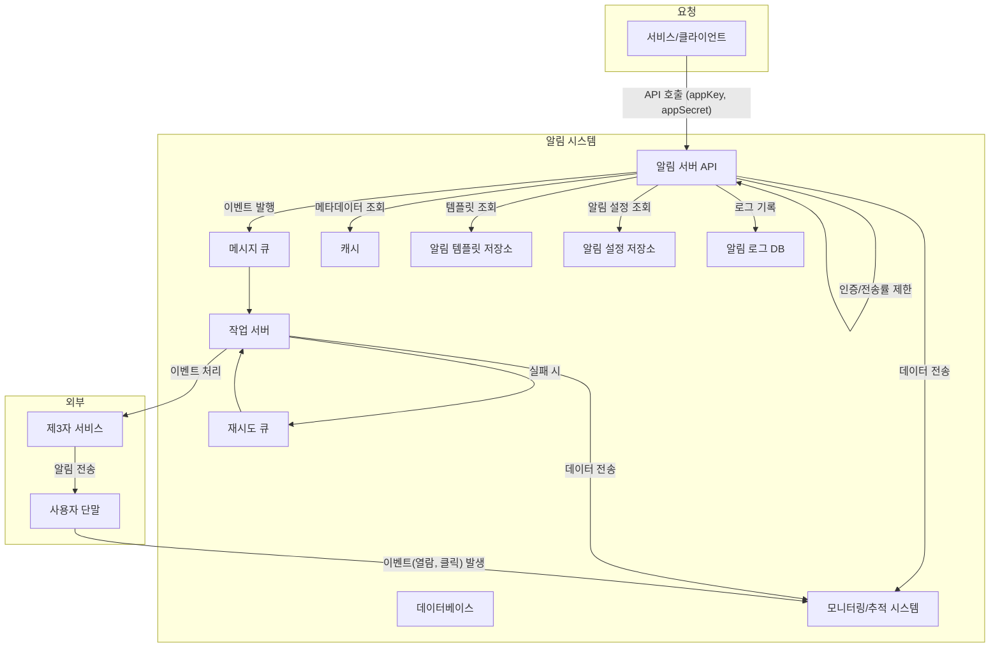

# [가면사배 시리즈 #10] 알림 시스템 설계

## 📖 책 소개

**제목**: 가상 면접 사례로 배우는 대규모 시스템 설계 기초  
**10장**: 알림 시스템 설계  
**핵심 주제**: 푸시 알림, SMS, 이메일을 모두 지원하는 대규모 분산 알림 시스템의 아키텍처, 안정성 및 확장성 설계 전략

## 🎯 학습 목표

- 다양한 알림 유형(푸시, SMS, 이메일)의 동작 원리와 외부 서비스(APNS, FCM 등) 연동 방법 이해
- 대규모 알림 시스템의 요구사항(실시간성, 확장성, 안정성) 정의
- 메시지 큐를 활용하여 컴포넌트 간 결합도를 낮춘 비동기 아키텍처 설계
- 데이터 손실 및 중복 전송 방지를 통해 시스템의 안정성을 확보하는 방법 학습
- 알림 템플릿, 사용자 설정, 전송률 제한, 모니터링 등 시스템의 완성도를 높이는 주요 기능 설계

## 1️⃣ 단계: 문제 이해 및 설계 범위 확정

알림 시스템은 사용자에게 최신 정보(뉴스, 업데이트, 이벤트 등)를 비동기적으로 전달하는 핵심 기능입니다. 효과적인 설계를 위해 요구사항을 명확히 해야 합니다.

### 요구사항
- **지원 알림 유형**: 모바일 푸시 알림 (iOS, Android), SMS 메시지, 이메일
- **성능 요구사항**: 연성 실시간(Soft Real-time). 약간의 지연은 허용되나 가능한 한 빨리 전달되어야 함.
- **지원 단말**: iOS, Android, 웹/데스크톱
- **기능 요구사항**: 클라이언트 및 서버에서 알림 생성 가능, 사용자의 수신 거부(Opt-out) 기능 지원
- **처리 규모 (일일)**:
  - 모바일 푸시: 1,000만 건
  - SMS: 100만 건
  - 이메일: 500만 건

## 2️⃣ 단계: 개략적 설계안

### 알림 유형별 지원 방안
각 알림 유형은 일반적으로 제3자 서비스(3rd-party services)를 통해 발송됩니다. 우리 시스템은 이 서비스들과 연동하는 '알림 제공자' 역할을 합니다.

- **iOS 푸시**: Apple Push Notification Service (APNS) 사용
- **Android 푸시**: Firebase Cloud Messaging (FCM) 사용
- **SMS**: Twilio, Nexmo 등 전문 SMS 서비스 이용
- **이메일**: SendGrid, Mailchimp 등 대량 메일 발송 서비스 이용

> **💡 글로벌 서비스 참고**: 제3자 서비스 선택 시에는 지역적/정치적 제약을 고려해야 합니다. 예를 들어, FCM은 중국에서 사용할 수 없으므로, 중국 시장을 대상으로는 JPush, PushY 같은 별도의 서비스를 이용해야 합니다.

### 연락처 정보 수집
알림을 보내려면 사용자의 단말 토큰, 전화번호, 이메일 주소 등이 필요합니다. 이 정보는 사용자가 앱을 설치하거나 회원가입 시 수집하여 DB에 저장합니다.

- **핵심 고려사항**: 한 명의 사용자가 여러 단말(모바일, 태블릿, PC 등)을 가질 수 있으므로, `USER`와 `DEVICE` 테이블을 분리합니다. 이를 통해 특정 사용자에게 알림을 보낼 때, 해당 사용자와 연결된 모든 단말에 알림을 전송할 수 있습니다.

### 초기 설계안과 문제점
하나의 서버로 모든 로직을 처리하는 중앙 집중형 시스템을 생각해볼 수 있습니다.

- **문제점**:
  1.  **단일 장애점 (SPOF)**: 해당 서버에 장애 발생 시 전체 시스템이 중단됩니다.
  2.  **규모 확장성 한계**: DB, 캐시 등 특정 컴포넌트만 개별적으로 확장하기 어렵습니다.
  3.  **성능 병목**: 알림 페이로드 생성, 외부 서비스 응답 대기 등 자원 소모가 많은 작업이 몰리면 시스템이 과부하에 빠질 수 있습니다.

### 개선된 설계: 메시지 큐 도입
위 문제들을 해결하기 위해, 시스템 컴포넌트 간의 결합도를 낮추는 메시지 큐 기반의 비동기 아키텍처를 도입합니다.

- **알림 서버**: 외부 요청을 받는 API 서버. 사용자 정보 조회, 알림 검증 후 메시지 큐에 이벤트를 발행하는 역할만 수행하여 가볍게 유지합니다.
- **메시지 큐**: 알림 유형별로 큐를 분리하여 특정 서비스 장애가 다른 알림에 영향을 주지 않도록 격리합니다. 시스템의 버퍼 역할을 수행하여 트래픽 급증에 대응합니다.
- **작업 서버 (Workers)**: 각 큐에서 알림 이벤트를 꺼내 실제 발송을 담당하는 제3자 서비스로 전달하는 역할을 수행합니다. 이 부분만 수평적으로 확장하여 대규모 발송을 처리할 수 있습니다.

## 3️⃣ 단계: 상세 설계

### 안정성 (Reliability)

- **데이터 손실 방지**: 어떤 상황에서도 알림이 소실되지 않도록, 생성된 알림 이벤트를 DB(**알림 로그**)에 먼저 기록합니다. 작업 서버는 전송 실패 시 이 로그를 바탕으로 재시도할 수 있습니다.

- **중복 전송 방지**: 분산 시스템에서는 '정확히 한 번 전달(Exactly-once delivery)'을 보장하기 어렵습니다. 중복을 최소화하기 위해, 알림 이벤트에 **고유 ID**를 부여하고, 작업 서버가 이벤트를 처리하기 전에 ID를 확인하여 이미 처리된 이벤트는 무시하는 방식을 사용합니다.

### 추가 컴포넌트 및 고려사항

- **알림 템플릿**: 반복되는 알림 형식을 템플릿으로 만들어 메시지 생성 과정을 단순화하고 일관성을 유지합니다. (`안녕하세요, [사용자명]님! [상품명]이 재입고되었습니다.`)

- **알림 설정**: 사용자가 채널별(푸시, SMS, 이메일)로 알림 수신 여부를 선택(opt-in/out)할 수 있는 기능을 제공하고, 발송 전 반드시 이 설정을 확인합니다.

- **전송률 제한 (Rate Limiting)**: 사용자 피로도를 방지하고 시스템 남용을 막기 위해, 특정 기간 동안 한 사용자가 받을 수 있는 알림의 빈도를 제한합니다.

- **재시도 메커니즘**: 제3자 서비스가 일시적으로 불안정하여 발송에 실패한 경우, 해당 알림을 별도의 **재시도 큐**에 넣어 지수 백오프(Exponential Backoff)와 같은 전략으로 다시 시도합니다.

- **보안**: `appKey`, `appSecret` 등을 활용한 API 인증을 통해 인가된 클라이언트만이 알림을 보낼 수 있도록 합니다.

- **모니터링 및 이벤트 추적**: 
  - **큐 모니터링**: 메시지 큐에 쌓인 이벤트 수(Queue Depth)를 모니터링하여, 지연이 발생하면 작업 서버를 증설하는 등 신속하게 대응합니다.
  - **이벤트 추적**: 알림 확인율(Open Rate), 클릭률(Click-through Rate) 등 사용자 행동 데이터를 수집/분석하여 알림의 효과를 측정하고 서비스를 개선하는 데 활용합니다. 더 나아가, 사용자가 알림을 통해 실제 구매나 특정 행동으로 이어지는 **전환율(Conversion Rate)**까지 추적하여 비즈니스 기여도를 정량적으로 파악할 수 있습니다.

### 최종 설계안

## 🤔 토론 주제

### 기술적 관점
1.  **실시간성 강화**: 현재의 연성 실시간 시스템보다 더 엄격한 실시간성이 요구된다면(예: 1초 내외 딜레이), 아키텍처의 어느 부분을 어떻게 개선해야 할까요? (큐 대신 직접 호출, 프로토콜 변경 등)
2.  **메시지 큐 선택**: 대규모 알림 시스템에 적합한 메시지 큐로 RabbitMQ와 Kafka 중 어떤 것이 더 적합할까요? 각 기술의 장단점은 무엇일까요?
3.  **중복과 순서**: 알림의 '중복'과 '순서 변경' 중 사용자 경험에 더 치명적인 것은 무엇이며, 이를 방지하기 위한 기술적 트레이드오프는 무엇일까요?

### 실무 및 비즈니스 관점
1.  **사용자 경험**: 사용자가 알림을 스팸으로 느끼지 않게 하면서도 비즈니스 목표를 달성할 수 있는 최적의 알림 발송 전략은 무엇일까요?
2.  **비용 최적화**: 수많은 제3자 서비스(SMS, 이메일) 이용 비용을 절감하기 위해, 특정 조건에서는 푸시 알림으로 대체 발송하는 동적 채널 선택 로직을 어떻게 구현할 수 있을까요?
3.  **A/B 테스팅**: 어떤 문구와 형식의 알림이 더 높은 클릭률을 보이는지 테스트하고 싶다면, 현재 아키텍처에 어떤 기능을 추가해야 할까요?

## 📚 추가 학습 자료

- **제3자 서비스 문서**: Twilio, SendGrid, APNS, FCM 공식 개발자 문서
- **메시지 큐**: RabbitMQ, Apache Kafka 등 메시지 브로커의 동작 원리
- **관련 개념**: Exactly-Once Delivery의 어려움, 분산 시스템의 재시도 패턴
- **모니터링 도구**: Datadog, Prometheus 등을 활용한 큐 모니터링 방법

## 🎯 핵심 메시지

> "대규모 알림 시스템의 핵심은 **메시지 큐를 통한 비동기 처리**와 **컴포넌트 간 결합도 최소화**에 있다. 안정적인 서비스를 위해서는 단순 전송 기능을 넘어, **안정성, 보안, 사용자 설정, 모니터링** 등 운영 전반을 고려한 종합적인 설계가 필수적이다."