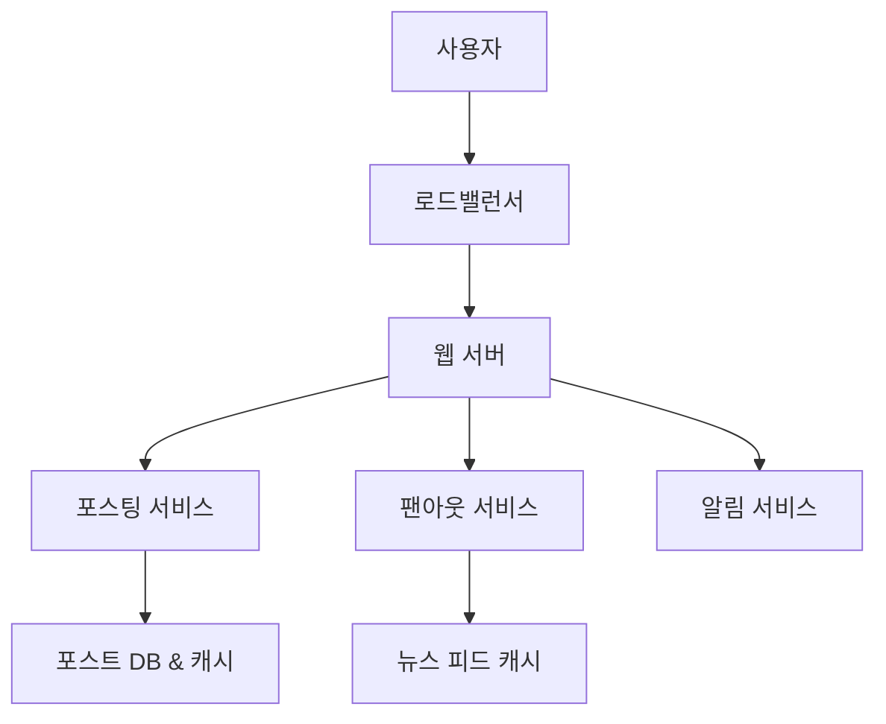
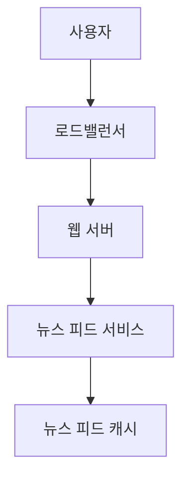
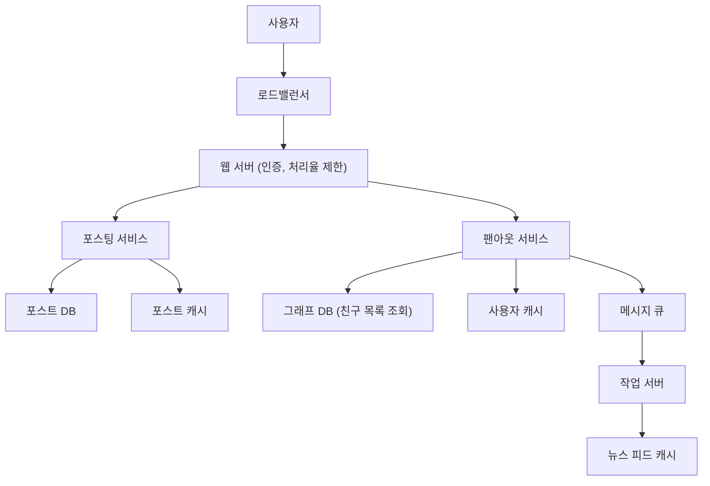
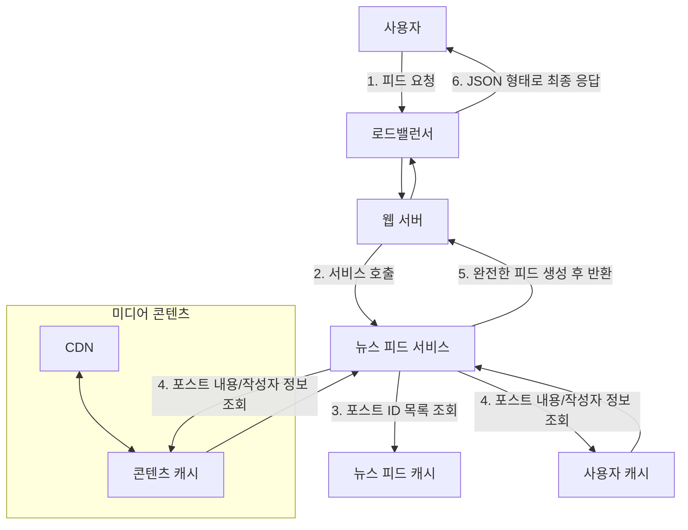
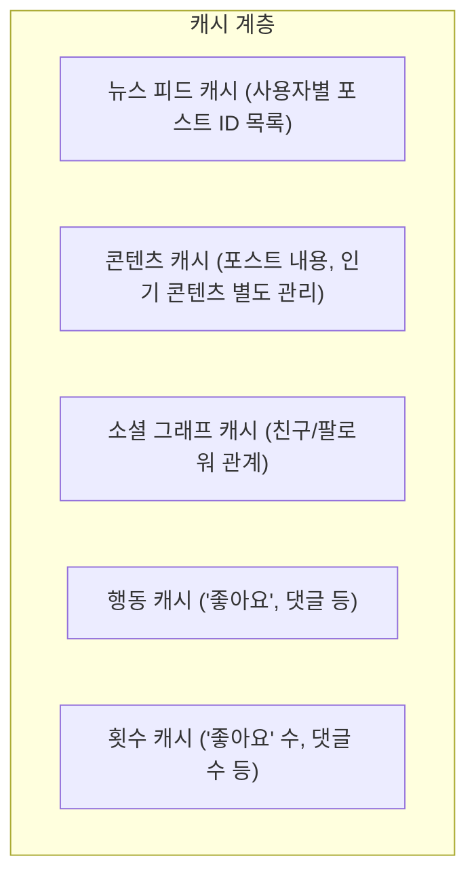

# [가면사배 시리즈 #11] 뉴스 피드 시스템 설계

## 📖 책 소개

**제목**: 가상 면접 사례로 배우는 대규모 시스템 설계 기초  
**11장**: 뉴스 피드 시스템 설계  
**핵심 주제**: 뉴스 피드 시스템의 두 가지 주요 흐름(피드 발행, 피드 생성)과 그에 따른 아키텍처 설계, 그리고 확장성 및 성능 최적화 전략

## 🎯 학습 목표

- 뉴스 피드 시스템의 기능 및 비기능적 요구사항 정의 및 개략적 규모 추정
- 피드 발행(Fan-out on write)과 피드 생성(Fan-out on read) 모델의 아키텍처, 장단점, 트레이드오프 분석
- 두 모델을 결합한 하이브리드 접근법과 핫키(hotkey) 문제 해결 방안 학습
- 대규모 읽기/쓰기 트래픽을 처리하기 위한 캐시, 데이터베이스, 비동기 메시지 큐, CDN 활용법 이해
- 안정 해시, 데이터 다중화, 샤딩 등 시스템 확장 전략 논의

## 1️⃣ 단계: 문제 이해 및 설계 범위 확정

뉴스 피드 시스템은 페이스북, 인스타그램, 트위터 타임라인 등 소셜 미디어의 핵심 기능입니다. 설계에 앞서 질문을 통해 요구사항을 명확히 해야 합니다.

### 요구사항
- **지원 플랫폼**: 모바일 앱과 웹 모두 지원
- **핵심 기능**: 새 포스트(스토리) 작성, 친구들의 포스트로 구성된 뉴스 피드 조회
- **피드 정렬**: 시간 역순 (최신 포스트가 가장 위에 표시)
- **사용자 규모**: 일일 능동 사용자(DAU) 1,000만 명
- **소셜 관계**: 한 사용자는 최대 5,000명의 친구를 가질 수 있음
- **콘텐츠 유형**: 텍스트, 이미지, 비디오 등 미디어 파일 포함

## 2️⃣ 단계: 개략적 설계안

시스템은 크게 **피드 발행**과 **뉴스 피드 생성**의 두 가지 흐름으로 나뉩니다.

### API 엔드포인트
- **피드 발행**: `POST /v1/me/feed`
  - 사용자가 새 포스트를 작성할 때 호출하는 API입니다.
  - `body`에는 포스트 내용이, `Authorization` 헤더에는 인증 토큰이 포함됩니다.
- **피드 조회**: `GET /v1/me/feed`
  - 사용자가 자신의 뉴스 피드를 불러올 때 호출하는 API입니다.

### 피드 발행 흐름 (개략적)
사용자가 포스트를 올리면, 시스템은 이를 데이터베이스와 캐시에 저장하고 친구들의 뉴스 피드에 전송합니다.

- **포스팅 서비스**: 새 포스트를 DB와 캐시에 저장합니다.
- **팬아웃 서비스**: 새 포스트를 친구들의 뉴스 피드에 푸시합니다.
- **알림 서비스**: 친구들에게 새 포스트 알림을 보냅니다.

### 뉴스 피드 생성 흐름 (개략적)
사용자가 뉴스 피드를 요청하면, 시스템은 캐시된 피드 데이터를 가져와 빠르게 반환합니다.

- **뉴스 피드 서비스**: 캐시에서 뉴스 피드를 가져오는 역할을 담당합니다.
- **뉴스 피드 캐시**: 렌더링에 필요한 포스트 ID 목록을 보관하여 빠른 조회를 지원합니다.

## 3️⃣ 단계: 상세 설계

### 피드 발행 흐름 상세 설계

#### 웹 서버
- 클라이언트와의 통신 외에 **인증**을 통해 올바른 사용자만 포스팅할 수 있도록 하고, **처리율 제한(Rate Limiting)**을 통해 스팸이나 악의적인 콘텐츠 도배를 방지합니다.

#### 포스팅 전송 (팬아웃) 전략
팬아웃은 한 사용자의 포스트를 모든 친구에게 전달하는 과정입니다. 여기에는 두 가지 모델이 있습니다.

- **쓰기 시점 팬아웃 (Push 모델)**
  - **동작**: 포스트 작성 시점에 모든 친구의 뉴스 피드 캐시를 갱신합니다.
  - **장점**: 피드 읽기 요청 시 이미 계산된 결과가 있어 매우 빠릅니다. 실시간 업데이트에 가깝습니다.
  - **단점**: 친구가 많은 사용자(유명인)의 경우, 수천~수만 명의 피드를 갱신해야 하므로 쓰기 부하가 막대합니다 (이를 **핫키(hotkey) 문제**라 합니다). 또한, 서비스를 잘 이용하지 않는 비활성 사용자의 피드까지 갱신하므로 자원이 낭비됩니다.

- **읽기 시점 팬아웃 (Pull 모델)**
  - **동작**: 사용자가 피드를 읽는 시점에 친구 목록을 가져와 각 친구의 포스트를 조합하여 피드를 생성합니다.
  - **장점**: 쓰기 부하가 적고, 비활성 사용자에게 불필요한 자원을 낭비하지 않습니다. 핫키 문제가 발생하지 않습니다.
  - **단점**: 피드를 읽을 때마다 복잡한 연산을 수행해야 하므로 지연 시간이 길어집니다.

- **하이브리드 접근법 (최종 선택)**
  - 두 모델의 장점을 결합합니다.
  - **일반 사용자**: 친구 수가 적으므로 **Push 모델**을 사용해 빠른 읽기 속도를 보장합니다.
  - **유명인 (Celebrity)**: 친구/팔로워가 매우 많은 사용자는 **Pull 모델**을 사용해 쓰기 부하(핫키 문제)를 방지합니다. 팔로워들이 피드 요청 시 해당 유명인의 포스트를 직접 가져와 조합합니다.

#### 팬아웃 서비스 동작 상세
1.  **친구 목록 조회**: **그래프 데이터베이스**(친구 관계 관리에 최적화)에서 포스트 작성자의 친구 ID 목록을 가져옵니다.
2.  **친구 정보 필터링**: **사용자 캐시**에서 친구들의 정보를 조회하고, 사용자 설정(예: 특정 친구의 글 보지 않기)에 따라 최종적으로 포스트를 받을 친구 목록을 필터링합니다.
3.  **큐에 작업 추가**: 친구 목록과 새 포스트의 ID를 **메시지 큐**에 넣습니다. 메시지 큐는 팬아웃 작업이 실패하더라도 재시도를 보장하는 버퍼 역할을 합니다.
4.  **피드 캐시 갱신**: **작업 서버(Worker)**가 큐에서 작업을 꺼내 각 친구의 **뉴스 피드 캐시**에 `<포스트 ID, 사용자 ID>` 쌍을 추가합니다. 뉴스 피드 캐시는 메모리 사용량을 줄이기 위해 포스트의 전체 내용이 아닌 ID만 저장합니다.

### 피드 읽기 흐름 상세 설계

1.  사용자가 뉴스 피드를 요청합니다 (`GET /v1/me/feed`).
2.  웹 서버는 뉴스 피드 서비스를 호출합니다.
3.  뉴스 피드 서비스는 **뉴스 피드 캐시**에서 해당 사용자의 피드에 포함될 포스트 ID 목록을 가져옵니다.
4.  가져온 ID 목록을 기반으로 **콘텐츠 캐시**와 **사용자 캐시**에서 포스트 내용, 작성자 이름, 프로필 사진 등 렌더링에 필요한 모든 데이터를 조회합니다. (이미지, 비디오 등 미디어 파일은 **CDN**을 통해 제공되어 로딩 속도를 높입니다.)
5.  모든 정보를 조합하여 완전한 뉴스 피드를 생성하고 사용자에게 JSON 형태로 반환합니다.

### 캐시 구조
효율적인 읽기 성능을 위해 캐시를 여러 계층으로 분리합니다.

## 4️⃣ 단계: 마무리 및 추가 논의사항

- **데이터베이스 규모 확장**: 읽기 부하 분산을 위한 **주-부 다중화(Master-Slave Replication)**, 쓰기 부하 분산을 위한 **샤딩(Sharding)** 전략을 적용할 수 있습니다.
- **무상태 웹 계층**: 웹 서버가 상태 정보를 갖지 않도록 설계하여, 트래픽에 따라 서버 수를 자유롭게 늘리거나 줄이는 **수평적 확장**을 용이하게 합니다.
- **핵심 메트릭 모니터링**: QPS, 피드 생성 지연 시간, 캐시 히트율 등을 모니터링하여 시스템 상태를 파악하고 병목 지점을 개선합니다.

## 🤔 토론 주제

1.  **팬아웃 전략**: 유명인(celebrity)을 판별하는 기준은 무엇이며, Push 모델과 Pull 모델을 전환하는 로직을 어떻게 구현할 수 있을까요?
2.  **데이터 일관성**: 사용자가 포스트를 올린 직후 친구의 피드에 즉시 보이지 않는 경우(결과적 일관성) 사용자 경험에 어떤 영향을 미칠까요? 이를 최소화할 방법은 무엇일까요?
3.  **저장소 선택**: 친구 관계를 저장하는 데 관계형 데이터베이스 대신 그래프 데이터베이스를 사용하는 이유는 무엇일까요?

## 📚 추가 학습 자료

- **TAO**: Facebook's Distributed Data Store for the Social Graph
- **안정 해시**: 5장 스터디 자료 복습
- **메시지 큐**: RabbitMQ, Kafka 등 메시지 브로커 기술
- **캐시 솔루션**: Redis, Memcached

## 🎯 핵심 메시지

> "대규모 뉴스 피드 시스템의 핵심은 **읽기 성능 최적화**에 있다. 이를 위해 **쓰기 시점 팬아웃(Push)**과 **읽기 시점 팬아웃(Pull)** 전략을 적절히 조합하고, 여러 계층의 **캐시**를 적극적으로 활용하여 지연 시간을 최소화해야 한다."