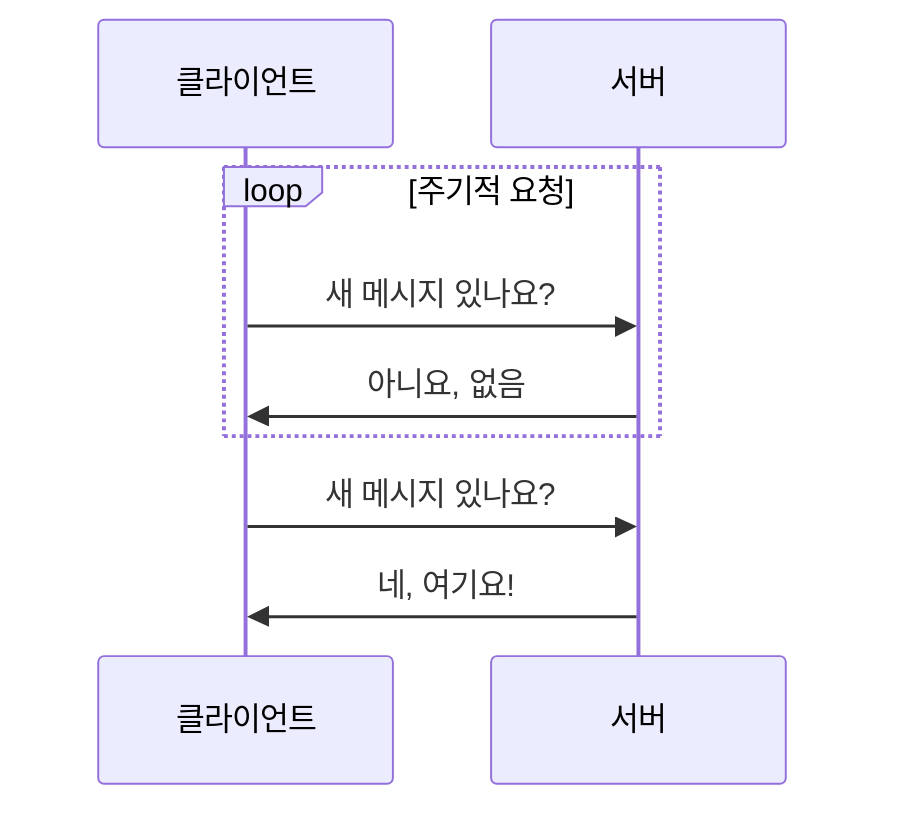
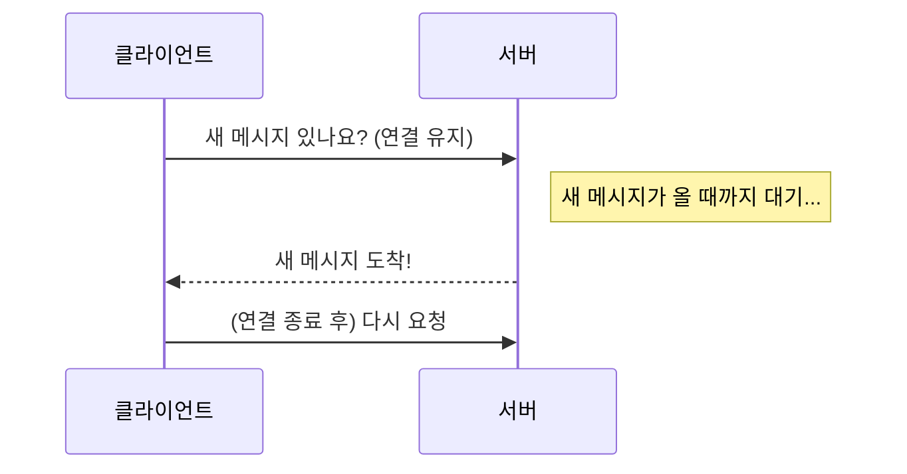
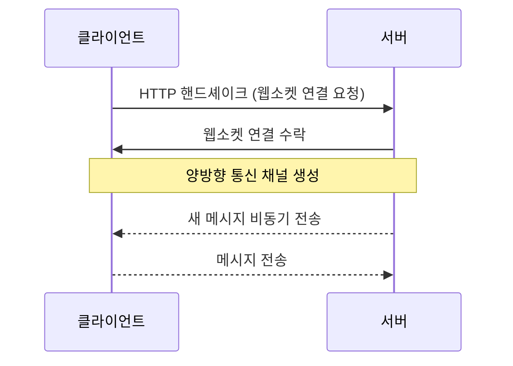
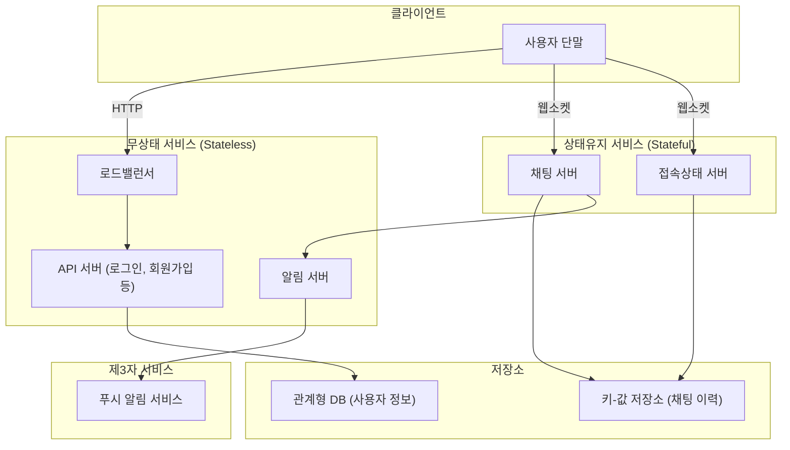
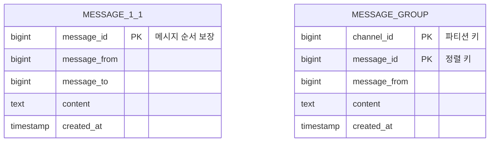
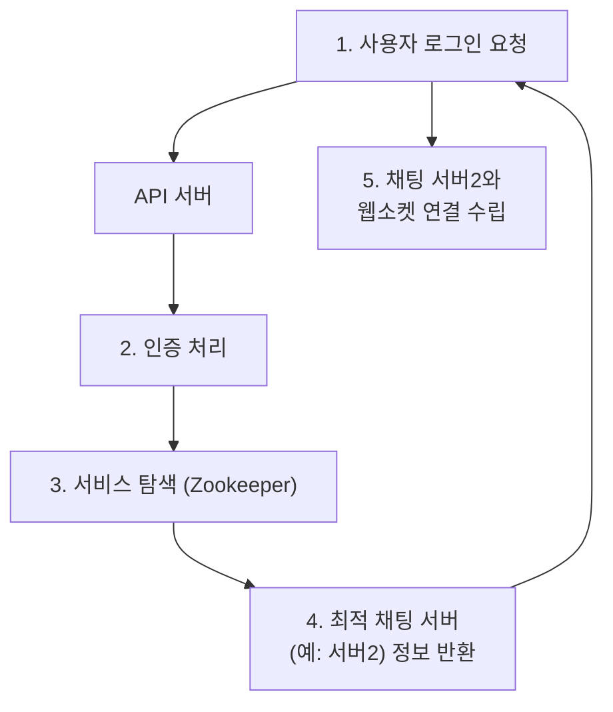
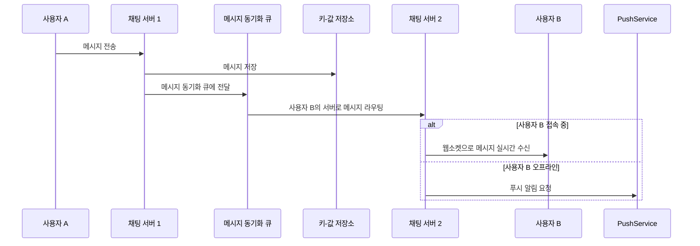

> 발표자: 길현준

---

# [가면사배 시리즈 #12] 채팅 시스템 설계

## 📖 책 소개

**제목**: 가상 면접 사례로 배우는 대규모 시스템 설계 기초  
**12장**: 채팅 시스템 설계  
**핵심 주제**: 1:1 채팅과 그룹 채팅을 모두 지원하는 대규모 분산 채팅 시스템 설계. 웹소켓 기반 실시간 통신, 서비스 탐색, 접속상태 관리, 메시지 동기화 등 핵심 기능 구현 전략

## 🎯 학습 목표

- 채팅 시스템의 통신 프로토콜(폴링, 롱폴링, 웹소켓) 비교 및 선택
- 상태유지(Stateful) 서비스와 무상태(Stateless) 서비스를 분리한 아키텍처 설계
- 대규모 메시지 저장을 위한 데이터 모델링 및 키-값 저장소 활용법 학습
- 서비스 탐색, 메시지 흐름, 사용자 접속상태 관리 등 핵심 컴포넌트의 상세 설계
- 여러 단말 간의 메시지 동기화 문제 해결 방안 이해

## 1️⃣ 단계: 문제 이해 및 설계 범위 확정

채팅 시스템은 1:1 채팅, 그룹 채팅, 업무용 메신저 등 다양한 형태가 존재하므로, 설계에 앞서 요구사항을 명확히 해야 합니다.

### 요구사항
- **핵심 기능**: 1:1 채팅, 그룹 채팅(최대 100명), 사용자 접속상태 표시
- **지원 플랫폼**: 모바일 앱 및 웹
- **사용자 규모**: 일일 능동 사용자(DAU) 5,000만 명
- **메시지 제약**: 텍스트만 지원 (최대 100,000자)
- **저장**: 채팅 이력은 영구적으로 보관
- **기타**: 여러 단말 동시 접속 지원, 푸시 알림

## 2️⃣ 단계: 개략적 설계안

### 통신 프로토콜 선택
클라이언트와 서버 간의 실시간 양방향 통신이 필수적입니다. 메시지 수신을 위해 클라이언트가 서버로부터 응답을 받는 방법을 중심으로 각종 프로토콜을 비교합니다.

#### 폴링 (Polling)
클라이언트가 주기적으로 서버에 새 메시지가 있는지 묻는 방식입니다.

- **단점**: 불필요한 요청이 많아 비효율적이며, 메시지 수신에 지연이 발생할 수 있습니다.

#### 롱 폴링 (Long Polling)
클라이언트는 서버에 요청을 보내고, 서버는 새 메시지가 생길 때까지 연결을 유지하다가 메시지가 생기면 응답합니다.

- **단점**: 메시지를 보내는 클라이언트와 받는 클라이언트가 다른 서버에 연결될 수 있고, 타임아웃마다 불필요한 재연결이 발생합니다.

#### 웹소켓 (WebSocket)
클라이언트와 서버 간에 양방향 통신 채널을 한 번만 생성하고 계속 유지합니다.

- **장점**: 실시간 양방향 통신에 가장 적합하며, HTTP/HTTPS 기본 포트를 사용해 방화벽 환경에서도 잘 동작합니다.
- **결정**: 메시지 송수신에는 **웹소켓**을 사용하고, 회원가입, 로그인 등 일반적인 기능에는 **HTTP**를 사용합니다.

### 고수준 아키텍처
시스템을 크게 무상태 서비스, 상태유지 서비스, 제3자 서비스로 나눕니다.

- **무상태 서비스**: 로그인, 회원가입, 프로필 관리 등 일반적인 요청/응답을 처리합니다.
- **상태유지 서비스**: 채팅 서버가 각 클라이언트와 웹소켓 연결을 항시 유지하여 실시간 통신을 담당합니다.
- **제3자 서비스**: 푸시 알림(APNS, FCM) 발송을 담당합니다.

### 저장소 설계
- **사용자 정보, 친구 목록 등**: 안정성이 중요한 일반 데이터는 **관계형 데이터베이스**에 저장합니다.
- **채팅 이력**: 방대한 양(일 600억 메시지 이상)과 빠른 읽기/쓰기 요구사항, 그리고 거의 조회되지 않는 오래된 메시지(**롱테일 데이터**)까지 효율적으로 처리해야 하므로 **키-값 저장소**(예: Cassandra, HBase)에 저장합니다.

#### 데이터 모델

- **메시지 ID(`message_id`)**: 메시지의 순서를 보장해야 하므로, 시간 순으로 정렬 가능한 고유 ID가 필요합니다. ID 생성 전략은 다음과 같이 다양하게 고려할 수 있습니다.
  1. **RDBMS의 `auto_increment`**: 구현이 간단하지만, 분산 환경의 NoSQL에서는 사용하기 어렵습니다.
  2. **전역적 순서 번호 생성기 (예: 스노플레이크)**: 시스템 전체에서 고유하고 정렬 가능한 ID를 생성합니다. 가장 보편적인 해결책입니다. (7장 참고)
  3. **지역적 순서 번호 생성기**: ID의 고유성을 특정 채널(채팅방) 내에서만 보장합니다. 구현이 비교적 간단하다는 장점이 있습니다.

## 3️⃣ 단계: 상세 설계

### 서비스 탐색 (Service Discovery)
클라이언트가 접속할 최적의 채팅 서버를 어떻게 찾을까요? (지리적 위치, 서버 부하 고려)

- 서비스 탐색 기능(예: Apache Zookeeper)이 현재 접속 가능한 채팅 서버 목록을 관리하며, 클라이언트에게 가장 적합한 서버의 주소를 알려줍니다.

### 메시지 흐름

#### 1:1 채팅 흐름

#### 여러 단말 간 메시지 동기화
사용자가 여러 단말기(PC, 모바일)를 사용할 경우, 각 단말은 마지막으로 받은 메시지의 ID(`cur_max_message_id`)를 로컬에 저장하고 추적합니다. 새 단말에서 접속 시, `cur_max_message_id` 이후의 메시지만을 서버에 요청하여 동기화합니다.

#### 그룹 채팅 흐름
소규모 그룹(100명 이하)에서는 한 사용자가 보낸 메시지를 그룹에 속한 모든 멤버의 **메시지 동기화 큐(수신함)**에 각각 복사하여 넣는 팬아웃(Fan-out) 방식을 사용합니다. 각 사용자는 자신의 큐만 확인하면 되므로 효율적입니다.

### 사용자 접속상태 표시
- **로그인/로그아웃**: 접속상태 서버(Presence Server)가 사용자의 상태(`online`/`offline`)와 마지막 접속 시간을 키-값 저장소에 기록합니다.
- **접속 장애**: 클라이언트가 주기적으로 **박동(heartbeat)** 이벤트를 서버로 보내 연결 유지를 알립니다. 일정 시간 박동이 없으면 서버는 해당 클라이언트를 오프라인으로 간주합니다.
- **상태 정보 전송**: 친구의 상태 변경을 알리기 위해 **발행-구독(Pub-Sub)** 모델을 사용합니다. 각 사용자 쌍(친구 관계)에 대한 채널을 만들어 상태 변경을 발행하고, 친구들이 이를 구독하여 실시간으로 업데이트를 받습니다.

## 4️⃣ 단계: 마무리 및 추가 논의사항

- **미디어 파일 지원**: 사진, 비디오 등 대용량 파일은 별도의 객체 저장소(예: S3)에 저장하고, 메시지에는 해당 파일의 URL만 포함시킵니다. CDN을 연동하여 전송 속도를 높일 수 있습니다.
- **종단 간 암호화**: 발신자와 수신자 외에는 아무도 메시지를 읽을 수 없도록 암호화합니다. 이 경우 서버 측 기능(검색 등)에 제약이 생깁니다.
- **오류 처리**: 채팅 서버 장애 시, 서비스 탐색 기능이 클라이언트에게 새로운 서버를 배정하여 재접속하도록 유도합니다. 메시지 전송 실패 시에는 재시도 큐를 활용하여 안정성을 높입니다.

## 🤔 토론 주제

1.  **메시지 ID 생성**: 전역적으로 순서가 보장되는 ID(스노플레이크)와 채널 내에서만 순서가 보장되는 ID 중 어떤 것이 채팅 시스템에 더 적합할까요?
2.  **상태 정보 전송**: 대규모 그룹(수만 명)에서 모든 사용자의 접속 상태를 실시간으로 전파하는 것은 비효율적입니다. 이 문제를 어떻게 개선할 수 있을까요?
3.  **웹소켓 vs HTTP/3**: 최신 기술인 HTTP/3와 QUIC 프로토콜이 웹소켓을 대체하여 채팅 시스템의 통신 방식으로 사용될 수 있을까요?

## 📚 추가 학습 자료

- **WebSocket**: 웹소켓 프로토콜(RFC 6455) 상세 명세
- **Apache Zookeeper**: 분산 코디네이션 서비스
- **키-값 저장소**: Amazon DynamoDB, Apache Cassandra 기술 백서
- **관련 논문**: "How Discord Stores Billions of Messages"

## 🎯 핵심 메시지

> "대규모 채팅 시스템의 핵심은 **웹소켓을 통한 실시간 양방향 통신**과 **상태유지/무상태 서비스의 분리**에 있다. 수평적 확장이 가능한 **키-값 저장소**를 데이터 계층으로 활용하고, **서비스 탐색**, **발행-구독**, **박동** 등의 패턴을 적용하여 안정성과 확장성을 모두 확보해야 한다."