> 발표자: 길현준

---

# [가면사배 시리즈 #13] 검색어 자동완성 시스템

## 📖 책 소개

- **제목**: 가상 면접 사례로 배우는 대규모 시스템 설계 기초
- **장**: 13장 - 검색어 자동완성 시스템
- **핵심 주제**: 트라이(Trie) 자료구조를 활용한 대규모 검색어 자동완성 시스템 설계

구글이나 아마존 검색창에 단어를 입력하면 자동으로 검색어가 완성되는 기능, 우리는 이를 당연하게 여기지만 그 뒤에는 정교한 시스템 설계가 숨어 있습니다. 이번 장에서는 가장 많이 이용된 검색어 k개를 자동완성하여 출력하는 시스템을 설계해봅니다.

## 🎯 학습 목표

이번 장을 통해 다음 내용을 학습합니다:

1. **요구사항 도출 및 규모 추정**: 100ms 이내 응답속도를 목표로 하는 시스템의 규모를 추정하고 요구사항을 명확히 정의하는 방법
2. **트라이(Trie) 자료구조**: 문자열 검색에 최적화된 트라이 자료구조의 동작 원리와 두 가지 핵심 최적화 기법
3. **데이터 수집 서비스**: 로그 취합부터 트라이 구축까지의 비동기 배치 처리 아키텍처
4. **질의 서비스**: AJAX, 브라우저 캐싱, 데이터 샘플링을 활용한 고성능 질의 처리
5. **저장소 샤딩 전략**: 알파벳 기반 샤딩에서 패턴 분석 기반 샤딩으로의 발전

## 1️⃣ 단계: 문제 이해 및 설계 범위 확정

### 요구사항 정리

면접에서 명확히 해야 할 핵심 질문들:
- 사용자 입력은 검색어의 **첫 부분**으로 한정
- 자동완성 검색어는 **5개**
- 선정 기준은 **질의 빈도(인기 순위)**
- 맞춤법 검사나 자동수정은 **미지원**
- 영어만 지원 (다국어 지원은 확장 고려사항)
- 모든 질의는 **영어 소문자**로 가정
- 일간 능동 사용자(DAU) **1,000만 명**

시스템이 만족해야 할 요구사항:

| 요구사항 | 설명 | 기준치 |
|---------|------|--------|
| 빠른 응답 속도 | 사용자가 입력함에 따라 즉시 표시 | 100ms 이내 (Facebook 기준) |
| 연관성 | 입력한 단어와 연관된 검색어 출력 | 접두어 일치 |
| 정렬 | 인기도 등 순위 모델에 의한 정렬 | popularity 기반 |
| 규모 확장성 | 많은 트래픽 처리 가능 | 수평 확장 가능 |
| 고가용성 | 일부 장애에도 서비스 지속 | 99.9% 가용성 |

### 개략적 규모 추정

```
📊 트래픽 추정
- DAU: 10,000,000 (천만 명)
- 1인당 하루 검색 횟수: 10회
- 1회 검색당 평균 입력 문자: 20바이트 (4단어 × 5글자 = 20자, ASCII 기준)
- 1회 검색당 요청 수: 20회 (각 글자 입력마다 요청 발생)
  예: "dinner" 입력 시 → d, di, din, dinn, dinne, dinner (6회 요청)

🔢 QPS 계산
- 평균 QPS = 10,000,000 × 10 × 20 / 86,400 ≈ 24,000
- 최대 QPS (피크 타임 2배 가정) ≈ 48,000

💾 저장소 추정
- 신규 검색어 비율: 20%
- 일일 신규 데이터 = 10,000,000 × 10 × 20 × 0.2 = 0.4GB/일
```

이 규모에서 핵심은 **48,000 QPS를 100ms 이내로 처리**하는 것입니다.

## 2️⃣ 단계: 개략적 설계안

시스템은 크게 두 부분으로 구성됩니다:

### 시스템 구성 개요

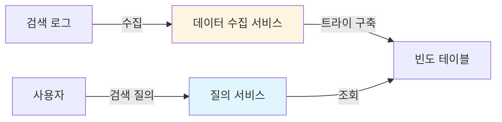

**1. 데이터 수집 서비스(Data Gathering Service)**
- 사용자가 입력한 질의를 실시간으로 수집
- 실제로는 실시간보다 배치 처리가 더 효율적 (상세 설계에서 개선)

**2. 질의 서비스(Query Service)**
- 주어진 질의에 대해 가장 인기 있는 검색어 5개를 정렬하여 반환

### 데이터 수집 서비스

빈도 테이블(Frequency Table) 기반 접근:

| 순서 | 질의 | 테이블 상태 (질의: 빈도) |
|-----|------|----------------------|
| 1 | twitch | twitch: 1 |
| 2 | twitter | twitch: 1, twitter: 1 |
| 3 | twitter | twitch: 1, twitter: 2 |
| 4 | twillo | twitch: 1, twitter: 2, twillo: 1 |

### 질의 서비스 - 초기 SQL 접근

사용자가 "tw"를 입력했을 때 top 5 검색어를 찾는 SQL:

```sql
SELECT * FROM frequency_table
WHERE query LIKE 'prefix%'
ORDER BY frequency DESC
LIMIT 5
```

**문제점**: 데이터가 많아지면 데이터베이스가 병목 → **트라이 자료구조**로 해결

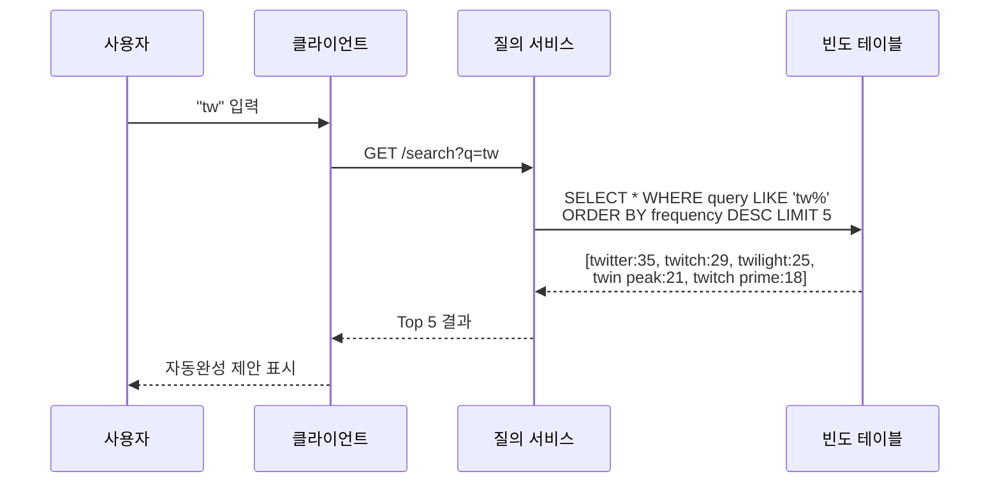

## 3️⃣ 단계: 상세 설계

### 트라이(Trie) 자료구조

트라이는 "retrieval"에서 온 이름으로, 문자열을 효율적으로 저장하고 검색하는 트리 형태의 자료구조입니다.

#### 기본 트라이 구조

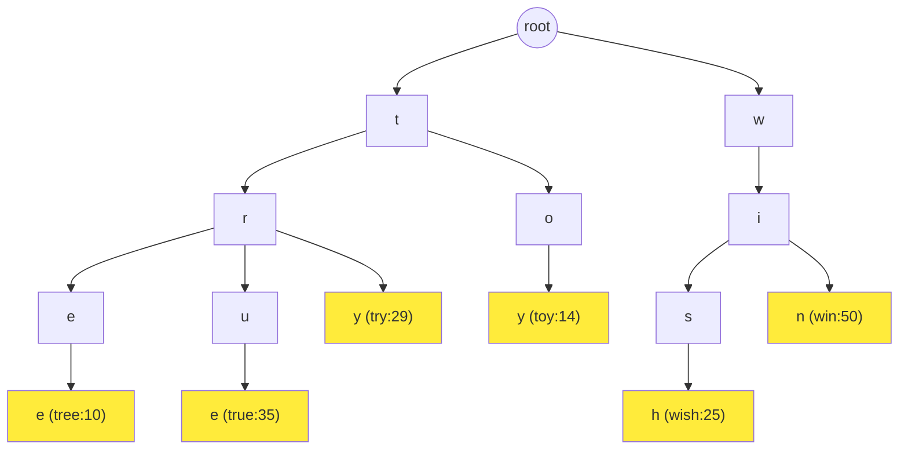

**핵심 특징**:
- 루트 노드는 빈 문자열
- 각 노드는 글자 하나를 저장
- 각 노드는 최대 26개(영어 알파벳) 자식 노드 보유
- 단어의 끝을 나타내는 노드에 빈도 정보 저장

#### 검색어 찾기 알고리즘 (최적화 전)

용어 정의:
- **p**: 접두어 길이
- **n**: 트라이 내 전체 노드 개수
- **c**: 주어진 노드의 자식 노드 개수

알고리즘 단계:
1. 접두어를 표현하는 노드 찾기 → **O(p)**
2. 해당 노드부터 하위 트리 탐색하여 모든 유효 노드 찾기 → **O(c)**
3. 유효 노드들을 정렬하여 top k 선택 → **O(c log c)**

**전체 시간 복잡도: O(p) + O(c) + O(c log c)**

문제: 최악의 경우 **전체 트라이를 탐색**해야 함!

#### 최적화 1: 접두어 최대 길이 제한

사용자가 매우 긴 검색어를 입력하는 경우는 드뭅니다. 접두어 최대 길이를 50자로 제한하면:
- O(p) → **O(1)** (작은 상수값)

#### 최적화 2: 각 노드에 인기 검색어 캐시

각 노드에 top k(예: 5개) 인기 검색어를 미리 저장:

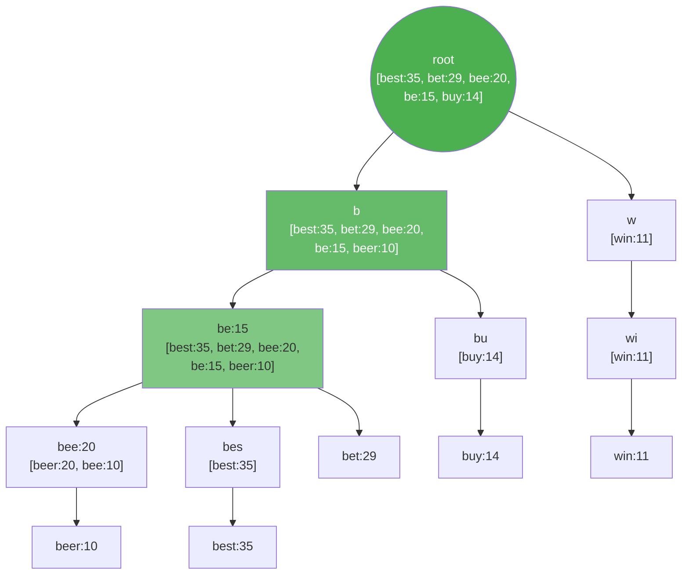

**장점**:
- 하위 트리 탐색 불필요 → **O(1)**
- 전체 시간 복잡도: **O(1)**

**단점**:
- 추가 저장공간 필요 (but 응답속도 향상을 위해 충분히 가치 있음)

### 데이터 수집 서비스 상세 설계

실시간 업데이트는 비효율적입니다:
- 매일 수천만 건의 질의 → 매번 트라이 갱신 시 질의 서비스 느려짐
- 인기 검색어는 자주 바뀌지 않음 → 실시간 갱신 불필요

#### 아키텍처 구성

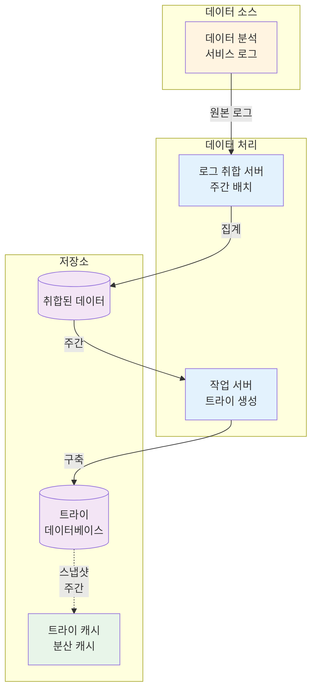

#### 각 컴포넌트 역할

**1. 데이터 분석 서비스 로그**
- 검색창에 입력된 질의의 원본 데이터 보관
- 추가만 이루어지고 수정 없음 (Append-only)
- 인덱스 없음

예시:
| query | time |
|-------|------|
| tree | 2019-10-01 22:01:01 |
| try | 2019-10-01 22:01:05 |
| tree | 2019-10-01 22:01:30 |

**2. 로그 취합 서버**
- 로그를 주기적으로 집계 (본 설계: 주간 단위)
- 실시간 애플리케이션(트위터)은 짧은 주기, 일반 검색은 주간으로 충분

취합 결과:
| query | time | frequency |
|-------|------|-----------|
| tree | 2019-10-01 | 12000 |
| tree | 2019-10-08 | 15000 |
| toy | 2019-10-01 | 8500 |

**3. 작업 서버(Worker)**
- 주기적으로 비동기 작업 실행
- 트라이 자료구조 생성 및 데이터베이스 저장

**4. 트라이 캐시**
- 분산 캐시 시스템 (Redis, Memcached)
- 트라이 데이터를 메모리에 유지하여 읽기 성능 향상
- 매주 데이터베이스 스냅샷으로 갱신

**5. 트라이 데이터베이스**
- 지속성 저장소

선택지 1: **문서 저장소** (MongoDB)
- 주기적으로 트라이를 직렬화하여 저장
- 전체 트라이를 문서로 관리

선택지 2: **키-값 저장소** (Cassandra)
- 트라이를 해시 테이블로 변환
- 모든 접두어 → 해시 키
- 각 노드 데이터 → 해시 값

해시 테이블 변환 예시:
| 키 | 값 |
|----|-----|
| b | [be:15, bee:20, beer:10, best:35, bet:29] |
| be | [be:15, bee:20, beer:10, best:35, bet:29] |
| bee | [bee:20, beer:10] |
| beer | [beer:10] |
| bes | [best:35] |
| best | [best:35] |

### 질의 서비스 상세 설계

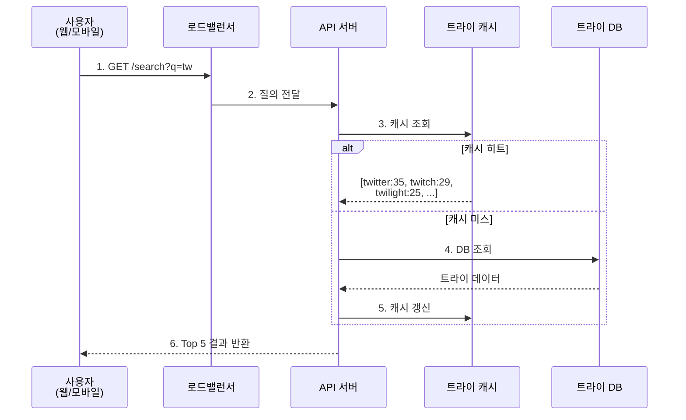

#### 최적화 기법

**1. AJAX 요청**
- 페이지 새로고침 없이 비동기로 자동완성 결과 가져오기
- 사용자 경험 향상

**2. 브라우저 캐싱**
- 자동완성 결과를 브라우저에 캐시
- 구글의 예: `Cache-Control: private, max-age=3600` (1시간)
- 같은 접두어에 대한 반복 요청 시 네트워크 요청 불필요

```javascript
// 브라우저 캐시 활용 예시
const autocompleteCache = new Map();

async function fetchAutocomplete(prefix) {
  // 1. 브라우저 메모리 캐시 확인
  if (autocompleteCache.has(prefix)) {
    return autocompleteCache.get(prefix);
  }

  // 2. API 요청 (HTTP 캐시 헤더 활용)
  const response = await fetch(`/api/autocomplete?q=${prefix}`);
  const results = await response.json();

  // 3. 메모리 캐시에 저장
  autocompleteCache.set(prefix, results);

  return results;
}
```

**3. 데이터 샘플링**
- 모든 질의를 로깅하면 CPU/저장공간 과다 소비
- N개 요청 중 1개만 로깅 (예: 10% 샘플링)
- 통계적으로 충분히 유의미한 데이터 확보 가능

```javascript
// 데이터 샘플링 예시
function logQuery(query) {
  const SAMPLE_RATE = 0.1; // 10% 샘플링

  if (Math.random() < SAMPLE_RATE) {
    analyticsService.log({
      query,
      timestamp: Date.now(),
      userId: getCurrentUserId()
    });
  }
}
```

### 트라이 연산

#### 트라이 생성
- 작업 서버가 취합된 데이터로 트라이 구축
- 주간 단위로 전체 재생성

#### 트라이 갱신

**방법 1: 주간 전체 교체 (채택)**
- 새 트라이 생성 후 기존 트라이 교체
- 간단하고 안정적
- 실시간성은 떨어지지만 대부분의 경우 충분

**방법 2: 개별 노드 갱신**
- 실시간 갱신 가능
- 문제: 노드 갱신 시 **모든 상위 노드도 갱신 필요**
- 트라이가 작을 때만 실용적

갱신 과정 예시:
```
beer 빈도를 10 → 30으로 갱신 시:
1. beer 노드: 10 → 30
2. bee 노드 캐시: [beer:10, bee:10] → [beer:30, bee:10]
3. be 노드 캐시: [..., beer:10] → [..., beer:30]
4. b 노드 캐시: [..., beer:10] → [..., beer:30]
5. root 노드 캐시도 갱신
```

#### 검색어 삭제 - 필터 계층

혐오성, 폭력적, 성적으로 노골적인 질의어 제거:

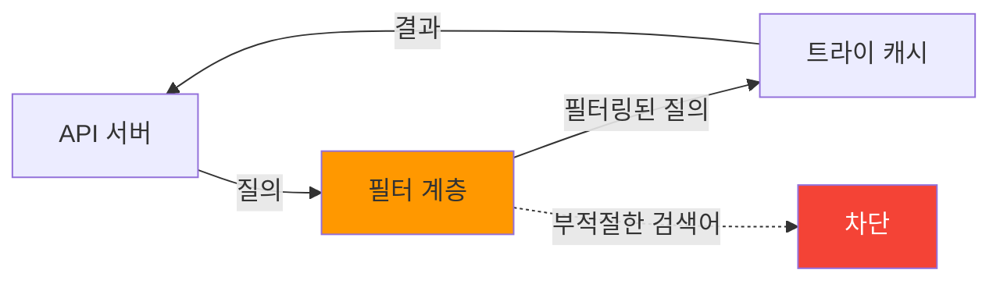

**필터 계층의 장점**:
- 필터 규칙을 자유롭게 변경 가능
- 트라이 데이터베이스를 직접 수정하지 않아도 됨
- 물리적 삭제는 다음 업데이트 사이클에 비동기로 처리

### 저장소 규모 확장

트라이가 한 서버에 담기 어려울 정도로 큰 경우 샤딩 필요.

#### 방법 1: 첫 글자 기준 샤딩

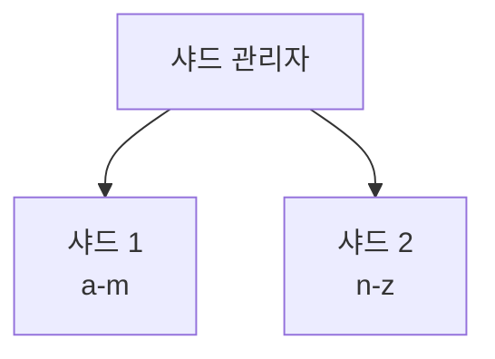

- 2대 서버: a-m, n-z
- 3대 서버: a-i, j-r, s-z

**문제점**:
- 최대 26대 서버로 제한 (영어 알파벳)
- 데이터 불균형: 'c'로 시작하는 단어 >> 'x'로 시작하는 단어

#### 방법 2: 계층적 샤딩

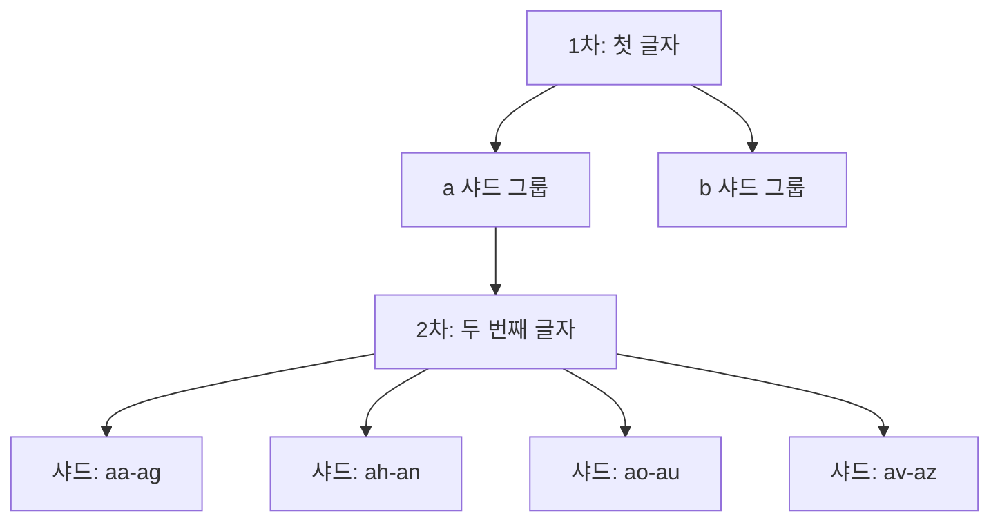

'a'로 시작하는 검색어를 4대 서버에 분산:
- 샤드 1: aa-ag
- 샤드 2: ah-an
- 샤드 3: ao-au
- 샤드 4: av-az

#### 방법 3: 패턴 분석 기반 샤딩 (추천)

과거 질의 패턴을 분석하여 데이터를 균등하게 분배:

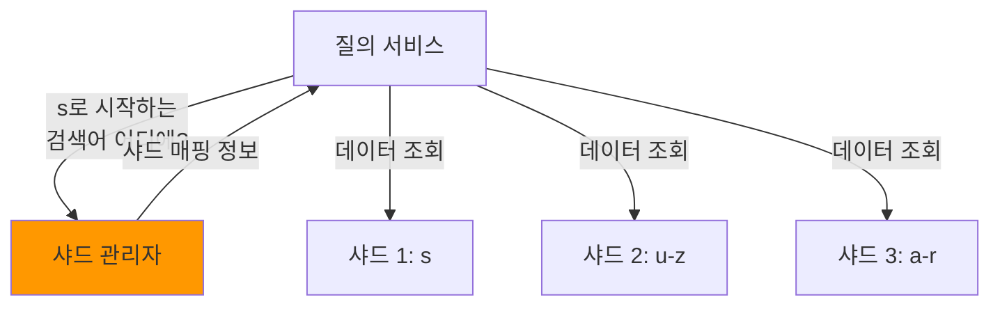

예시:
- 's'로 시작하는 검색어 빈도 ≈ 'u'~'z' 전체 빈도
- → 샤드 1: s, 샤드 2: u-z
- 'a'~'r'을 여러 샤드로 분산

**샤드 관리자(Shard Map Manager)**:
- 어떤 검색어가 어느 샤드에 있는지 관리
- 동적으로 샤드 추가/재배치 가능

## 4️⃣ 단계: 마무리 및 추가 논의사항

### 다국어 지원

**유니코드 저장**:
- 트라이에 유니코드 데이터 저장
- 한글, 일본어, 중국어 등 모든 문자 체계 지원

```javascript
// 다국어 트라이 노드 구조
class TrieNode {
  constructor() {
    this.children = new Map(); // 문자 → 자식 노드
    this.isEndOfWord = false;
    this.frequency = 0;
    this.topQueries = []; // 캐시된 top k 검색어
  }
}

// 유니코드 문자 처리
function normalizeQuery(query, language) {
  switch(language) {
    case 'ko': // 한글
      return query.normalize('NFC'); // 정규화
    case 'ja': // 일본어
      return convertToHiragana(query);
    default:
      return query.toLowerCase();
  }
}
```

### 국가별 인기 검색어

**국가별 트라이**:
- 각 국가마다 별도 트라이 유지
- CDN에 트라이 캐시 저장하여 응답속도 향상

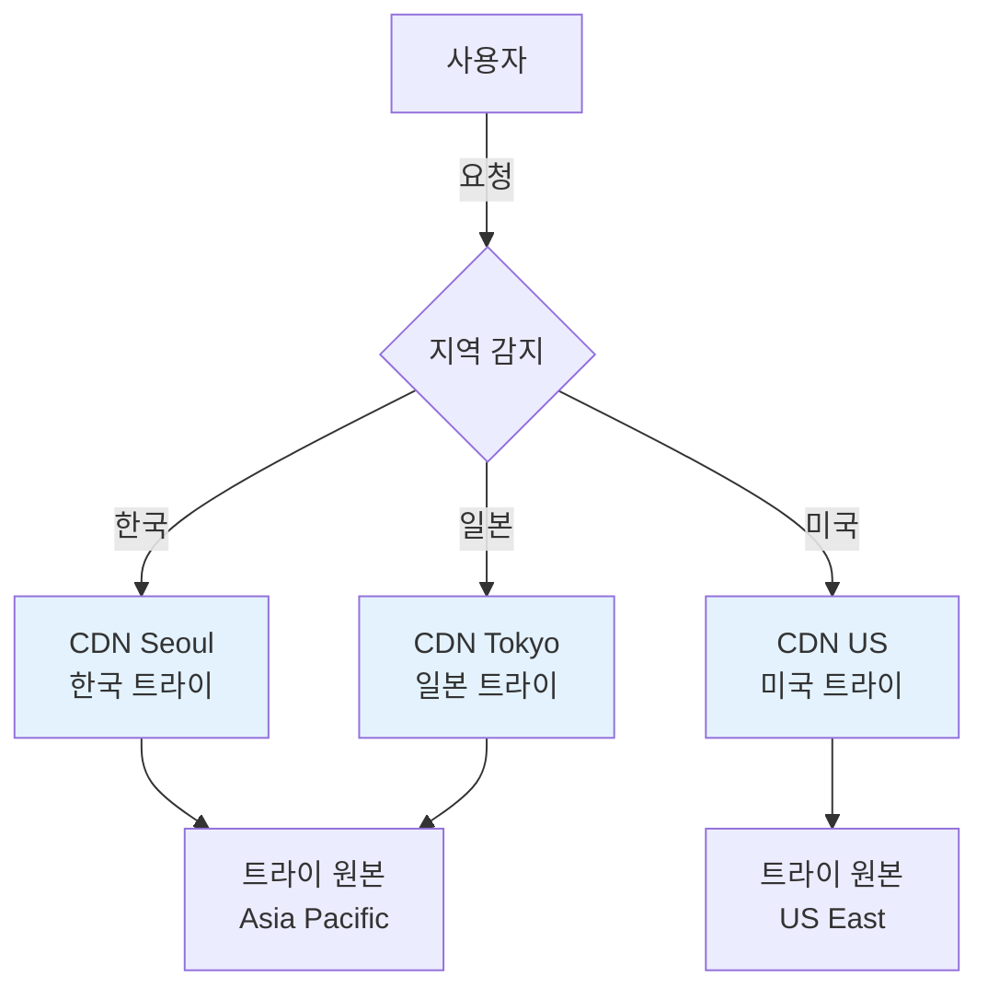

### 실시간 검색어 추이 반영

현 설계안의 한계:
- 주간 배치 처리 → 시의적절한 갱신 불가
- 트라이 구성에 시간 소요

**개선 방안**:

1. **샤딩을 통한 작업량 감소**
   - 각 샤드를 독립적으로 병렬 갱신

2. **순위 모델 개선**
   - 최근 검색어에 더 높은 가중치 부여
   - 시간 감쇠 함수 적용: `score = frequency × e^(-λt)`

3. **스트림 프로세싱**
   - 데이터가 스트림 형태로 지속적으로 생성
   - Apache Kafka, Spark Streaming, Storm 등 활용

```javascript
// 시간 기반 가중치 적용 예시
function calculateScore(frequency, timestamp) {
  const now = Date.now();
  const ageInHours = (now - timestamp) / (1000 * 60 * 60);
  const decayFactor = 0.1; // 시간당 10% 감소

  return frequency * Math.exp(-decayFactor * ageInHours);
}
```

스트림 프로세싱 아키텍처:


## 🤔 토론 주제

### 기술적 관점

1. **트라이 vs 역색인**: 대규모 검색어 자동완성 시스템에서 트라이 자료구조와 역색인(inverted index) 중 어느 것이 더 적합한가? 각각의 장단점은?

2. **메모리 vs 디스크**: 전체 트라이를 메모리에 올리기 어려울 때, 핫 데이터만 메모리에 두고 나머지는 디스크에 두는 하이브리드 전략은 어떻게 구현할 수 있을까?

3. **정확도 vs 성능**: 실시간 검색어 추이를 반영하기 위해 얼마나 정확도를 희생할 수 있는가? 10분 지연 vs 1시간 지연의 비즈니스 임팩트는?

### 실무/비즈니스 관점

1. **개인화 전략**: 사용자별 검색 히스토리를 반영한 맞춤형 자동완성과 일반 인기 검색어 중 어느 것이 더 효과적인가? 개인화 비율은?

2. **수익화 가능성**: 검색어 자동완성 결과에 광고 키워드나 스폰서 검색어를 삽입하는 것의 UX 트레이드오프는? 어떤 위치에 배치하는 것이 적절한가?

3. **콘텐츠 필터링 기준**: 부적절한 검색어를 어디까지 필터링해야 하는가? 과도한 필터링 vs 표현의 자유, 뉴스 가치가 있는 논란성 키워드 처리는?

### 운영/확장성 관점

1. **캐시 전략**: 3단계 캐싱(노드 캐시, 트라이 캐시, 브라우저 캐시)의 각 계층에서 최적의 TTL은? 캐시 워밍 전략은?

2. **모니터링 지표**: 시스템 건강도를 측정하기 위한 핵심 메트릭은? (응답 시간, 캐시 히트율, 샤드 불균형 등)

3. **장애 대응**: 트라이 캐시 장애 시 fallback 전략은? 전체 장애 vs 부분 장애에 따른 서비스 저하 시나리오는?

## 📚 추가 학습 자료

### 자료구조 및 알고리즘
- [Trie (Prefix Tree) - Wikipedia](https://en.wikipedia.org/wiki/Trie)
- [Trie 자료구조 구현 - GeeksforGeeks](https://www.geeksforgeeks.org/trie-insert-and-search/)
- [Prefix Hash Tree 논문](https://people.eecs.berkeley.edu/~sylvia/papers/pht.pdf) - 분산 해시 테이블 기반 접두어 검색

### 실제 시스템 사례
- [The Life of a Typeahead Query - Facebook Engineering](https://www.facebook.com/notes/facebook-engineering/the-life-of-a-typeahead-query/389105248919/)
- [How We Built Prefixy - Medium](https://medium.com/@prefixyteam/how-we-built-prefixy-a-scalable-prefix-search-service-for-powering-autocomplete-c20f98e2edf1)

### 분산 시스템 및 캐싱
- [Redis Cluster Tutorial](https://redis.io/topics/cluster-tutorial) - 분산 캐시 구현
- [Memcached Wiki](https://github.com/memcached/memcached/wiki) - 고성능 캐싱

### 스트림 프로세싱
- [Apache Kafka Documentation](https://kafka.apache.org/documentation/)
- [Spark Streaming Guide](https://spark.apache.org/streaming/)
- [Apache Storm Tutorial](https://storm.apache.org/releases/2.2.0/Tutorial.html)

## 🎯 핵심 메시지

> "검색어 자동완성 시스템의 핵심은 **트라이 자료구조의 효율적인 설계**와 **데이터 수집/질의 서비스의 분리**에 있다. 100ms 이내 응답속도를 달성하기 위해서는 두 가지 최적화가 필수적이다: (1) 접두어 최대 길이 제한, (2) 각 노드에 top k 검색어 캐시. 이로써 시간 복잡도를 O(p) + O(c log c)에서 **O(1)**로 개선할 수 있다.
>
> 규모 확장을 위해서는 단순한 첫 글자 샤딩이 아닌, **과거 질의 패턴을 분석한 지능적 샤딩**이 필요하다. 데이터 수집 서비스는 실시간이 아닌 **주간 배치 처리**로 충분하며, 질의 서비스는 **AJAX + 브라우저 캐싱 + 데이터 샘플링**의 3가지 최적화 기법으로 대규모 트래픽을 효율적으로 처리할 수 있다.
>
> 실무에서는 기술적 완성도뿐만 아니라 **부적절한 콘텐츠 필터링**, **개인화 vs 일반화의 균형**, **실시간성의 비즈니스 가치** 등을 함께 고려해야 한다. 완벽한 설계보다는 주어진 요구사항과 제약 조건에 **가장 적합한 트레이드오프**를 찾는 것이 중요하다."

---

**다음 스터디**: 14장에서는 유튜브와 같은 동영상 스트리밍 플랫폼 설계를 다룹니다. 대용량 미디어 파일 처리, CDN 최적화, 적응형 비트레이트 스트리밍 등 미디어 시스템의 핵심 개념들을 학습할 예정입니다.
