> 발표자: 길현준

---

# [가면사배 시리즈 #14] 유튜브 설계

## 📖 책 소개

- **제목**: 가상 면접 사례로 배우는 대규모 시스템 설계 기초
- **장**: 14장 - 유튜브 설계
- **핵심 주제**: 대규모 비디오 스트리밍 플랫폼의 업로드, 트랜스코딩, CDN 기반 스트리밍 시스템 설계

매일 50억 개의 비디오가 재생되고, 월 20억 명의 사용자가 이용하는 유튜브. 단순히 비디오를 올리고 재생하는 것처럼 보이지만, 그 이면에는 엄청나게 복잡한 시스템이 숨어 있습니다. 이번 장에서는 유튜브와 같은 대규모 비디오 스트리밍 플랫폼을 설계하며, 비디오 업로드부터 트랜스코딩, 그리고 전 세계로의 스트리밍까지 모든 과정을 다룹니다.

## 🎯 학습 목표

이번 장을 통해 다음 내용을 학습합니다:

1. **비디오 시스템 요구사항**: 일간 150TB의 비디오 데이터를 처리하고 CDN 비용을 최적화하는 대규모 미디어 플랫폼의 규모 추정
2. **트랜스코딩 아키텍처**: DAG(Directed Acyclic Graph) 모델을 활용한 유연하고 병렬화 가능한 비디오 처리 파이프라인 설계
3. **업로드 최적화**: GOP 단위 병렬 업로드, 근거리 업로드 센터, 메시지 큐를 통한 속도 개선 전략
4. **비용 최적화**: 롱테일 분포를 활용한 CDN 비용 절감 및 인기 콘텐츠 기반 선택적 전송
5. **안정성 확보**: Pre-signed URL, DRM, AES 암호화를 통한 보안 및 오류 처리 메커니즘

## 1️⃣ 단계: 문제 이해 및 설계 범위 확정

### 유튜브 통계 (2020년 기준)

시스템 설계에 앞서 유튜브의 규모를 파악해봅시다:

| 지표 | 수치 |
|-----|------|
| 월간 능동 사용자 | 20억 명 |
| 일일 재생 비디오 | 50억 개 |
| 미국 성인 이용률 | 73% |
| 창작자 수 | 5천만 명 |
| 2019년 광고 수입 | 150억 달러 (전년 대비 36% 증가) |
| 모바일 트래픽 점유율 | 37% |
| 지원 언어 | 80개 |

### 요구사항 정리

면접에서 명확히 해야 할 핵심 질문들:

**질문 1**: 어떤 기능이 가장 중요한가요?
- **답변**: 비디오 업로드와 시청 기능

**질문 2**: 어떤 클라이언트를 지원해야 하나요?
- **답변**: 모바일 앱, 웹 브라우저, 스마트 TV

**질문 3**: 일간 능동 사용자(DAU) 수는?
- **답변**: 5백만 명

**질문 4**: 평균 사용 시간은?
- **답변**: 30분

**질문 5**: 다국어 지원이 필요한가요?
- **답변**: 네, 모든 언어 지원

**질문 6**: 지원 해상도는?
- **답변**: 대부분의 비디오 해상도 지원

**질문 7**: 암호화가 필요한가요?
- **답변**: 네

**질문 8**: 비디오 파일 크기 제한은?
- **답변**: 최대 1GB

**질문 9**: 클라우드 서비스 활용 가능한가요?
- **답변**: 네, 가능

### 핵심 기능 요구사항

| 요구사항 | 설명 |
|---------|------|
| 빠른 비디오 업로드 | 대용량 파일의 효율적인 업로드 처리 |
| 원활한 비디오 재생 | 끊김 없는 스트리밍 경험 제공 |
| 재생 품질 선택 | 네트워크 상황에 따른 화질 조정 |
| 낮은 인프라 비용 | CDN 및 저장소 비용 최적화 |
| 고가용성 | 99.9% 이상의 서비스 가용성 |
| 규모 확장성 | 수평 확장 가능한 아키텍처 |
| 안정성 | 오류 처리 및 복구 메커니즘 |

### 개략적 규모 추정

```
📊 트래픽 및 저장소 추정

기본 가정:
- DAU: 5,000,000 (5백만 명)
- 1인당 하루 시청 비디오: 5개
- 업로드 사용자 비율: 10%
- 1인당 하루 업로드: 1개
- 비디오 평균 크기: 300MB

💾 일일 저장 용량
= 5,000,000 × 10% × 300MB
= 500,000 × 300MB
= 150TB/일

💰 CDN 비용 (Amazon CloudFront 기준, 미국 100% 트래픽 가정)
- GB당 요금: $0.02
- 일일 스트리밍 데이터
  = 5,000,000 사용자 × 5비디오 × 0.3GB
  = 7,500,000GB
- 일일 CDN 비용
  = 7,500,000 × $0.02
  = $150,000/일
  = $4,500,000/월 (약 54억 원/년)

📈 핵심 과제
- 매일 150TB의 비디오 데이터 저장 및 처리
- 월 450만 달러의 CDN 비용 최적화 필수
- 대규모 할인 협상 및 비용 절감 전략 수립
```

**💡 설계 포인트**: CDN 비용이 엄청나므로 **롱테일 분포**를 활용한 최적화가 핵심입니다.

## 2️⃣ 단계: 개략적 설계안

### 시스템 구성 개요

유튜브 시스템은 크게 세 가지 컴포넌트로 구성됩니다:

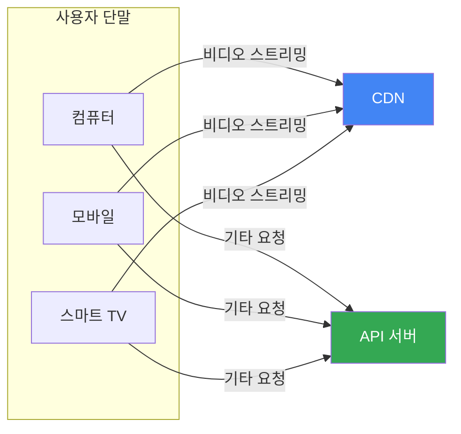
```mermaid
graph LR
    subgraph "사용자 단말"
        A1[컴퓨터]
        A2[모바일]
        A3[스마트 TV]
    end

    A1 & A2 & A3 -->|비디오 스트리밍| B[CDN]
    A1 & A2 & A3 -->|기타 요청| C[API 서버]

    style B fill:#4285f4,color:#fff
    style C fill:#34a853,color:#fff
```

**1. 단말(Client)**
- 컴퓨터, 모바일, 스마트 TV
- 다양한 해상도 및 포맷 지원 필요

**2. CDN (Content Delivery Network)**
- 비디오 캐싱 및 전송
- 사용자와 가장 가까운 엣지 서버에서 스트리밍
- 전송 지연 최소화

**3. API 서버**
- 비디오 스트리밍을 제외한 모든 요청 처리
- 피드 추천, 업로드 URL 생성, 메타데이터 관리
- 사용자 인증 및 가입 처리

### 클라우드 서비스 활용 전략

**왜 모든 것을 직접 만들지 않는가?**

1. **시간 효율성**: 시스템 설계 면접은 적절한 기술 선택이 핵심
2. **비용 효율성**: CDN과 BLOB 저장소를 직접 구축하는 것은 복잡하고 비용이 큼
3. **실무 현실**: 넷플릭스(AWS), 페이스북(Akamai CDN)도 클라우드 서비스 활용

### 비디오 업로드 절차

전체 아키텍처:

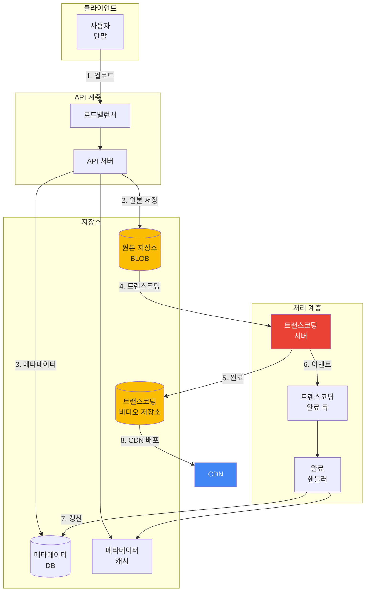
```mermaid
graph TB
    subgraph "클라이언트"
        A[사용자<br/>단말]
    end

    subgraph "API 계층"
        B[로드밸런서]
        C[API 서버]
    end

    subgraph "저장소"
        D[(원본 저장소<br/>BLOB)]
        E[(메타데이터<br/>DB)]
        F[메타데이터<br/>캐시]
        G[(트랜스코딩<br/>비디오 저장소)]
    end

    subgraph "처리 계층"
        H[트랜스코딩<br/>서버]
        I[트랜스코딩<br/>완료 큐]
        J[완료<br/>핸들러]
    end

    K[CDN]

    A -->|1. 업로드| B
    B --> C
    C -->|2. 원본 저장| D
    C -->|3. 메타데이터| E
    C --> F
    D -->|4. 트랜스코딩| H
    H -->|5. 완료| G
    H -->|6. 이벤트| I
    I --> J
    J -->|7. 갱신| E
    J --> F
    G -->|8. CDN 배포| K

    style D fill:#fbbc04
    style G fill:#fbbc04
    style H fill:#ea4335,color:#fff
    style K fill:#4285f4,color:#fff
```

#### 주요 컴포넌트 역할

**1. 로드밸런서**
- API 서버로 요청을 균등하게 분산
- 특정 서버 과부하 방지

**2. API 서버**
- 비디오 스트리밍 외 모든 요청 처리
- 무상태(stateless) 설계로 수평 확장 가능

**3. 메타데이터 데이터베이스**
- 비디오 정보 저장 (제목, 크기, 해상도, 포맷, 사용자 정보)
- 샤딩과 복제를 통한 고성능 및 가용성 확보

**4. 메타데이터 캐시**
- 자주 조회되는 비디오 메타데이터와 사용자 객체 캐시
- 읽기 성능 향상

**5. 원본 저장소**
- 대형 이진 파일 저장소 (BLOB Storage)
- 업로드된 원본 비디오 보관

**6. 트랜스코딩 서버**
- 비디오 인코딩 (포맷 변환)
- MPEG, HLS 등 다양한 포맷 지원
- 단말 및 대역폭 요구사항에 맞는 스트림 생성

**7. 트랜스코딩 비디오 저장소**
- 인코딩 완료된 비디오 저장

**8. 트랜스코딩 완료 큐**
- 메시지 큐 (Message Queue)
- 비디오 트랜스코딩 완료 이벤트 보관

**9. 트랜스코딩 완료 핸들러**
- 큐에서 이벤트를 가져와 메타데이터 갱신
- 작업 서버 클러스터로 구성

### 비디오 업로드 프로세스

두 가지 프로세스가 **병렬적으로** 실행됩니다:

#### 프로세스 A: 비디오 업로드 및 트랜스코딩

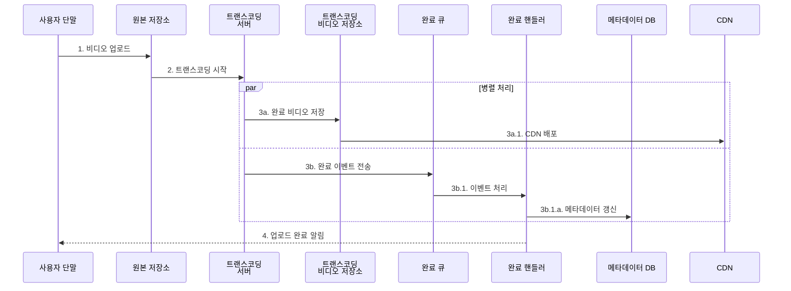
```mermaid
sequenceDiagram
    participant C as 사용자 단말
    participant OS as 원본 저장소
    participant TS as 트랜스코딩<br/>서버
    participant TVS as 트랜스코딩<br/>비디오 저장소
    participant Q as 완료 큐
    participant H as 완료 핸들러
    participant DB as 메타데이터 DB
    participant CDN as CDN

    C->>OS: 1. 비디오 업로드
    OS->>TS: 2. 트랜스코딩 시작

    par 병렬 처리
        TS->>TVS: 3a. 완료 비디오 저장
        TVS->>CDN: 3a.1. CDN 배포
    and
        TS->>Q: 3b. 완료 이벤트 전송
        Q->>H: 3b.1. 이벤트 처리
        H->>DB: 3b.1.a. 메타데이터 갱신
    end

    H-->>C: 4. 업로드 완료 알림
```

**단계별 설명**:
1. 사용자가 비디오를 원본 저장소에 업로드
2. 트랜스코딩 서버가 원본을 가져와 인코딩 시작
3. 완료 후 두 작업 병렬 실행:
   - **3a**: 완료된 비디오를 저장소에 업로드 → CDN 배포
   - **3b**: 완료 이벤트를 큐에 전송 → 핸들러가 DB/캐시 갱신
4. API 서버가 단말에 완료 알림

#### 프로세스 B: 메타데이터 갱신

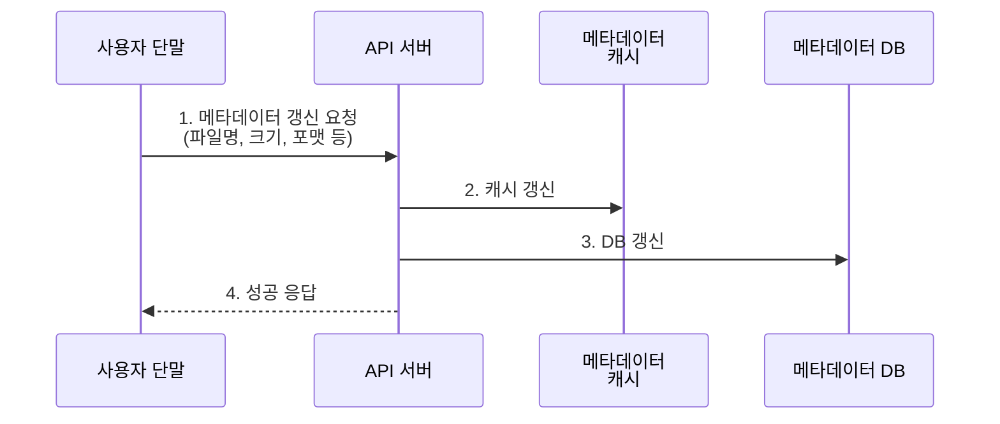
```mermaid
sequenceDiagram
    participant C as 사용자 단말
    participant API as API 서버
    participant Cache as 메타데이터<br/>캐시
    participant DB as 메타데이터 DB

    C->>API: 1. 메타데이터 갱신 요청<br/>(파일명, 크기, 포맷 등)
    API->>Cache: 2. 캐시 갱신
    API->>DB: 3. DB 갱신
    API-->>C: 4. 성공 응답
```

**병렬 처리의 장점**:
- 파일 업로드와 메타데이터 갱신이 동시에 진행
- 전체 업로드 시간 단축
- 사용자 경험 향상

### 비디오 스트리밍 절차

#### 다운로드 vs 스트리밍

**다운로드**:
- 비디오 파일 전체를 단말로 내려받음
- 다운로드 완료 후 재생 가능

**스트리밍**:
- 지속적으로 비디오 스트림을 전송받아 즉시 재생
- 재생 버튼을 누르면 바로 시작
- 전체 다운로드 불필요

#### 스트리밍 프로토콜

비디오 스트리밍을 위한 표준화된 통신 방법:

| 프로토콜 | 설명 | 특징 |
|---------|------|------|
| **MPEG-DASH** | Dynamic Adaptive Streaming over HTTP | HTTP 기반, 적응형 비트레이트 |
| **Apple HLS** | HTTP Live Streaming | iOS/macOS 최적화 |
| **Microsoft Smooth Streaming** | 마이크로소프트 스트리밍 | Windows 플랫폼 최적화 |
| **Adobe HDS** | HTTP Dynamic Streaming | Flash 기반 |

**프로토콜 선택 기준**:
- 지원하는 비디오 인코딩 방식
- 지원 플레이어 종류
- 서비스 용례 및 클라이언트 환경

#### 스트리밍 아키텍처

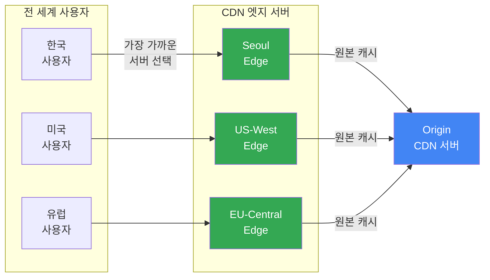
```mermaid
graph LR
    subgraph "전 세계 사용자"
        A1[한국<br/>사용자]
        A2[미국<br/>사용자]
        A3[유럽<br/>사용자]
    end

    subgraph "CDN 엣지 서버"
        B1[Seoul<br/>Edge]
        B2[US-West<br/>Edge]
        B3[EU-Central<br/>Edge]
    end

    A1 -->|가장 가까운<br/>서버 선택| B1
    A2 --> B2
    A3 --> B3

    B1 & B2 & B3 -->|원본 캐시| C[Origin<br/>CDN 서버]

    style B1 fill:#34a853,color:#fff
    style B2 fill:#34a853,color:#fff
    style B3 fill:#34a853,color:#fff
    style C fill:#4285f4,color:#fff
```

**핵심 특징**:
- 사용자에게 가장 가까운 CDN 엣지 서버가 전송 담당
- 전송 지연(latency) 최소화
- Origin 서버 부하 분산

## 3️⃣ 단계: 상세 설계

### 비디오 트랜스코딩

#### 트랜스코딩이란?

비디오 인코딩이라고도 하며, 비디오를 한 포맷에서 다른 포맷으로 변환하는 절차입니다.

**트랜스코딩이 중요한 이유**:

1. **저장 공간 절감**
   - 원본 비디오(raw video)는 수백 GB 차지 가능
   - 60fps HD 비디오는 엄청난 용량 필요

2. **호환성 보장**
   - 단말과 브라우저는 특정 포맷만 지원
   - 여러 포맷으로 인코딩 필요

3. **네트워크 최적화**
   - 대역폭 충분: 고화질 비디오
   - 대역폭 부족: 저화질 비디오
   - 끊김 없는 재생 보장

4. **적응형 재생**
   - 모바일 네트워크 상황 변화 대응
   - 자동/수동 화질 변경 지원

#### 인코딩 포맷 구성

**컨테이너(Container)**:
- 비디오 파일, 오디오, 메타데이터를 담는 바구니
- 확장자: `.avi`, `.mov`, `.mp4`

**코덱(Codec)**:
- 화질 보존하며 파일 크기 줄이는 압축/압축 해제 알고리즘
- 주요 코덱: `H.264`, `VP9`, `HEVC`

### DAG(Directed Acyclic Graph) 모델

#### DAG 모델 도입 이유

각 콘텐츠 창작자는 서로 다른 비디오 프로세싱 요구사항을 가집니다:
- 워터마크 표시
- 커스텀 섬네일
- 고화질 vs 저화질 선호

**해결 방안**:
- 적절한 추상화 도입
- 클라이언트가 실행할 작업(task)을 직접 정의
- 작업의 순차적/병렬적 실행 지원

#### DAG 모델 구조

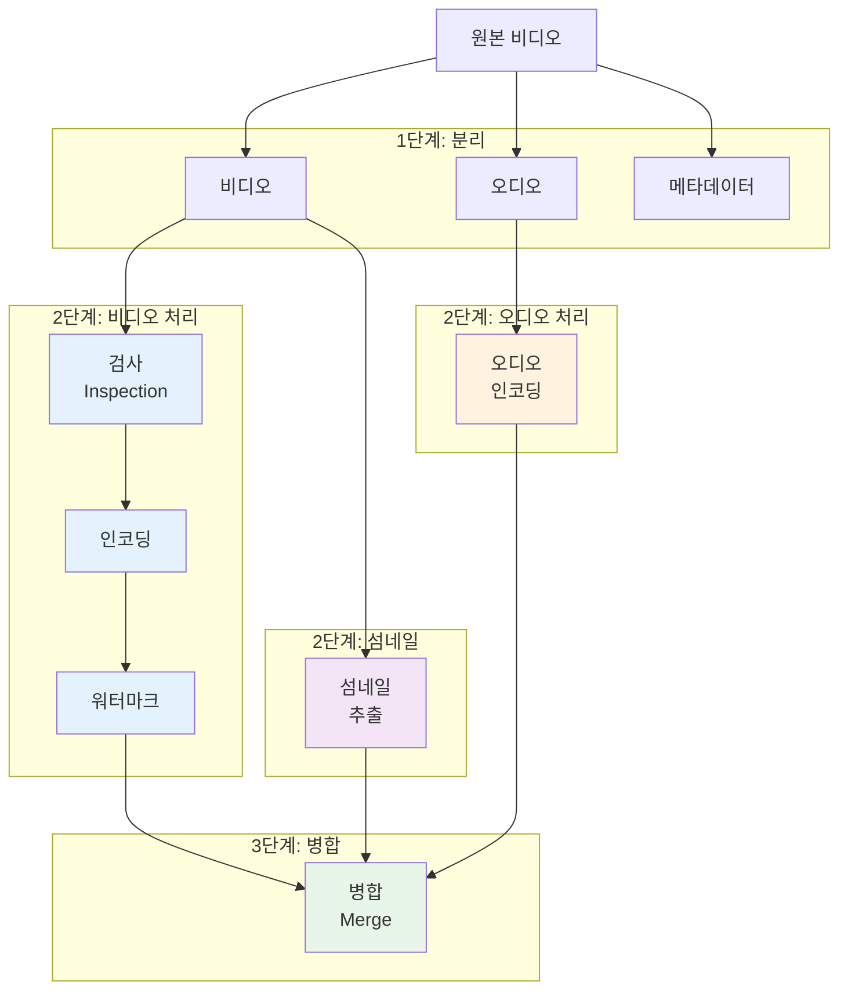
```mermaid
graph TB
    Start[원본 비디오]

    subgraph "1단계: 분리"
        V[비디오]
        A[오디오]
        M[메타데이터]
    end

    subgraph "2단계: 비디오 처리"
        V1[검사<br/>Inspection]
        V2[인코딩]
        V3[워터마크]
    end

    subgraph "2단계: 오디오 처리"
        A1[오디오<br/>인코딩]
    end

    subgraph "2단계: 섬네일"
        T1[섬네일<br/>추출]
    end

    subgraph "3단계: 병합"
        Merge[병합<br/>Merge]
    end

    Start --> V
    Start --> A
    Start --> M

    V --> V1
    V1 --> V2
    V2 --> V3
    V3 --> Merge

    A --> A1
    A1 --> Merge

    V --> T1
    T1 --> Merge

    style V1 fill:#e3f2fd
    style V2 fill:#e3f2fd
    style V3 fill:#e3f2fd
    style A1 fill:#fff3e0
    style T1 fill:#f3e5f5
    style Merge fill:#e8f5e9
```

**작업 설명**:

**1. 검사(Inspection)**
- 비디오 품질 확인
- 손상 여부 검증

**2. 비디오 인코딩**
- 다양한 해상도로 인코딩
- 예시: 360p, 480p, 720p, 1080p, 4K

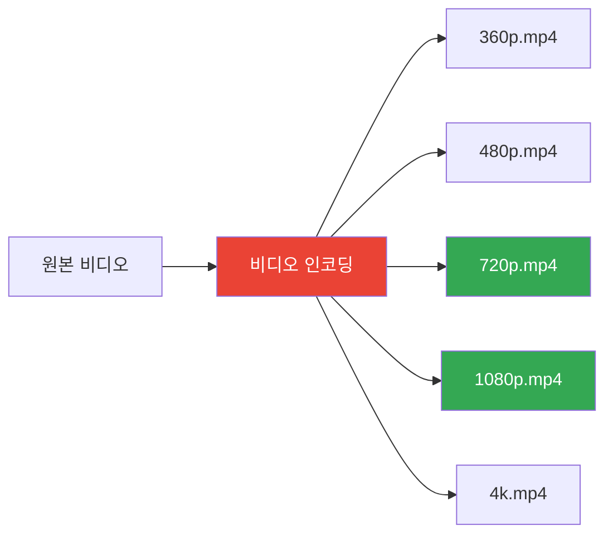
```mermaid
graph LR
    A[원본 비디오] --> B[비디오 인코딩]
    B --> C1[360p.mp4]
    B --> C2[480p.mp4]
    B --> C3[720p.mp4]
    B --> C4[1080p.mp4]
    B --> C5[4k.mp4]

    style B fill:#ea4335,color:#fff
    style C3 fill:#34a853,color:#fff
    style C4 fill:#34a853,color:#fff
```

**3. 섬네일(Thumbnail)**
- 사용자 업로드 이미지 사용
- 또는 비디오에서 자동 추출

**4. 워터마크(Watermark)**
- 비디오 식별 정보를 오버레이로 표시

### 비디오 트랜스코딩 아키텍처

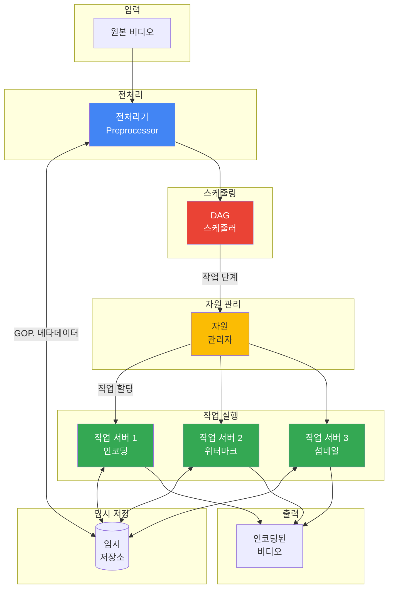
```mermaid
graph TB
    subgraph "입력"
        A[원본 비디오]
    end

    subgraph "전처리"
        B[전처리기<br/>Preprocessor]
    end

    subgraph "스케줄링"
        C[DAG<br/>스케줄러]
    end

    subgraph "자원 관리"
        D[자원<br/>관리자]
    end

    subgraph "작업 실행"
        E1[작업 서버 1<br/>인코딩]
        E2[작업 서버 2<br/>워터마크]
        E3[작업 서버 3<br/>섬네일]
    end

    subgraph "임시 저장"
        F[(임시<br/>저장소)]
    end

    subgraph "출력"
        G[인코딩된<br/>비디오]
    end

    A --> B
    B <-->|GOP, 메타데이터| F
    B --> C
    C -->|작업 단계| D
    D -->|작업 할당| E1
    D --> E2
    D --> E3
    E1 & E2 & E3 <--> F
    E1 & E2 & E3 --> G

    style B fill:#4285f4,color:#fff
    style C fill:#ea4335,color:#fff
    style D fill:#fbbc04
    style E1 fill:#34a853,color:#fff
    style E2 fill:#34a853,color:#fff
    style E3 fill:#34a853,color:#fff
```

#### 1. 전처리기(Preprocessor)

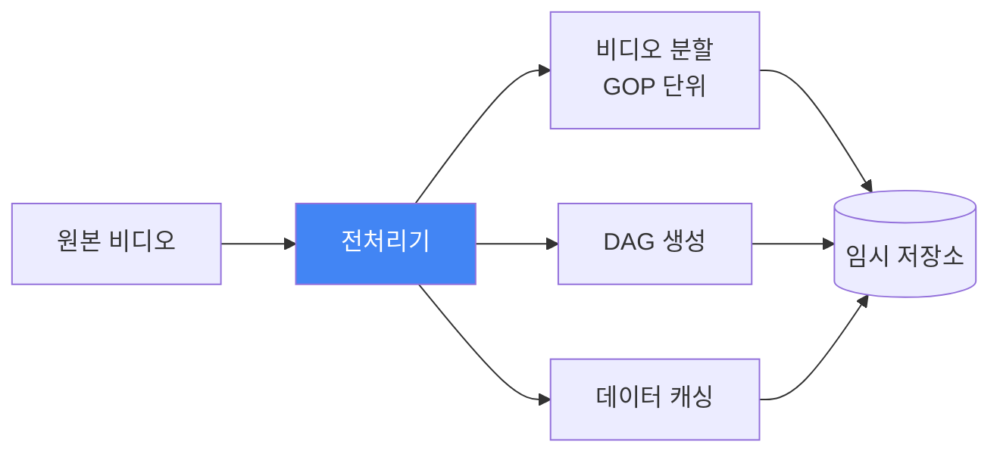
```mermaid
graph LR
    A[원본 비디오] --> B[전처리기]
    B --> C[비디오 분할<br/>GOP 단위]
    B --> D[DAG 생성]
    B --> E[데이터 캐싱]

    C & D & E --> F[(임시 저장소)]

    style B fill:#4285f4,color:#fff
```

**주요 기능**:

**1) 비디오 분할(Video Splitting)**
- GOP(Group of Pictures) 단위로 분할
- GOP는 특정 순서로 배열된 프레임 그룹
- 각 GOP는 독립적으로 재생 가능 (보통 몇 초)
- 오래된 단말/브라우저 지원용

**2) DAG 생성**
- 클라이언트 설정 파일로부터 DAG 생성
- 작업 간 의존성 정의

설정 파일 예시:
```javascript
// 다운로드 작업
task {
  name: 'download-input',
  type: 'download',
  input: {
    url: config.url
  },
  output: {
    context.outputVideo = file
  },
  next: 'transcode'
}

// 트랜스코딩 작업
task {
  name: 'transcode',
  type: 'transcode',
  input: {
    video: context.inputVideo,
    config: config.transConfig
  },
  output: {
    context.file = outputVideo
  }
}
```

**3) 데이터 캐시**
- 분할된 GOP와 메타데이터를 임시 저장소에 보관
- 인코딩 실패 시 재개 가능 (안정성 향상)

#### 2. DAG 스케줄러

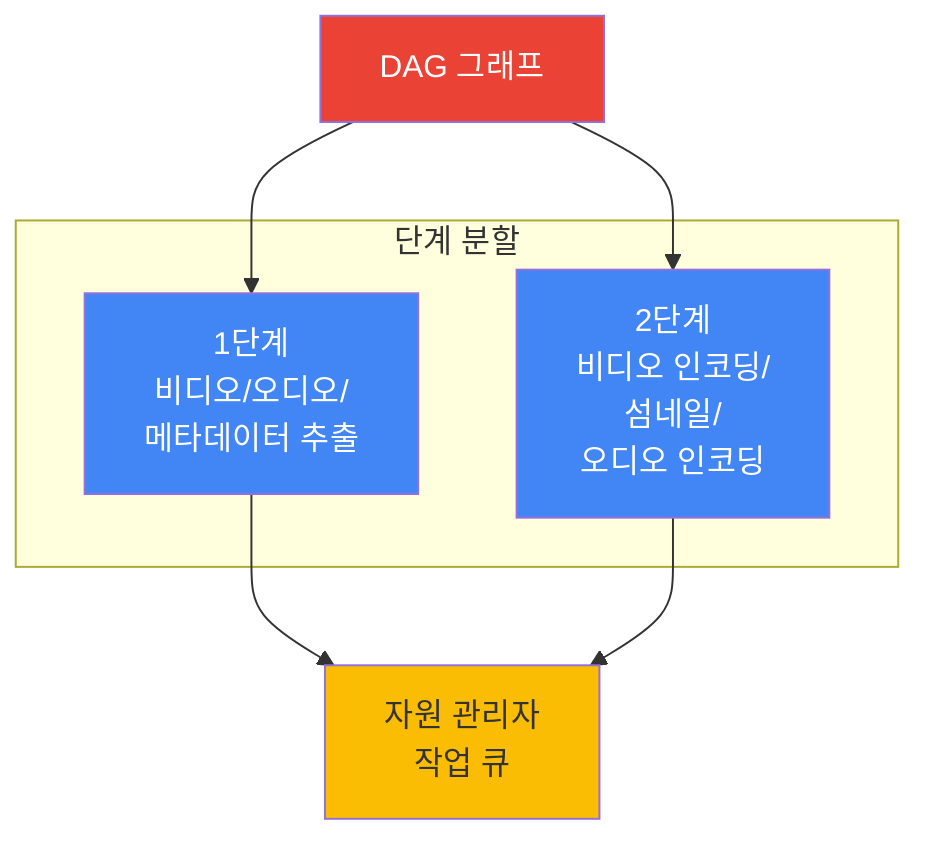
```mermaid
graph TB
    A[DAG 그래프]

    subgraph "단계 분할"
        B[1단계<br/>비디오/오디오/<br/>메타데이터 추출]
        C[2단계<br/>비디오 인코딩/<br/>섬네일/<br/>오디오 인코딩]
    end

    D[자원 관리자<br/>작업 큐]

    A --> B
    A --> C
    B --> D
    C --> D

    style A fill:#ea4335,color:#fff
    style B fill:#4285f4,color:#fff
    style C fill:#4285f4,color:#fff
    style D fill:#fbbc04
```

**역할**:
- DAG를 여러 단계(stage)로 분할
- 각 단계를 자원 관리자의 작업 큐에 추가
- 의존성 관리 및 병렬 실행 최적화

#### 3. 자원 관리자(Resource Manager)

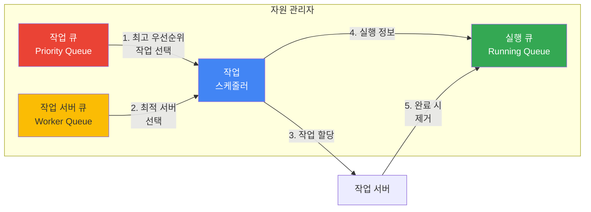
```mermaid
graph LR
    subgraph "자원 관리자"
        A[작업 큐<br/>Priority Queue]
        B[작업 서버 큐<br/>Worker Queue]
        C[실행 큐<br/>Running Queue]
        D[작업<br/>스케줄러]
    end

    E[작업 서버]

    A -->|1. 최고 우선순위<br/>작업 선택| D
    B -->|2. 최적 서버<br/>선택| D
    D -->|3. 작업 할당| E
    D -->|4. 실행 정보| C
    E -->|5. 완료 시<br/>제거| C

    style A fill:#ea4335,color:#fff
    style B fill:#fbbc04
    style C fill:#34a853,color:#fff
    style D fill:#4285f4,color:#fff
```

**구성 요소**:

**작업 큐(Task Queue)**:
- 우선순위 큐
- 실행 대기 중인 작업 보관

**작업 서버 큐(Worker Queue)**:
- 작업 서버의 가용 상태 정보 저장
- 서버 선택 최적화

**실행 큐(Running Queue)**:
- 현재 실행 중인 작업 정보
- 작업-서버 매핑 관리

**작업 스케줄러(Task Scheduler)**:
- 최적의 작업/서버 조합 선택
- 작업 실행 지시

**동작 프로세스**:
1. 작업 큐에서 최고 우선순위 작업 선택
2. 적합한 작업 서버 선택
3. 해당 서버에 작업 실행 지시
4. 작업 할당 정보를 실행 큐에 추가
5. 작업 완료 시 실행 큐에서 제거

#### 4. 작업 서버(Task Worker)

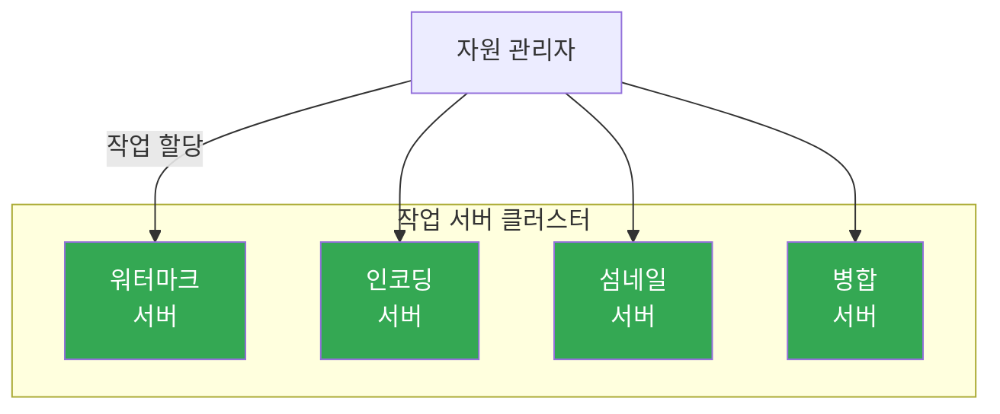
```mermaid
graph TB
    A[자원 관리자]

    subgraph "작업 서버 클러스터"
        B1[워터마크<br/>서버]
        B2[인코딩<br/>서버]
        B3[섬네일<br/>서버]
        B4[병합<br/>서버]
    end

    A -->|작업 할당| B1
    A --> B2
    A --> B3
    A --> B4

    style B1 fill:#34a853,color:#fff
    style B2 fill:#34a853,color:#fff
    style B3 fill:#34a853,color:#fff
    style B4 fill:#34a853,color:#fff
```

**특징**:
- DAG에 정의된 작업 수행
- 작업 종류별로 서버 구분 관리
- 수평 확장 가능

#### 5. 임시 저장소(Temporary Storage)

**저장소 선택 기준**:
- 데이터 유형
- 데이터 크기
- 이용 빈도
- 데이터 유효 기간

**전략**:

| 데이터 유형 | 저장소 | 이유 |
|-----------|--------|------|
| 메타데이터 | 메모리 캐시 | 빈번한 참조, 작은 크기 |
| 비디오/오디오 | BLOB 저장소 | 대용량, 순차 접근 |

**수명 주기**:
- 비디오 프로세싱 완료 후 삭제
- 일시적 데이터 저장 목적

### 시스템 최적화

#### 속도 최적화 1: 비디오 병렬 업로드

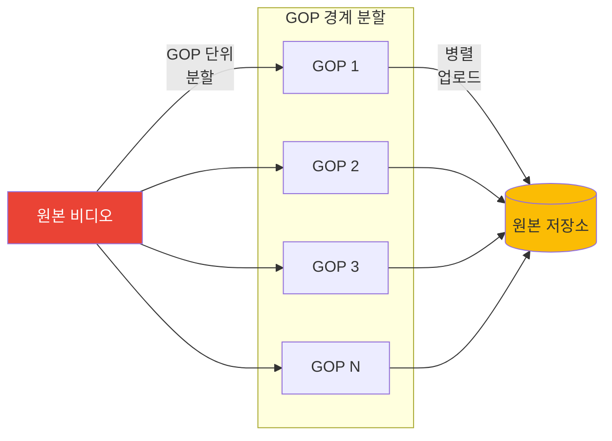
```mermaid
graph LR
    A[원본 비디오]

    subgraph "GOP 경계 분할"
        B1[GOP 1]
        B2[GOP 2]
        B3[GOP 3]
        B4[GOP N]
    end

    C[(원본 저장소)]

    A -->|GOP 단위<br/>분할| B1
    A --> B2
    A --> B3
    A --> B4

    B1 -->|병렬<br/>업로드| C
    B2 --> C
    B3 --> C
    B4 --> C

    style A fill:#ea4335,color:#fff
    style C fill:#fbbc04
```

**장점**:
- 전체 비디오를 한 번에 올리는 것보다 효율적
- 일부 실패 시 해당 GOP만 재업로드
- 빠른 업로드 재개

**구현**:
```javascript
// GOP 단위 병렬 업로드 예시
async function uploadVideo(videoFile) {
  // 1. 비디오를 GOP 단위로 분할
  const gops = await splitVideoIntoGOPs(videoFile);

  // 2. 병렬 업로드 (Promise.all 사용)
  const uploadPromises = gops.map((gop, index) =>
    uploadGOP(gop, index)
  );

  // 3. 모든 GOP 업로드 완료 대기
  const results = await Promise.all(uploadPromises);

  // 4. 서버에 병합 요청
  await mergeGOPs(results);
}

async function uploadGOP(gopData, index) {
  const maxRetries = 3;
  let attempt = 0;

  while (attempt < maxRetries) {
    try {
      const response = await fetch('/upload/gop', {
        method: 'POST',
        body: gopData,
        headers: {
          'Content-Type': 'application/octet-stream',
          'X-GOP-Index': index
        }
      });

      if (response.ok) {
        return await response.json();
      }
    } catch (error) {
      attempt++;
      if (attempt === maxRetries) throw error;
      // 지수 백오프(exponential backoff)
      await sleep(Math.pow(2, attempt) * 1000);
    }
  }
}
```

#### 속도 최적화 2: 근거리 업로드 센터

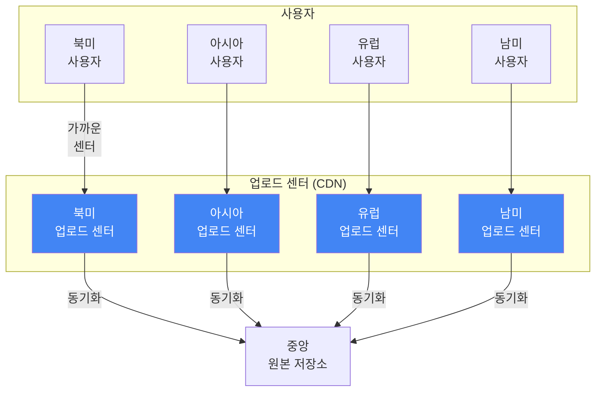
```mermaid
graph TB
    subgraph "사용자"
        A1[북미<br/>사용자]
        A2[아시아<br/>사용자]
        A3[유럽<br/>사용자]
        A4[남미<br/>사용자]
    end

    subgraph "업로드 센터 (CDN)"
        B1[북미<br/>업로드 센터]
        B2[아시아<br/>업로드 센터]
        B3[유럽<br/>업로드 센터]
        B4[남미<br/>업로드 센터]
    end

    C[중앙<br/>원본 저장소]

    A1 -->|가까운<br/>센터| B1
    A2 --> B2
    A3 --> B3
    A4 --> B4

    B1 & B2 & B3 & B4 -->|동기화| C

    style B1 fill:#4285f4,color:#fff
    style B2 fill:#4285f4,color:#fff
    style B3 fill:#4285f4,color:#fff
    style B4 fill:#4285f4,color:#fff
```

**전략**:
- 사용자 위치에 따라 가장 가까운 업로드 센터 선택
- CDN을 업로드 센터로 활용
- 네트워크 지연 최소화

#### 속도 최적화 3: 병렬화를 통한 결합도 감소

**기존 문제**: 순차적 의존성으로 병렬성 낮음

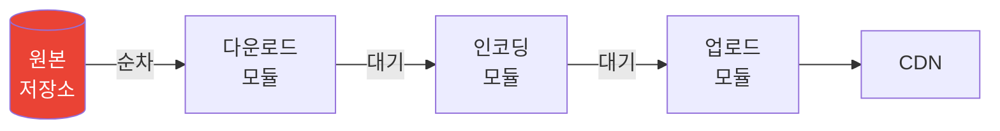
```mermaid
graph LR
    A[(원본<br/>저장소)] -->|순차| B[다운로드<br/>모듈]
    B -->|대기| C[인코딩<br/>모듈]
    C -->|대기| D[업로드<br/>모듈]
    D --> E[CDN]

    style A fill:#ea4335,color:#fff
```

**개선**: 메시지 큐 도입으로 느슨한 결합

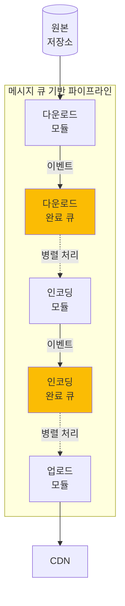
```mermaid
graph TB
    A[(원본<br/>저장소)]

    subgraph "메시지 큐 기반 파이프라인"
        B[다운로드<br/>모듈]
        Q1[다운로드<br/>완료 큐]
        C[인코딩<br/>모듈]
        Q2[인코딩<br/>완료 큐]
        D[업로드<br/>모듈]
    end

    E[CDN]

    A --> B
    B -->|이벤트| Q1
    Q1 -.->|병렬 처리| C
    C -->|이벤트| Q2
    Q2 -.->|병렬 처리| D
    D --> E

    style Q1 fill:#fbbc04
    style Q2 fill:#fbbc04
```

**장점**:
- 다운로드 완료 즉시 메시지 큐에 이벤트 전송
- 인코딩 모듈은 큐에서 이벤트를 가져와 병렬 처리
- 각 모듈이 독립적으로 동작
- 전체 처리 시간 단축

**메시지 큐 구현 예시**:
```javascript
// Redis를 사용한 메시지 큐 예시
const Redis = require('ioredis');
const redis = new Redis();

// 다운로드 모듈: 완료 이벤트 발행
async function onDownloadComplete(videoId, filePath) {
  await redis.lpush('download:completed', JSON.stringify({
    videoId,
    filePath,
    timestamp: Date.now()
  }));
}

// 인코딩 모듈: 이벤트 수신 및 병렬 처리
async function encodeWorker() {
  while (true) {
    // 큐에서 작업 가져오기 (블로킹)
    const [_, data] = await redis.brpop('download:completed', 0);
    const { videoId, filePath } = JSON.parse(data);

    // 비동기로 인코딩 처리 (병렬)
    processEncoding(videoId, filePath).catch(handleError);
  }
}

// 여러 인코딩 워커 실행 (병렬성 증가)
for (let i = 0; i < 10; i++) {
  encodeWorker();
}
```

#### 안정성 최적화 1: Pre-signed URL

허가받은 사용자만 올바른 위치에 업로드하도록 보안 강화:

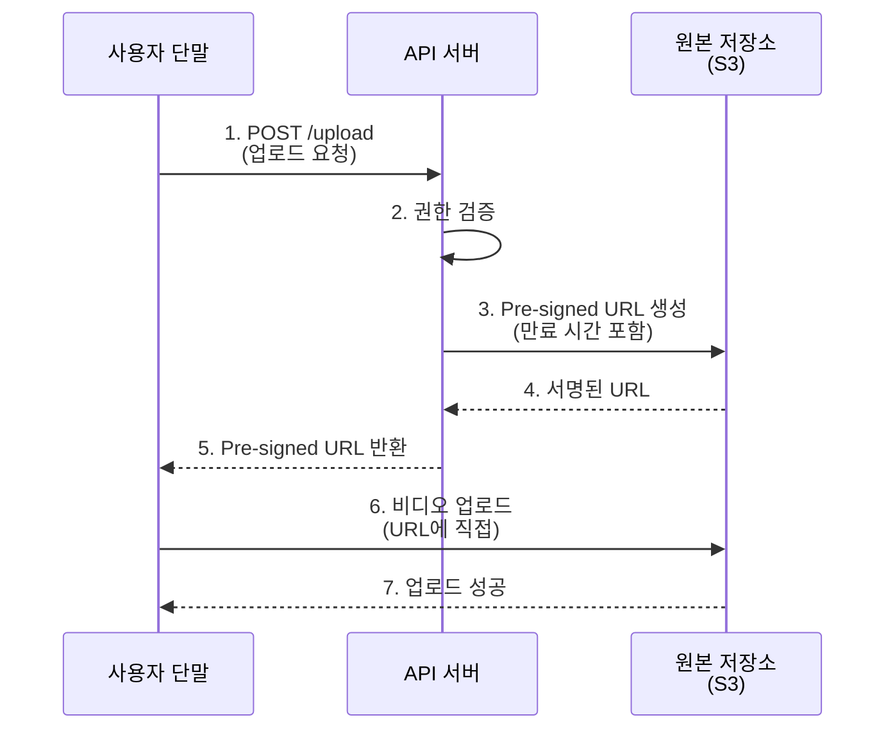
```mermaid
sequenceDiagram
    participant C as 사용자 단말
    participant API as API 서버
    participant S3 as 원본 저장소<br/>(S3)

    C->>API: 1. POST /upload<br/>(업로드 요청)
    API->>API: 2. 권한 검증
    API->>S3: 3. Pre-signed URL 생성<br/>(만료 시간 포함)
    S3-->>API: 4. 서명된 URL
    API-->>C: 5. Pre-signed URL 반환
    C->>S3: 6. 비디오 업로드<br/>(URL에 직접)
    S3-->>C: 7. 업로드 성공
```

**Pre-signed URL 특징**:
- 객체에 대한 임시 접근 권한 부여
- 만료 시간 설정 가능 (예: 1시간)
- 중간 서버를 거치지 않고 직접 업로드
- AWS S3, Azure Blob 등에서 지원

**구현 예시**:
```javascript
// Node.js + AWS SDK를 사용한 Pre-signed URL 생성
const AWS = require('aws-sdk');
const s3 = new AWS.S3();

async function generateUploadUrl(userId, videoId) {
  // 1. 사용자 권한 검증
  if (!await validateUser(userId)) {
    throw new Error('Unauthorized');
  }

  // 2. Pre-signed URL 생성
  const params = {
    Bucket: 'youtube-videos-bucket',
    Key: `uploads/${userId}/${videoId}.mp4`,
    Expires: 3600, // 1시간
    ContentType: 'video/mp4'
  };

  const url = await s3.getSignedUrlPromise('putObject', params);

  return url;
}

// API 엔드포인트
app.post('/api/upload/url', async (req, res) => {
  const { userId, videoId } = req.body;
  const uploadUrl = await generateUploadUrl(userId, videoId);

  res.json({
    uploadUrl,
    expiresIn: 3600
  });
});
```

#### 안정성 최적화 2: 비디오 보호

콘텐츠 저작권 보호를 위한 세 가지 방법:

**1. DRM (Digital Rights Management) 시스템**

| 제공사 | 솔루션 | 특징 |
|-------|--------|------|
| Apple | FairPlay | iOS/macOS 생태계 |
| Google | Widevine | Android, Chrome |
| Microsoft | PlayReady | Windows 플랫폼 |

**2. AES 암호화**

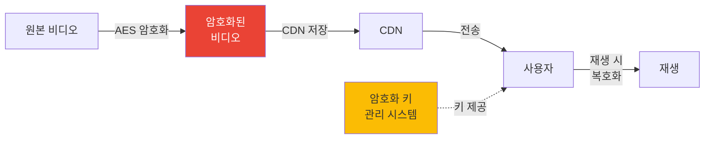
```mermaid
graph LR
    A[원본 비디오] -->|AES 암호화| B[암호화된<br/>비디오]
    B -->|CDN 저장| C[CDN]
    C -->|전송| D[사용자]
    D -->|재생 시<br/>복호화| E[재생]

    F[암호화 키<br/>관리 시스템] -.->|키 제공| D

    style B fill:#ea4335,color:#fff
    style F fill:#fbbc04
```

**구현 예시**:
```javascript
// Node.js + crypto를 사용한 AES 암호화
const crypto = require('crypto');
const fs = require('fs');

// 비디오 암호화
function encryptVideo(inputPath, outputPath, encryptionKey) {
  const algorithm = 'aes-256-cbc';
  const iv = crypto.randomBytes(16); // Initialization Vector

  const cipher = crypto.createCipheriv(algorithm, encryptionKey, iv);
  const input = fs.createReadStream(inputPath);
  const output = fs.createWriteStream(outputPath);

  // IV를 파일 시작 부분에 저장
  output.write(iv);

  input.pipe(cipher).pipe(output);

  return new Promise((resolve, reject) => {
    output.on('finish', resolve);
    output.on('error', reject);
  });
}

// 재생 시 복호화
function decryptVideo(encryptedPath, outputPath, encryptionKey) {
  const algorithm = 'aes-256-cbc';
  const input = fs.createReadStream(encryptedPath);
  const output = fs.createWriteStream(outputPath);

  let iv = null;
  let decipher = null;

  input.on('readable', () => {
    if (!iv) {
      // 첫 16바이트를 IV로 사용
      iv = input.read(16);
      decipher = crypto.createDecipheriv(algorithm, encryptionKey, iv);
      input.pipe(decipher).pipe(output);
    }
  });

  return new Promise((resolve, reject) => {
    output.on('finish', resolve);
    output.on('error', reject);
  });
}
```

**3. 워터마크**

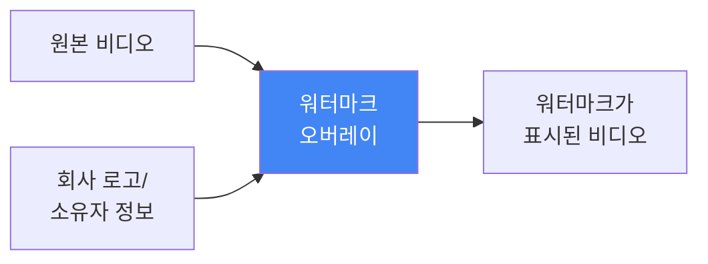
```mermaid
graph LR
    A[원본 비디오] --> B[워터마크<br/>오버레이]
    C[회사 로고/<br/>소유자 정보] --> B
    B --> D[워터마크가<br/>표시된 비디오]

    style B fill:#4285f4,color:#fff
```

- 비디오 위에 소유자 정보 표시
- 회사 로고, 이름 등 사용
- 불법 복제 추적 가능

#### 비용 최적화: 롱테일 분포 활용

**롱테일 분포의 특징**:
- 소수의 인기 비디오가 대부분의 트래픽 차지
- 대다수 비디오는 거의 재생되지 않음

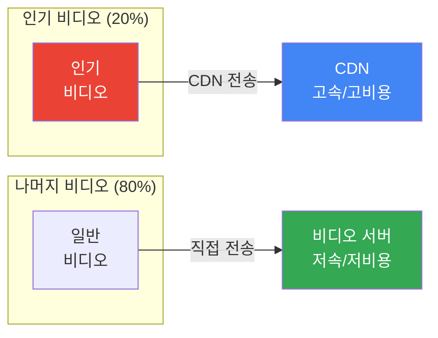
```mermaid
graph LR
    subgraph "인기 비디오 (20%)"
        A[인기<br/>비디오]
    end

    subgraph "나머지 비디오 (80%)"
        B[일반<br/>비디오]
    end

    C[CDN<br/>고속/고비용]
    D[비디오 서버<br/>저속/저비용]

    A -->|CDN 전송| C
    B -->|직접 전송| D

    style A fill:#ea4335,color:#fff
    style C fill:#4285f4,color:#fff
    style D fill:#34a853,color:#fff
```

**최적화 전략**:

**1. 선택적 CDN 사용**
```javascript
// 비디오 인기도에 따른 전송 방법 결정
function getVideoUrl(videoId, viewCount) {
  const POPULARITY_THRESHOLD = 10000; // 1만 회 이상

  if (viewCount > POPULARITY_THRESHOLD) {
    // 인기 비디오 → CDN
    return `https://cdn.example.com/videos/${videoId}.mp4`;
  } else {
    // 일반 비디오 → 직접 서버
    return `https://video-server.example.com/videos/${videoId}.mp4`;
  }
}
```

**2. 필요 시 인코딩**
- 인기 없는 비디오는 사전 인코딩 생략
- 최초 재생 시 on-demand 인코딩
- 짧은 비디오에 효과적

**3. 지역 기반 최적화**
- 특정 지역에서만 인기 있는 비디오
- 해당 지역에만 배포
- 불필요한 글로벌 배포 방지

**4. CDN 직접 구축 및 ISP 제휴**
- 초대형 서비스의 경우 자체 CDN 구축 고려
- ISP (Comcast, AT&T, Verizon 등)와 제휴
- 사용자와 가깝고 비용 절감

**비용 절감 효과**:
```
기존: 모든 비디오 CDN → $150,000/일
개선:
  - 인기 비디오 20% → CDN: $30,000/일
  - 나머지 80% → 자체 서버: $10,000/일
  - 총 비용: $40,000/일
  - 절감: $110,000/일 (약 73% 절감)
```

### 오류 처리

대규모 시스템에서 오류는 불가피합니다. 우아한 오류 처리와 빠른 복구가 핵심입니다.

#### 오류 유형

**1. 회복 가능 오류(Recoverable Error)**
- 특정 비디오 세그먼트 트랜스코딩 실패
- 네트워크 일시 장애
- **처리 방법**: 재시도(retry)

**2. 회복 불가능 오류(Non-recoverable Error)**
- 비디오 포맷 오류
- 파일 손상
- **처리 방법**: 작업 중단, 적절한 오류 코드 반환

#### 컴포넌트별 오류 처리 전략

| 컴포넌트 | 오류 시나리오 | 해결 방법 |
|---------|-------------|----------|
| **업로드** | 네트워크 실패 | 몇 회 재시도, 지수 백오프 |
| **비디오 분할** | 낡은 클라이언트 | 전체 비디오를 서버로 전송, 서버에서 분할 |
| **트랜스코딩** | 일시적 실패 | 재시도, 다른 서버에서 재실행 |
| **전처리** | DAG 생성 실패 | DAG 그래프 재생성 |
| **DAG 스케줄러** | 스케줄링 실패 | 작업 재스케줄링 |
| **자원 관리자 큐** | 큐 장애 | 사본(replica) 이용 |
| **작업 서버** | 서버 장애 | 다른 서버에서 작업 재시도 |
| **API 서버** | 서버 다운 | 무상태 서버, 다른 서버로 우회 |
| **메타데이터 캐시** | 캐시 서버 장애 | 다중화된 다른 노드 사용, 장애 서버 교체 |
| **메타데이터 DB** | 주 서버 장애 | 부 서버를 주 서버로 승격 |
| | 부 서버 장애 | 다른 부 서버 사용, 장애 서버 교체 |

**재시도 로직 구현 예시**:
```javascript
// 지수 백오프를 사용한 재시도 로직
async function retryWithExponentialBackoff(
  operation,
  maxRetries = 3,
  baseDelay = 1000
) {
  for (let attempt = 0; attempt < maxRetries; attempt++) {
    try {
      return await operation();
    } catch (error) {
      // 마지막 시도에서 실패하면 에러 던지기
      if (attempt === maxRetries - 1) {
        throw error;
      }

      // 회복 불가능한 에러는 즉시 중단
      if (isNonRecoverableError(error)) {
        throw error;
      }

      // 지수 백오프 대기
      const delay = baseDelay * Math.pow(2, attempt);
      await sleep(delay);
    }
  }
}

// 사용 예시
try {
  await retryWithExponentialBackoff(
    () => transcodeVideo(videoId),
    3,  // 최대 3회 재시도
    1000 // 초기 지연 1초
  );
} catch (error) {
  // 모든 재시도 실패 후 처리
  notifyUser(videoId, 'transcoding_failed');
  logError(error);
}
```

## 4️⃣ 단계: 마무리 및 추가 논의사항

### API 계층 규모 확장

**무상태(Stateless) 서버 설계**:

```mermaid
graph TB
    A[로드밸런서]

    subgraph "무상태 API 서버 클러스터"
        B1[API 서버 1]
        B2[API 서버 2]
        B3[API 서버 3]
        B4[API 서버 N]
    end

    C[(공유 데이터:<br/>DB/캐시)]

    A --> B1
    A --> B2
    A --> B3
    A --> B4

    B1 & B2 & B3 & B4 --> C

    style A fill:#4285f4,color:#fff
    style B1 fill:#34a853,color:#fff
    style B2 fill:#34a853,color:#fff
    style B3 fill:#34a853,color:#fff
    style B4 fill:#34a853,color:#fff
```

**특징**:
- 세션 정보를 서버에 저장하지 않음
- 모든 요청이 독립적으로 처리 가능
- 수평적 확장 용이

### 데이터베이스 규모 확장

**1. 읽기 성능 향상: 복제(Replication)**

```mermaid
graph TB
    A[로드밸런서]

    B[주 데이터베이스<br/>Write]

    subgraph "읽기 전용 복제본"
        C1[복제본 1<br/>Read]
        C2[복제본 2<br/>Read]
        C3[복제본 3<br/>Read]
    end

    A -->|쓰기| B
    A -->|읽기| C1
    A -->|읽기| C2
    A -->|읽기| C3

    B -.->|복제| C1
    B -.->|복제| C2
    B -.->|복제| C3

    style B fill:#ea4335,color:#fff
    style C1 fill:#34a853,color:#fff
    style C2 fill:#34a853,color:#fff
    style C3 fill:#34a853,color:#fff
```

**2. 쓰기 성능 향상: 샤딩(Sharding)**

```mermaid
graph TB
    A[샤드 라우터]

    subgraph "사용자 ID 기반 샤딩"
        B1[샤드 1<br/>User 1M-2M]
        B2[샤드 2<br/>User 2M-3M]
        B3[샤드 3<br/>User 3M-4M]
        B4[샤드 4<br/>User 4M-5M]
    end

    A -->|User ID % 4 = 0| B1
    A -->|User ID % 4 = 1| B2
    A -->|User ID % 4 = 2| B3
    A -->|User ID % 4 = 3| B4

    style A fill:#fbbc04
    style B1 fill:#4285f4,color:#fff
    style B2 fill:#4285f4,color:#fff
    style B3 fill:#4285f4,color:#fff
    style B4 fill:#4285f4,color:#fff
```

### 라이브 스트리밍

유튜브 라이브, 트위치와 같은 실시간 방송 기능:

**일반 스트리밍 vs 라이브 스트리밍**

| 구분 | 일반 비디오 | 라이브 스트리밍 |
|-----|-----------|--------------|
| **업로드** | 사전 업로드 후 처리 | 실시간 인코딩 및 전송 |
| **처리 시간** | 시간 제약 낮음 | 극도로 낮은 지연 요구 |
| **병렬화** | 높음 (GOP 단위) | 낮음 (실시간 순차 처리) |
| **오류 처리** | 재시도 가능 | 빠른 복구 필수 |
| **프로토콜** | HLS, DASH | WebRTC, RTMP, Low-Latency HLS |

**라이브 스트리밍 아키텍처**:

```mermaid
graph LR
    A[방송자] -->|RTMP| B[인제스트<br/>서버]
    B -->|실시간<br/>인코딩| C[트랜스코더]
    C -->|세그먼트<br/>생성| D[Origin<br/>서버]
    D -->|배포| E[CDN]
    E -->|Low-Latency<br/>HLS| F[시청자]

    style A fill:#ea4335,color:#fff
    style C fill:#fbbc04
    style E fill:#4285f4,color:#fff
```

**핵심 차이점**:

1. **응답 지연**: 2-5초 이내 목표 (일반: 수 분 가능)
2. **프로토콜 선택**:
   - RTMP (인제스트)
   - WebRTC (초저지연, 1초 이하)
   - Low-Latency HLS (2-5초)
3. **오류 처리**: 빠른 failover, 백업 스트림 준비

### 비디오 삭제(Takedown)

저작권 위반, 부적절한 콘텐츠 처리:

```mermaid
graph TB
    A[콘텐츠 감지]

    subgraph "감지 방법"
        B1[업로드 시<br/>자동 감지]
        B2[사용자<br/>신고]
        B3[권리자<br/>Content ID]
    end

    C{검토}

    D[삭제 처리]

    subgraph "삭제 작업"
        E1[메타데이터<br/>상태 변경]
        E2[CDN<br/>캐시 무효화]
        E3[저장소<br/>파일 삭제]
    end

    A --> B1
    A --> B2
    A --> B3

    B1 & B2 & B3 --> C
    C -->|위반 확인| D

    D --> E1
    D --> E2
    D --> E3

    style B1 fill:#fbbc04
    style B2 fill:#4285f4,color:#fff
    style B3 fill:#ea4335,color:#fff
    style D fill:#f44336,color:#fff
```

**처리 절차**:
1. **즉시 차단**: 메타데이터 상태를 "삭제됨"으로 변경
2. **CDN 무효화**: 모든 CDN 캐시 삭제
3. **비동기 삭제**: 실제 파일은 배치 작업으로 삭제

## 🤔 토론 주제

### 기술적 관점

1. **트랜스코딩 최적화**: DAG 모델 외에 비디오 트랜스코딩 성능을 개선할 수 있는 방법은? GPU 가속, 분산 처리, 적응형 인코딩 파라미터 조정 등을 고려할 때 각각의 트레이드오프는?

2. **저장소 전략**: BLOB 저장소로 S3, Azure Blob, Google Cloud Storage 중 선택 시 고려사항은? 멀티 클라우드 전략의 장단점은? (비용, 가용성, 복잡도)

3. **스트리밍 프로토콜**: HLS와 MPEG-DASH의 실질적 차이는? 어떤 상황에서 어느 프로토콜이 더 적합한가? WebRTC는 언제 고려해야 하는가?

### 실무/비즈니스 관점

1. **추천 알고리즘 통합**: 비디오 업로드 후 추천 시스템에 어떻게 통합하는가? 신규 비디오의 cold start 문제는 어떻게 해결하는가? 메타데이터 추출 및 분류 파이프라인은?

2. **수익화 전략**: 광고 삽입 지점을 어떻게 결정하는가? Pre-roll, Mid-roll, Post-roll 광고의 최적 배치는? 사용자 이탈률과 광고 수익의 균형점은?

3. **콘텐츠 저작권**: Content ID 시스템을 어떻게 구현하는가? 오탐지(false positive)와 미탐지(false negative)의 비즈니스 임팩트는? 권리자와 창작자 간 수익 분배 메커니즘은?

### 운영/확장성 관점

1. **트래픽 패턴**: 특정 시간대(예: 저녁 8시~11시)에 트래픽이 5배 증가할 때 대응 전략은? Auto-scaling 임계값 설정 기준은? 예측 기반 스케일링 vs 반응형 스케일링?

2. **CDN 비용 모니터링**: 일일 $150,000의 CDN 비용을 실시간으로 추적하고 제어하는 방법은? 예산 초과 시 긴급 대응 시나리오는? (트래픽 throttling, 품질 제한 등)

3. **재해 복구**: 특정 리전의 CDN이나 저장소가 완전히 다운됐을 때 복구 전략은? RPO(Recovery Point Objective)와 RTO(Recovery Time Objective) 설정 기준은?

## 📚 추가 학습 자료

### 비디오 기술

- [Video Encoding Basics - FFmpeg](https://ffmpeg.org/documentation.html)
- [HLS vs DASH - Streaming Protocols Comparison](https://www.dacast.com/blog/hls-vs-dash/)
- [Understanding GOP (Group of Pictures)](https://en.wikipedia.org/wiki/Group_of_pictures)
- [Adaptive Bitrate Streaming](https://developer.apple.com/streaming/)

### 실제 시스템 사례

- [Scaling Video Infrastructure - Netflix Tech Blog](https://netflixtechblog.com/)
- [YouTube Architecture - High Scalability](http://highscalability.com/youtube-architecture)
- [Facebook Video Processing - SVE Paper](https://www.cs.princeton.edu/~wlloyd/papers/sve-sosp17.pdf)
- [Twitch Engineering Blog](https://blog.twitch.tv/en/tags/engineering/)

### CDN 및 비용 최적화

- [Amazon CloudFront Pricing](https://aws.amazon.com/cloudfront/pricing/)
- [Akamai Content Delivery](https://www.akamai.com/)
- [Video CDN Best Practices](https://www.cloudflare.com/learning/cdn/what-is-a-cdn/)
- [Long Tail Distribution in Video Streaming](https://arxiv.org/pdf/0707.3670.pdf)

### 보안 및 DRM

- [Content Protection - Apple FairPlay](https://developer.apple.com/streaming/fps/)
- [Google Widevine DRM](https://www.widevine.com/)
- [AES Encryption for Video](https://en.wikipedia.org/wiki/Advanced_Encryption_Standard)
- [Pre-signed URLs - AWS S3](https://docs.aws.amazon.com/AmazonS3/latest/userguide/PresignedUrlUploadObject.html)

### 메시지 큐 및 분산 시스템

- [Apache Kafka Documentation](https://kafka.apache.org/documentation/)
- [RabbitMQ Tutorials](https://www.rabbitmq.com/getstarted.html)
- [Redis as Message Queue](https://redis.io/topics/streams-intro)

## 🎯 핵심 메시지

> "유튜브와 같은 대규모 비디오 스트리밍 플랫폼의 핵심은 **업로드-트랜스코딩-스트리밍 파이프라인의 효율적인 분리**에 있다. DAG 모델을 통한 유연한 트랜스코딩, GOP 단위 병렬 업로드, 메시지 큐 기반 느슨한 결합으로 **속도와 확장성**을 확보한다.
>
> 비용 최적화는 롱테일 분포를 활용하는 것이 핵심이다. 인기 비디오 20%만 CDN으로 서비스하고 나머지 80%는 직접 서버로 전송하면 **CDN 비용을 70% 이상 절감**할 수 있다. Pre-signed URL, DRM, AES 암호화로 안정성과 보안을 확보하되, 회복 가능 오류는 재시도로, 회복 불가능 오류는 명확한 에러 코드로 처리한다.
>
> 실무에서는 **비용, 속도, 품질**의 트레이드오프를 지속적으로 조정해야 한다. 일간 150TB의 비디오 데이터를 처리하면서도 월 450만 달러의 CDN 비용을 최적화하려면, 데이터 분석 기반의 지능적 전송 전략이 필수적이다. 라이브 스트리밍, 추천 시스템 통합, Content ID와 같은 확장 기능은 핵심 파이프라인이 안정화된 후 단계적으로 추가하는 것이 현명하다."

---

**다음 스터디**: 15장에서는 구글 드라이브와 같은 파일 저장 및 동기화 시스템 설계를 다룹니다. 대용량 파일 동기화, 충돌 해결, 오프라인 편집 지원 등 실시간 협업 플랫폼의 핵심 개념들을 학습할 예정입니다.
