>  발표자: 길현준

---

# [가면사배 시리즈 #15] 구글 드라이브 설계

## 📖 책 소개

- **제목**: 가상 면접 사례로 배우는 대규모 시스템 설계 기초
- **장**: 15장 - 구글 드라이브 설계
- **핵심 주제**: 대규모 클라우드 파일 저장 및 동기화 시스템의 설계, 블록 저장소, 델타 동기화, 충돌 해결

구글 드라이브, 드롭박스, 원드라이브, 아이클라우드... 우리가 매일 사용하는 클라우드 저장소 서비스는 어떻게 설계될까요? 단순히 파일을 업로드하고 다운로드하는 것처럼 보이지만, 그 이면에는 여러 단말 간 실시간 동기화, 대용량 파일 처리, 충돌 해결, 오프라인 편집 지원 등 복잡한 시스템이 숨어 있습니다. 이번 장에서는 500 페타바이트의 저장 공간을 관리하고 천만 명의 사용자를 지원하는 구글 드라이브와 같은 시스템을 설계합니다.

## 🎯 학습 목표

이번 장을 통해 다음 내용을 학습합니다:

1. **대규모 파일 시스템 요구사항**: 천만 명의 DAU와 500PB 저장소를 관리하는 클라우드 서비스의 규모 추정 및 설계 제약사항
2. **블록 저장소 아키텍처**: 파일을 4MB 블록 단위로 분할하여 저장하고, 델타 동기화로 네트워크 대역폭을 절감하는 전략
3. **메타데이터 설계**: 사용자, 파일, 블록, 버전 관리를 위한 데이터베이스 스키마와 강한 일관성 보장 방법
4. **동기화 충돌 해결**: 여러 사용자가 동시에 같은 파일을 수정할 때 발생하는 충돌을 감지하고 해결하는 메커니즘
5. **알림 시스템**: 롱 폴링을 통해 클라이언트에게 파일 변경사항을 실시간으로 알리는 효율적인 방법

## 1️⃣ 단계: 문제 이해 및 설계 범위 확정

### 구글 드라이브란?

구글 드라이브는 파일 저장 및 동기화 서비스로, 문서, 사진, 비디오 등의 파일을 클라우드에 보관하고 컴퓨터, 스마트폰, 태블릿 등 여러 단말에서 접근할 수 있도록 합니다.

### 면접 질문을 통한 범위 확정

**질문 1**: 가장 중요하게 지원해야 할 기능들은 무엇인가요?
- **답변**: 파일 업로드/다운로드, 파일 동기화, 알림(notification)

**질문 2**: 모바일 앱이나 웹 앱 가운데 하나만 지원하면 되나요?
- **답변**: 둘 다 지원해야 합니다

**질문 3**: 파일을 암호화해야 할까요?
- **답변**: 네

**질문 4**: 파일 크기에 제한이 있습니까?
- **답변**: 10GB 제한

**질문 5**: 사용자는 얼마나 됩니까?
- **답변**: 일간 능동 사용자(DAU) 기준으로 천만(10 million) 명

### 요구사항 정리

#### 기능적 요구사항

| 기능 | 설명 |
|-----|------|
| **파일 추가** | Drag-and-drop으로 파일 업로드 |
| **파일 다운로드** | 원하는 파일 내려받기 |
| **파일 동기화** | 한 단말에서 추가한 파일이 다른 단말에 자동 동기화 |
| **파일 갱신 이력** | 파일의 버전 히스토리 조회 가능 |
| **파일 공유** | 다른 사용자와 파일 공유 |
| **알림** | 파일 편집/삭제/공유 시 알림 표시 |

**제외 사항**:
- 구글 문서(Google Docs) 편집 및 협업 기능 (여러 사용자가 동시에 같은 문서를 편집하는 기능)

#### 비기능적 요구사항

| 요구사항 | 설명 | 중요도 |
|---------|------|--------|
| **안정성** | 데이터 손실이 절대 발생하면 안 됨 | ⭐⭐⭐⭐⭐ |
| **빠른 동기화** | 동기화 지연 최소화 (사용자 인내심 고려) | ⭐⭐⭐⭐ |
| **네트워크 효율성** | 대역폭을 불필요하게 소모하지 않음 | ⭐⭐⭐⭐ |
| **규모 확장성** | 대량의 트래픽 처리 가능 | ⭐⭐⭐⭐ |
| **높은 가용성** | 일부 서버 장애에도 서비스 지속 | ⭐⭐⭐⭐ |

### 개략적 규모 추정

```
📊 시스템 규모 계산

기본 가정:
- 가입 사용자: 50,000,000 (5천만 명)
- DAU (일간 능동 사용자): 10,000,000 (1천만 명)
- 사용자당 무료 저장공간: 10GB
- 1인당 일일 평균 파일 업로드: 2개
- 파일 평균 크기: 500KB
- 읽기:쓰기 비율: 1:1

💾 필요한 저장공간 총량
= 50,000,000 사용자 × 10GB
= 500 페타바이트 (Petabyte)

📤 업로드 API QPS
= 10,000,000 사용자 × 2회 업로드 / 24시간 / 3600초
= 약 240 QPS

⚡ 최대 QPS (피크 타임)
= 240 × 2
= 480 QPS

📈 핵심 과제
- 500PB의 대규모 저장소 관리
- 효율적인 파일 동기화 메커니즘
- 네트워크 대역폭 최적화
```

**💡 설계 포인트**: 500PB의 데이터를 안정적으로 저장하고, 여러 단말 간 빠른 동기화를 보장하면서도 네트워크 대역폭을 절약하는 것이 핵심입니다.

## 2️⃣ 단계: 개략적 설계안

### 한 대 서버에서 시작하기

모든 것을 한 번에 설계하기보다는, 단순한 한 대 서버에서 시작해 점진적으로 발전시켜 나가겠습니다.

**초기 구성**:
- 파일 업로드/다운로드를 처리할 웹 서버
- 사용자 데이터, 로그인 정보, 파일 정보를 보관할 데이터베이스
- 파일을 저장할 저장소 시스템 (1TB 공간)

#### 파일 저장 구조

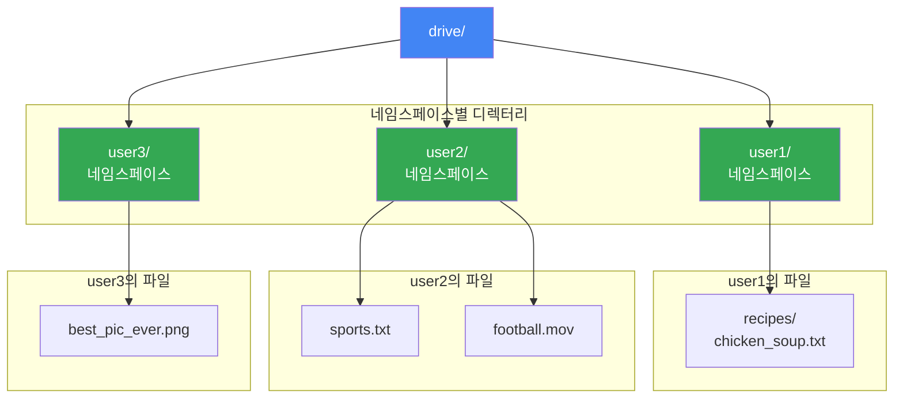

**네임스페이스(namespace)**: 각 사용자별로 파일을 구분하여 보관하는 하위 디렉터리입니다. 각 파일은 `네임스페이스/상대경로`로 유일하게 식별할 수 있습니다.

### API 설계

#### 1. 파일 업로드 API

시스템은 두 가지 종류의 업로드를 지원합니다:

**단순 업로드(Simple Upload)**:
- 파일 크기가 작을 때 사용

**이어 올리기(Resumable Upload)**:
- 파일 크기가 크고 네트워크 문제로 업로드 중단 가능성이 높을 때 사용

```
API: https://api.example.com/files/upload?uploadType=resumable

인자:
- uploadType=resumable
- data: 업로드할 로컬 파일

절차:
1. 이어 올리기 URL을 받기 위한 최초 요청 전송
2. 데이터를 업로드하고 상태 모니터링
3. 장애 발생 시 중단 시점부터 재시작
```

#### 2. 파일 다운로드 API

```
API: https://api.example.com/files/download

인자:
- path: 다운로드할 파일의 경로

예시:
{
  "path": "/recipes/soup/best_soup.txt"
}
```

#### 3. 파일 갱신 히스토리 API

```
API: https://api.example.com/files/list_revisions

인자:
- path: 갱신 히스토리를 가져올 파일의 경로
- limit: 히스토리 길이의 최대치

예시:
{
  "path": "/recipes/soup/best_soup.txt",
  "limit": 20
}
```

**보안**: 모든 API는 사용자 인증을 필요로 하며 HTTPS 프로토콜을 사용합니다.

### 한 대 서버의 제약 극복

#### 문제 1: 저장 공간 부족

파일 시스템이 가득 차면 (예: 1TB 중 10MB만 남음) 더 이상 업로드할 수 없습니다.

**해결책**: 샤딩(Sharding)

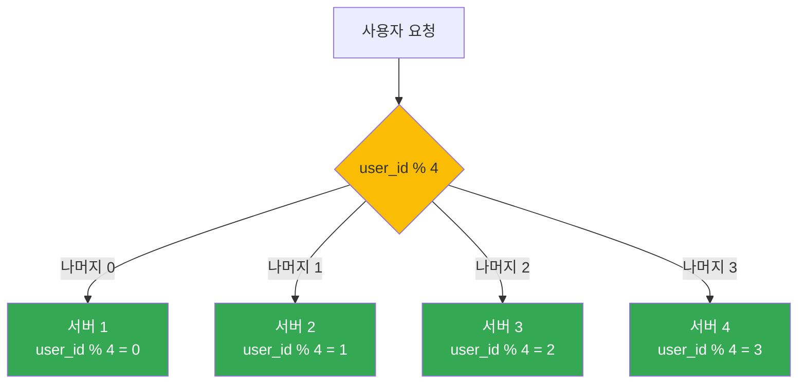

#### 문제 2: 데이터 손실 위험

단일 서버에 장애가 발생하면 데이터를 잃게 됩니다.

**해결책**: Amazon S3 활용

Amazon S3(Simple Storage Service)는 업계 최고 수준의 규모 확장성, 가용성, 보안, 성능을 제공하는 객체 저장소 서비스입니다.

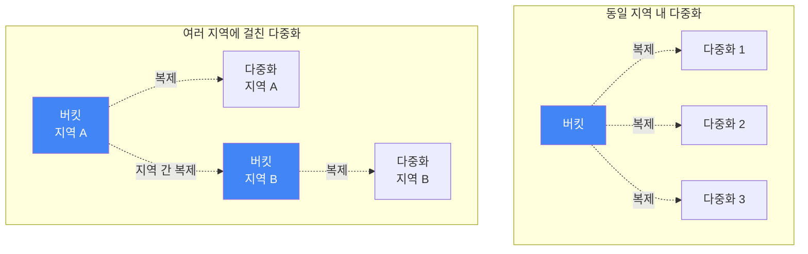

**S3 다중화 전략**:
- 같은 지역 내 다중화: 빠른 복구, 낮은 지연
- 여러 지역에 걸친 다중화: 데이터 손실 방지, 가용성 최대화 (채택!)

### 개선된 시스템 아키텍처

S3를 도입한 후, 추가적인 개선 사항들:

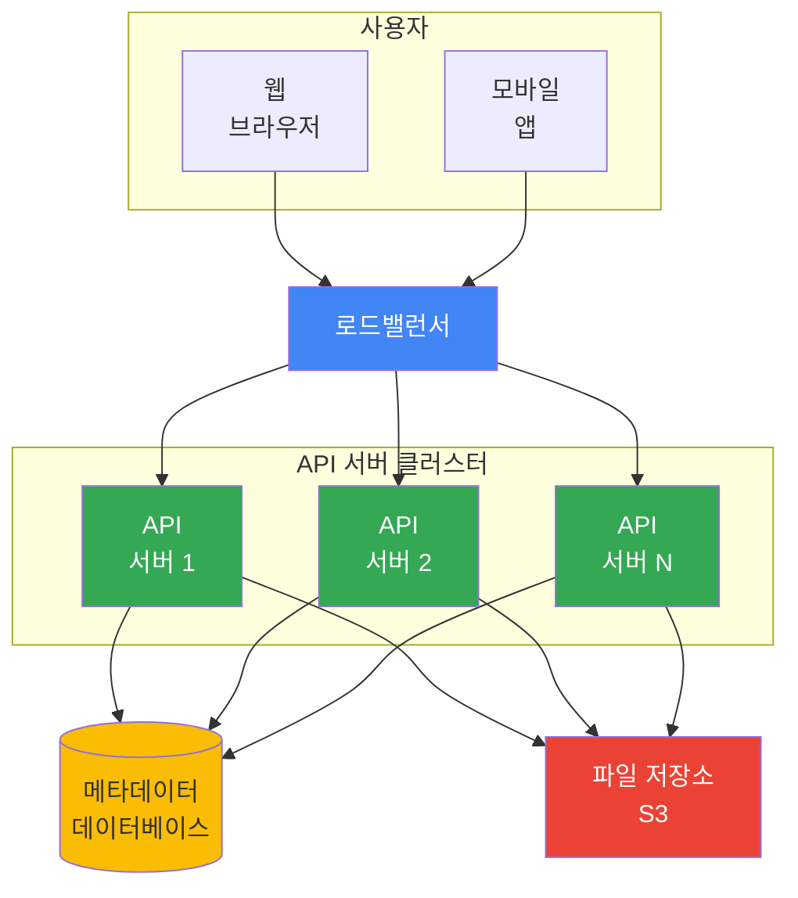

**개선 사항**:

| 컴포넌트 | 역할 | 장점 |
|---------|------|------|
| **로드밸런서** | 트래픽 분산 및 장애 우회 | 고가용성, 수평 확장 용이 |
| **웹 서버** | 더 많은 서버 추가 가능 | 트래픽 폭증에 대응 |
| **메타데이터 DB** | 파일 저장소와 분리 | SPOF 회피, 다중화/샤딩 적용 |
| **파일 저장소** | S3로 다중화 | 데이터 무손실, 높은 가용성 |

### 동기화 충돌 해결

여러 사용자가 같은 파일을 동시에 수정하면 어떻게 될까요?

**전략**: 먼저 처리되는 변경은 성공, 나중 변경은 충돌 표시

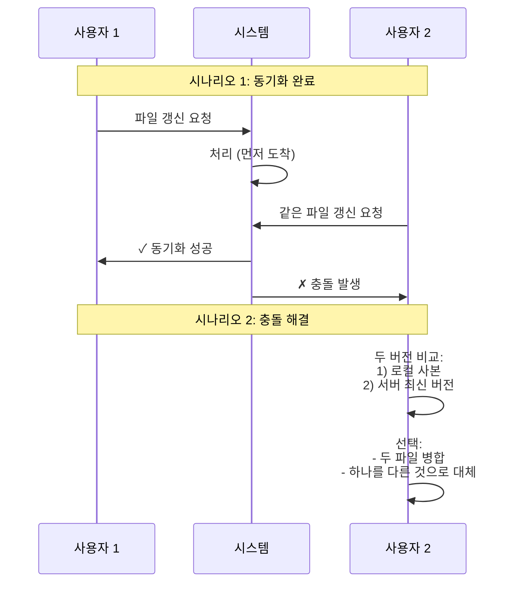

**충돌 파일 명명 규칙**:
```
SystemDesignInterview.txt
SystemDesignInterview_user2_conflicted_copy_2019-05-01.txt
```

### 개략적 설계안 전체 구성

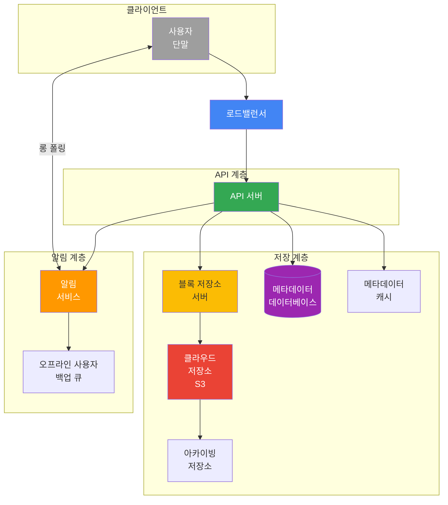

#### 주요 컴포넌트 설명

**사용자 단말**:
- 웹 브라우저, 모바일 앱 등의 클라이언트

**블록 저장소 서버(Block Server)**:
- 파일을 여러 개의 블록으로 나눠 저장
- 각 블록에는 고유한 해시값 할당
- 블록 최대 크기: 4MB (드롭박스 사례 참고)
- 파일 재구성 시 블록을 원래 순서대로 합침

**클라우드 저장소**:
- 파일이 블록 단위로 저장됨 (S3)

**아카이빙 저장소(Cold Storage)**:
- 오랫동안 사용되지 않은 비활성(inactive) 데이터 저장
- 비용 절감 (S3 Glacier 등)

**API 서버**:
- 파일 업로드 외 거의 모든 것을 담당
- 사용자 인증, 프로파일 관리, 메타데이터 갱신

**메타데이터 데이터베이스**:
- 사용자, 파일, 블록, 버전 정보 관리
- 실제 파일은 클라우드에, 메타데이터만 DB에 저장

**메타데이터 캐시**:
- 자주 쓰이는 메타데이터 캐싱으로 성능 향상

**알림 서비스**:
- 발행/구독(Pub/Sub) 프로토콜 기반
- 파일 추가/편집/삭제 이벤트를 클라이언트에 알림

**오프라인 사용자 백업 큐**:
- 접속 중이 아닌 클라이언트를 위한 이벤트 보관
- 재접속 시 동기화

## 3️⃣ 단계: 상세 설계

### 블록 저장소 서버

대용량 파일을 정기적으로 갱신할 때 전체 파일을 매번 업로드하면 네트워크 대역폭이 낭비됩니다.

**최적화 방법**:

#### 1. 델타 동기화(Delta Sync)

파일이 수정되면 전체 파일 대신 **수정된 블록만 동기화**합니다.

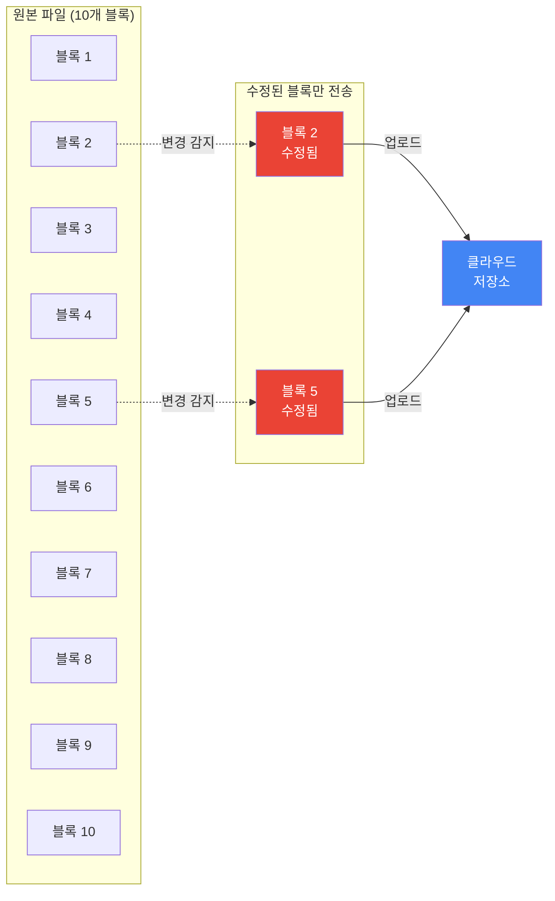

**장점**:
- 네트워크 대역폭 절감
- 업로드 시간 단축
- 사용자 경험 향상

#### 2. 압축(Compression)

블록 단위로 압축하여 데이터 크기를 줄입니다.

**압축 알고리즘 선택**:
- 텍스트 파일: `gzip`, `bzip2`
- 이미지/비디오: 파일 유형별 최적 알고리즘

#### 블록 저장소 서버 동작 과정

새 파일 추가 시:

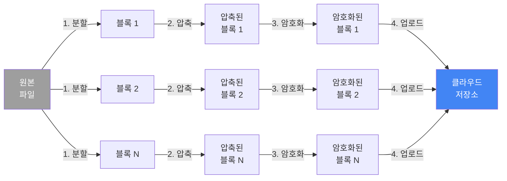

**처리 단계**:
1. **분할**: 파일을 작은 블록으로 나눔
2. **압축**: 각 블록 압축
3. **암호화**: 보안을 위해 암호화
4. **업로드**: 클라우드 저장소로 전송

### 높은 일관성 요구사항

**강한 일관성(Strong Consistency)** 모델 필수:
- 같은 파일이 단말이나 사용자에 따라 다르게 보이면 안 됨
- 메타데이터 캐시와 DB 계층 모두 적용

#### 일관성 보장 방법

**메모리 캐시의 문제**:
- 보통 결과적 일관성(Eventual Consistency) 모델 지원
- 캐시와 DB가 일시적으로 불일치 가능

**해결책**:
1. 캐시의 사본과 DB의 원본이 일치하도록 보장
2. DB의 원본이 변경되면 캐시 무효화

**데이터베이스 선택**:

| 데이터베이스 | ACID 지원 | 강한 일관성 | 비고 |
|------------|----------|-----------|------|
| **관계형 DB** | ✓ 기본 지원 | ✓ 쉬움 | 채택! |
| **NoSQL** | △ 기본 미지원 | △ 프로그래밍 필요 | 동기화 로직 직접 구현 |

**결론**: ACID를 기본 지원하는 **관계형 데이터베이스 채택**

### 메타데이터 데이터베이스

#### 스키마 설계

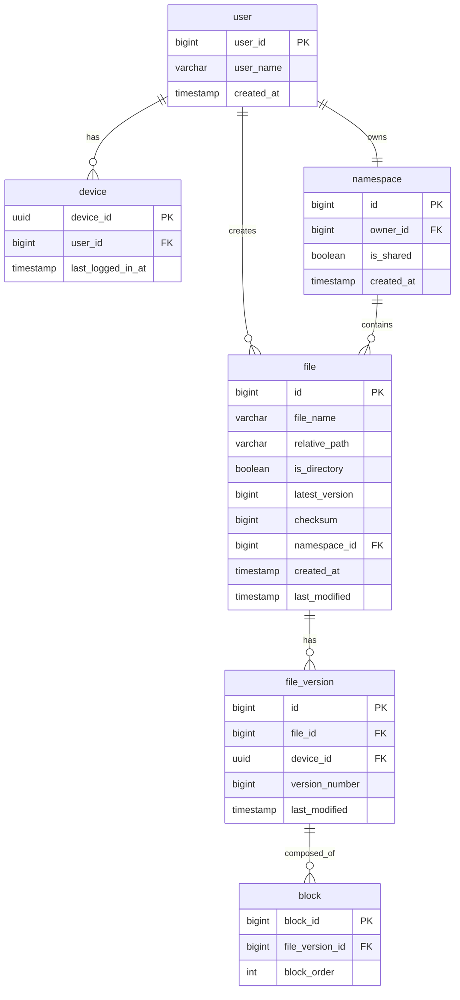

#### 테이블 설명

**user 테이블**:
- 사용자의 이름, 이메일, 프로파일 사진 등 기본 정보

**device 테이블**:
- 단말 정보 (push_id는 모바일 푸시 알림용)
- 한 사용자가 여러 대의 단말 보유 가능

**namespace 테이블**:
- 사용자의 루트 디렉터리 정보

**file 테이블**:
- 파일의 최신 정보 보관

**file_version 테이블**:
- 파일의 갱신 이력 (읽기 전용)
- 히스토리 훼손 방지

**block 테이블**:
- 파일 블록 정보
- 특정 버전의 파일은 블록을 올바른 순서로 조합하여 복원

### 업로드 절차

파일 업로드 시 두 개 요청이 **병렬적으로** 전송됩니다:

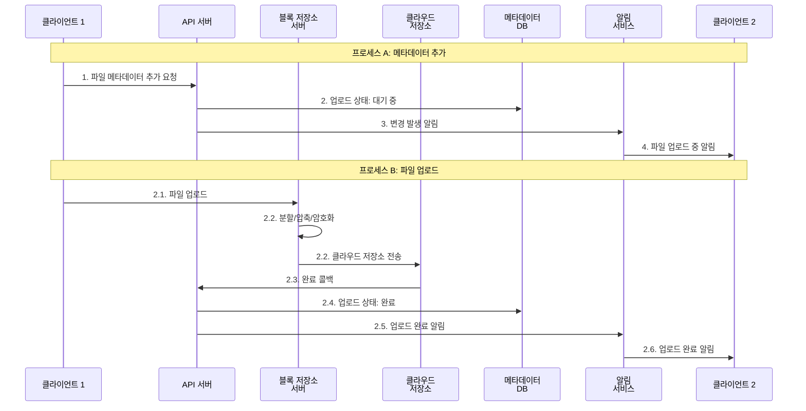

**병렬 처리의 장점**:
- 메타데이터 갱신과 파일 업로드가 동시 진행
- 전체 업로드 시간 단축

### 다운로드 절차

파일 변경을 감지하는 두 가지 방법:

1. **접속 중인 클라이언트**: 알림 서비스가 변경 알림
2. **오프라인 클라이언트**: 재접속 시 캐시에서 데이터 가져옴

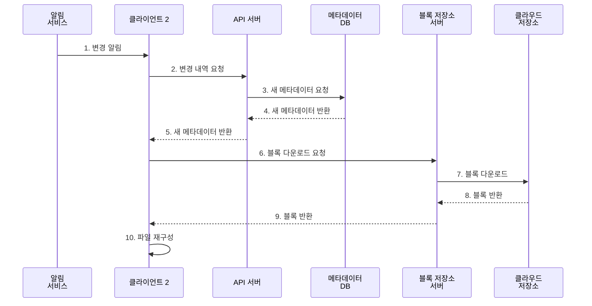

**단계별 설명**:
1-5. 메타데이터 동기화
6-9. 블록 다운로드
10. 로컬에서 파일 재구성

### 알림 서비스

파일 일관성 유지를 위해 변경사항을 다른 클라이언트에게 알립니다.

#### 롱 폴링 vs 웹소켓

| 특성 | 롱 폴링 | 웹소켓 |
|-----|--------|--------|
| **통신 방향** | 단방향 (서버 → 클라이언트) | 양방향 |
| **연결 유지** | 이벤트 발생 시 연결 끊음 | 지속적 연결 |
| **적합한 용도** | 간헐적 알림 | 실시간 양방향 통신 (채팅 등) |
| **구현 복잡도** | 낮음 | 높음 |

**구글 드라이브는 롱 폴링 선택**:

이유:
1. 양방향 통신 불필요 (서버 → 클라이언트만)
2. 알림 빈도가 높지 않음
3. 단시간 대량 데이터 전송 없음

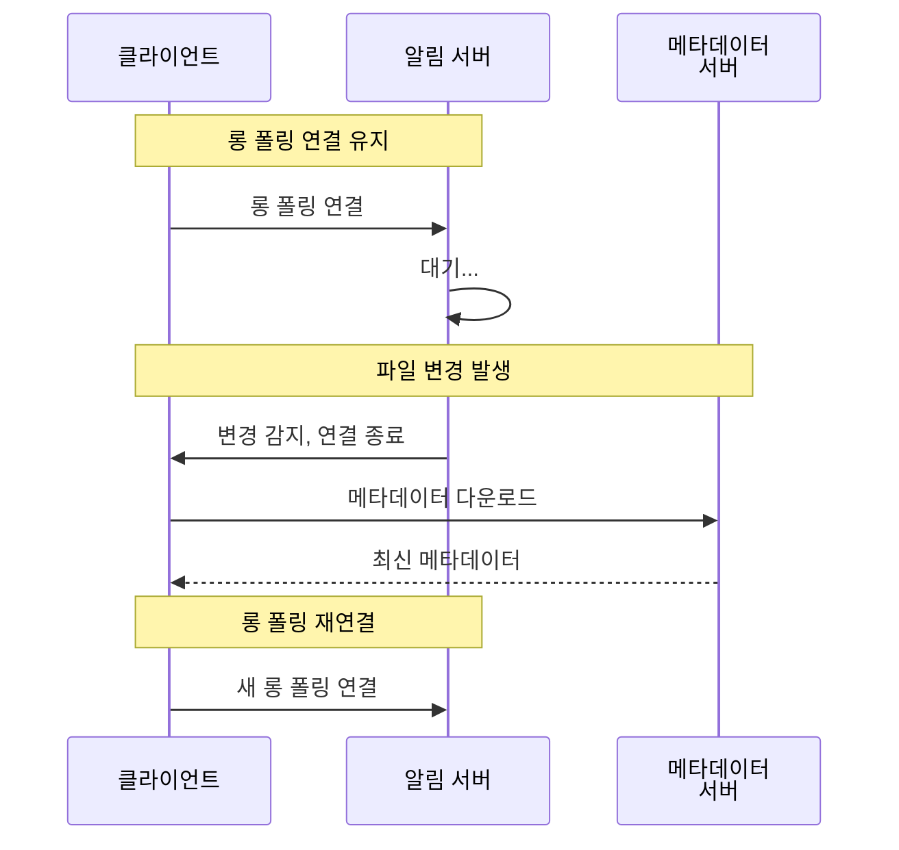

**동작 원리**:
1. 클라이언트가 롱 폴링 연결 유지
2. 파일 변경 감지 시 연결 끊음
3. 클라이언트가 메타데이터 서버와 연결해 최신 내역 다운로드
4. 다운로드 완료 또는 타임아웃 후 즉시 새 롱 폴링 연결

### 저장소 공간 절약

파일의 여러 버전을 여러 데이터센터에 보관하면 저장 용량이 빨리 소진됩니다.

**절약 방법**:

#### 1. 중복 제거(De-dupe)

```javascript
// 중복 블록 제거 로직
function deduplicateBlock(blockData) {
  // 블록의 해시값 계산
  const blockHash = calculateSHA256(blockData);

  // 이미 저장된 블록인지 확인
  const existingBlock = await db.block.findOne({
    where: { hash: blockHash }
  });

  if (existingBlock) {
    // 중복 블록 - 기존 블록 참조
    return existingBlock.id;
  } else {
    // 새 블록 - 저장소에 업로드
    const blockId = await uploadToStorage(blockData);
    await db.block.create({
      id: blockId,
      hash: blockHash
    });
    return blockId;
  }
}
```

**장점**:
- 같은 내용의 블록을 여러 번 저장하지 않음
- 계정 차원에서 중복 제거

#### 2. 지능적 백업 전략

**한도 설정**:
- 보관 버전 개수에 상한 설정
- 예: 최근 100개 버전만 유지

**중요 버전만 보관**:
```javascript
// 중요 버전 선별 로직
function isImportantVersion(version) {
  const now = Date.now();
  const versionAge = now - version.timestamp;

  // 24시간 이내: 모든 버전 유지
  if (versionAge < 24 * 60 * 60 * 1000) {
    return true;
  }

  // 1주일 이내: 매 시간마다 1개
  if (versionAge < 7 * 24 * 60 * 60 * 1000) {
    return version.timestamp % (60 * 60 * 1000) === 0;
  }

  // 1달 이내: 매일 1개
  if (versionAge < 30 * 24 * 60 * 60 * 1000) {
    return version.timestamp % (24 * 60 * 60 * 1000) === 0;
  }

  // 그 이상: 매주 1개
  return version.timestamp % (7 * 24 * 60 * 60 * 1000) === 0;
}
```

#### 3. 아카이빙 저장소(Cold Storage)

자주 사용되지 않는 데이터를 저비용 저장소로 이동:

| 저장소 | 용도 | 비용 | 접근 속도 |
|-------|------|------|----------|
| **S3 Standard** | 활성 데이터 | 높음 | 빠름 |
| **S3 Glacier** | 아카이빙 | 낮음 (1/10) | 느림 (수 분~수 시간) |

### 장애 처리

대규모 시스템에서 장애는 불가피합니다. 각 컴포넌트별 장애 처리 전략:

#### 컴포넌트별 장애 대응

| 컴포넌트 | 장애 시나리오 | 해결 방법 |
|---------|-------------|----------|
| **로드밸런서** | 주 LB 다운 | 박동(heartbeat) 신호 모니터링, 부(secondary) LB 활성화 |
| **블록 저장소 서버** | 서버 장애 | 다른 서버가 미완료 작업 이어받기 |
| **클라우드 저장소** | S3 버킷 장애 | 다른 지역에서 파일 가져오기 (다중화) |
| **API 서버** | 서버 다운 | 무상태 서버, 로드밸런서가 자동으로 다른 서버로 우회 |
| **메타데이터 캐시** | 캐시 서버 장애 | 다중화된 다른 노드 사용, 장애 서버 교체 |
| **메타데이터 DB** | 주 DB 장애 | 부 DB를 주 DB로 승격, 새 부 DB 추가 |
| | 부 DB 장애 | 다른 부 DB 사용, 장애 서버 교체 |
| **알림 서비스** | 서버 장애 | 롱 폴링 연결 재설정 (느린 복구) |
| **오프라인 백업 큐** | 큐 장애 | 사본(replica) 큐로 구독 관계 재설정 |

#### 알림 서비스 장애의 특수성

2012년 드롭박스 발표에 따르면:
- 한 대의 알림 서버가 **1백만 개 이상의 연결** 관리
- 서버 장애 시 백만 명이 재연결 필요
- **주의**: 1백만 개 연결 **유지**는 가능하지만, 동시 **시작**은 불가능
- 따라서 롱 폴링 재연결은 상대적으로 느림

```javascript
// 지수 백오프를 사용한 재연결 로직
async function reconnectToNotificationService() {
  let retryCount = 0;
  const maxRetries = 5;
  const baseDelay = 1000; // 1초

  while (retryCount < maxRetries) {
    try {
      await connectLongPolling();
      console.log('알림 서비스 재연결 성공');
      return;
    } catch (error) {
      retryCount++;

      if (retryCount >= maxRetries) {
        console.error('알림 서비스 재연결 실패');
        throw error;
      }

      // 지수 백오프: 1초, 2초, 4초, 8초, 16초
      const delay = baseDelay * Math.pow(2, retryCount - 1);
      console.log(`${delay}ms 후 재시도 (${retryCount}/${maxRetries})`);
      await sleep(delay);
    }
  }
}
```

## 4️⃣ 단계: 마무리 및 추가 논의사항

### 설계 요약

이번 장에서는 구글 드라이브와 같은 대규모 파일 저장 및 동기화 시스템을 설계했습니다.

**핵심 설계 결정**:

1. **블록 저장소 + 델타 동기화**
   - 파일을 4MB 블록으로 분할
   - 수정된 블록만 전송
   - 네트워크 대역폭 절감

2. **강한 일관성 모델**
   - 관계형 DB 채택 (ACID 보장)
   - 캐시 무효화 전략
   - 모든 단말에서 동일한 파일 버전 보장

3. **롱 폴링 알림 시스템**
   - 실시간 파일 변경 알림
   - 웹소켓보다 단순하고 효율적
   - 간헐적 알림에 적합

4. **다중화 및 고가용성**
   - S3의 여러 지역 다중화
   - 무상태 API 서버
   - 주/부 데이터베이스 구조

### 대안 고려사항

#### 클라이언트 직접 업로드

블록 저장소 서버를 거치지 않고 파일을 클라우드 저장소에 직접 업로드한다면?

**장점**:
- 파일 전송이 클라우드로 직접 → 업로드 시간 단축 가능

**단점**:

| 문제 | 설명 |
|-----|------|
| **플랫폼별 구현** | 분할/압축/암호화 로직을 각 플랫폼(iOS, Android, 웹)마다 구현 필요 |
| **보안 위험** | 클라이언트에 암호화 로직 → 해킹 위험 증가 |
| **유지보수 복잡도** | 로직 변경 시 모든 클라이언트 업데이트 필요 |

**결론**: 블록 저장소 서버 유지가 더 나은 선택

#### 접속 상태 관리 서비스 분리

접속 상태 관리 로직을 알림 서비스에서 분리하여 별도 서비스로?

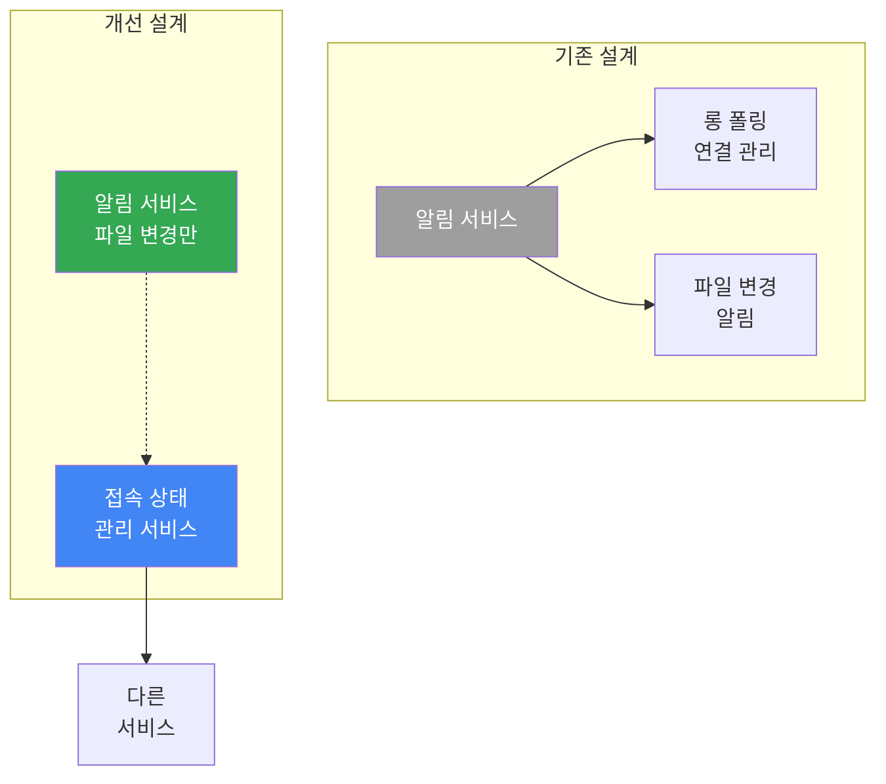

**장점**:
- 접속 상태 관리 로직을 다른 서비스에서도 활용 가능
- 관심사의 분리(Separation of Concerns)
- 독립적인 확장 가능

### 추가 확장 가능성

1. **실시간 협업 편집**
   - 구글 문서처럼 여러 사용자가 동시 편집
   - Operational Transformation 또는 CRDT 알고리즘 필요

2. **파일 공유 권한 관리**
   - 읽기 전용, 쓰기 가능, 공유 가능 등 세밀한 권한 제어
   - 조직/팀 단위 공유

3. **오프라인 모드 강화**
   - 로컬에서 편집 후 자동 동기화
   - 충돌 자동 병합 알고리즘

## 🤔 토론 주제

### 기술적 관점

1. **블록 크기 결정**: 드롭박스는 4MB 블록을 선택했습니다. 블록 크기를 결정할 때 고려해야 할 트레이드오프는? 작은 블록(1MB)과 큰 블록(16MB)의 장단점은? (네트워크 오버헤드, 중복 제거 효율성, 델타 동기화 효율성 측면에서)

2. **일관성 모델**: 강한 일관성 대신 결과적 일관성을 채택한다면 어떤 장점과 문제가 있을까요? 실시간 협업 문서(구글 문서)와 일반 파일 동기화(구글 드라이브)의 일관성 요구사항 차이는?

3. **메타데이터 DB 샤딩**: 500PB의 파일을 관리하기 위한 메타데이터 DB를 샤딩한다면 어떤 샤딩 키를 선택해야 할까요? (user_id vs file_id vs namespace_id) 각각의 장단점과 핫스팟(hot spot) 문제 해결 방법은?

### 실무/비즈니스 관점

1. **오프라인 편집 충돌**: 사용자가 비행기에서 오프라인으로 문서를 편집하고, 다른 팀원도 같은 시간에 같은 문서를 수정했습니다. 착륙 후 동기화 시 사용자 경험을 해치지 않으면서 충돌을 해결하는 방법은? 자동 병합 vs 사용자 선택의 기준은?

2. **비용 최적화**: S3 저장소 비용, CDN 전송 비용, 컴퓨팅 비용 등을 고려할 때 실제로 가장 비용이 많이 드는 부분은 어디일까요? 무료 사용자(10GB)와 유료 사용자(1TB)의 수익 모델은 어떻게 설계해야 할까요?

3. **대용량 파일 처리**: 10GB 제한이 있지만, 실무에서는 비디오 편집 작업(수십 GB) 등 더 큰 파일을 다루고 싶어하는 사용자가 많습니다. 100GB 파일 지원을 위해 시스템을 어떻게 개선해야 할까요? (청크 업로드, 부분 다운로드, 스트리밍 재생)

### 운영/확장성 관점

1. **알림 서비스 확장**: 드롭박스처럼 서버당 1백만 개 롱 폴링 연결을 유지한다면, 1억 명의 동시 접속자를 지원하기 위해 몇 대의 알림 서버가 필요할까요? 서버 추가 배포 시 기존 연결을 어떻게 재분배할까요? (graceful shutdown, connection draining)

2. **재해 복구 시나리오**: 특정 AWS 리전(예: us-east-1)이 완전히 다운됐을 때 복구 전략은? RPO(Recovery Point Objective: 복구 시점 목표)와 RTO(Recovery Time Objective: 복구 시간 목표)를 어떻게 설정하고, 이를 달성하기 위한 아키텍처 개선 방안은?

3. **데이터 마이그레이션**: 초기에 단일 리전에 데이터를 저장했다가, 전 세계 사용자 증가로 멀티 리전 아키텍처로 전환해야 한다면? 500PB의 데이터를 여러 리전으로 마이그레이션하는 전략과 예상 소요 시간은? (다운타임 최소화, 점진적 마이그레이션, 비용 절감)

## 📚 추가 학습 자료

### 파일 동기화 알고리즘

- [Differential Synchronization - Neil Fraser](https://neil.fraser.name/writing/sync/)
- [The rsync algorithm - Andrew Tridgell](https://rsync.samba.org/tech_report/)
- [Librsync - GitHub](https://github.com/librsync/librsync)
- [Differential Synchronization YouTube Talk](https://www.youtube.com/watch?v=S2Hp_ljqpY8)

### 실제 시스템 사례

- [How We've Scaled Dropbox - YouTube](https://youtu.be/PE4gwstWhmc)
- [Dropbox Security White Paper](https://www.dropbox.com/static/business/resources/Security_Whitepaper.pdf)
- [Google Drive Architecture](https://www.google.com/drive/)
- [iCloud Technical Overview - Apple](https://support.apple.com/en-us/HT204025)

### 클라우드 저장소

- [Amazon S3 Documentation](https://aws.amazon.com/s3)
- [Amazon S3 Glacier - Cold Storage](https://aws.amazon.com/glacier/faqs/)
- [Google Cloud Storage](https://cloud.google.com/storage)
- [Azure Blob Storage](https://azure.microsoft.com/en-us/services/storage/blobs/)

### 데이터베이스 및 일관성

- [ACID Properties](https://en.wikipedia.org/wiki/ACID)
- [Strong Consistency vs Eventual Consistency](https://en.wikipedia.org/wiki/Eventual_consistency)
- [CAP Theorem](https://en.wikipedia.org/wiki/CAP_theorem)

### 실시간 통신

- [Long Polling vs WebSockets](https://ably.com/blog/websockets-vs-long-polling)
- [Server-Sent Events (SSE)](https://developer.mozilla.org/en-US/docs/Web/API/Server-sent_events)

## 🎯 핵심 메시지

> "구글 드라이브와 같은 클라우드 파일 동기화 시스템의 핵심은 **블록 저장소 아키텍처와 델타 동기화**에 있다. 파일을 4MB 블록 단위로 분할하고, 수정된 블록만 전송함으로써 네트워크 대역폭을 크게 절감할 수 있다. 강한 일관성 모델을 채택해 모든 단말에서 동일한 파일 버전을 보장하되, 메타데이터는 관계형 DB에, 실제 파일은 S3와 같은 객체 저장소에 분리 저장한다.
>
> 동기화 충돌은 '먼저 처리된 변경 성공, 나중 변경은 충돌 표시' 전략으로 해결하고, 사용자에게 병합 또는 선택권을 제공한다. 롱 폴링 방식의 알림 서비스는 웹소켓보다 단순하면서도, 간헐적인 파일 변경 알림에는 충분히 효과적이다. 드롭박스 사례처럼 서버당 1백만 개 연결을 유지할 수 있지만, 동시 연결 시작은 불가능하므로 장애 복구 시 재연결 속도를 고려해야 한다.
>
> 실무에서는 **비용, 성능, 일관성**의 균형을 맞춰야 한다. 중복 제거, 지능적 백업 전략, 아카이빙 저장소 활용으로 500PB의 저장 비용을 절감하고, 여러 지역 다중화로 데이터 손실을 방지하며, 무상태 서버와 주/부 DB 구조로 고가용성을 확보한다. 블록 크기, 압축 알고리즘, 샤딩 키 선택 등 각 설계 결정의 트레이드오프를 이해하고, 사용자 경험을 최우선으로 고려하는 것이 성공적인 클라우드 저장소 시스템의 열쇠다."

---

**다음 스터디**: 16장에서는 지속적으로 생성되는 데이터를 수집, 저장, 분석하는 대규모 데이터 파이프라인과 로그 수집 시스템을 다룰 예정입니다. Kafka, Spark, Hadoop 등을 활용한 데이터 처리 아키텍처의 핵심 개념들을 학습합니다.
